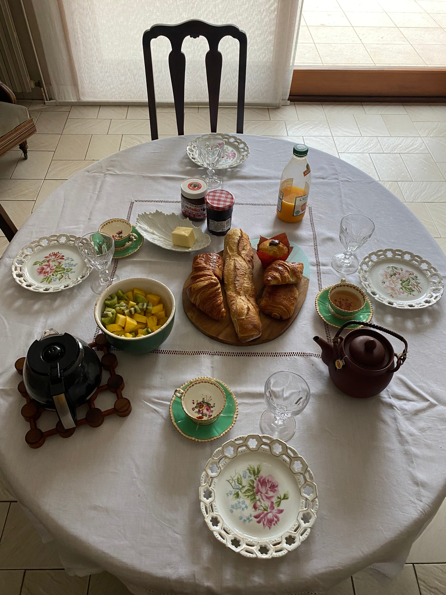

It's been a hot second, fellow readers ... but fear not, your favorite croissant-eating, Franglais, travel blogger is still here!

To catch you guys up on life since my last post - I came back from [August vacation in](/posts/des-vacances-sportives) [_l'Averyon_](/posts/des-vacances-sportives)_,_ hung out and caught up on work, had a fun golf outing with my _collègues,_ tackled work until October and then in November we were locked down _à nouveau._ It wasn't the most fun time and we had to push back our joint birthday party ☹️

:::gallery{folder="general"}

> Ice cream, you scream, we all scream for summer!

December went by really quickly and before I knew it, I was at the _aéroport_ to head home for my first time in a year! I split my time working remotely (_télétravail_) and hanging out with the fam and even seeing some of my best friends.

:::gallery{folder="general-2"}

January was back in France catching up with _colocs, collègues et copines_! The never-ending, impending doom of a potential 3rd lockdown tackled most of February and it was not the most fun time, if I can be honest. So when our friend Margaux and her boyfriend Romain invited us to their family home near Perpignan, Louise and I said, "_Oui !"_

We left work on Friday evening and after a quick 2.5 hour drive, we ended up in the countryside near the sea. We spent Friday evening checking out _la maison_ and of course celebrating our little weekend getaway with an _apéro_ while we waited for Romain to arrive. Dinner was _tartes_ and _salade_ before a _fondant au chocolat_ made by Margaux and my homemade chocolate chip cookies.

:::gallery{folder="general-3"}

> s-tarte-ing this week-end off right

The early bird gets the the worm ... the _croissants !_ Louise, our early riser, headed out and bought croissants for our brunch that we ate on the _terrasse_ in the sunshine. If that isn't a great way to start the day, I don't know what is!

:::gallery{folder="general-4"}

Our next stop was a little _randonnée_ (hike) In the hills near Collioure. To be honest, I was not expecting our 75 minute, scramble up the rocks (at one point) but the views were so worth it! We could see _la mer_ (the sea) and all the little villages almost all the way to the Spanish border.

:::gallery{folder="general-5"}

> nothing can stop me ... I'm all the way up!

We headed down the mountain and right to the beach for a lunchtime _pique-nique._ It was amazing to be by the seaside (just like in [Nice](/posts/it-s-going-to-be-a-nice-year)!) We hung out and then took a small sea-side stroll to check out the views.

:::gallery{folder="general-6"}

Stop [#3](https://www.forkspoonandstraw.com/home/hashtags/3) was the village of Collioure! We had a blast exploring the colorful _rues_ and the cute houses. It reminded me so much of the [_Côte d'Azur_](/posts/feelin-22-in-france) it was crazy. We ended up stopping in a local wine shop because we saw a sign for a _dégustation_ (tasting). We enjoyed trying different wines from the region and savoring the fact that we were in a sort-of bar, drinking wine with people (since bars have been closed since October).

:::gallery{folder="general-7"}

> Where's Waldo?

We finished our souvenir shopping (_les cartes postales pour moi, bien sûr !_) and then headed back to the house just in time for 6 pm curfew. Dinner was an _apéro dinatoire_ with lots of little snackies, Gin-To, and some board games to end the night.

:::gallery{folder="general-8"}

> these apps were the GOAT (cheese)

Sunday we were supposed to get rain, but when Louise came back with the croissants (sensing a theme here?!) there was not a drop that had fallen. We ate breakfast, packed up and headed back towards Narbonne to spend the afternoon there since it was closer to the _autoroute._

We headed out on another _balade_ near the cliffs of the sea and even stumbled upon people doing _parapente_ (paragliding). The second half of the afternoon was spent relaxing in the sun on the beach, _pique-nique_\-ing, and even heading across the street to buy a _crêpe_ in our bare feet [#SeasideLife](https://www.forkspoonandstraw.com/home/hashtags/SeasideLife).

:::gallery{folder="general-9"}

> props to our (very dedicated) personal photographer - Romain

We were sure sad to leave but taking the back roads and avoiding the traffic of everyone returning to Toulouse from February vacation made the last few moments of a great weekend even better!

_Hâte pour le prochain week-end entre potes,_

