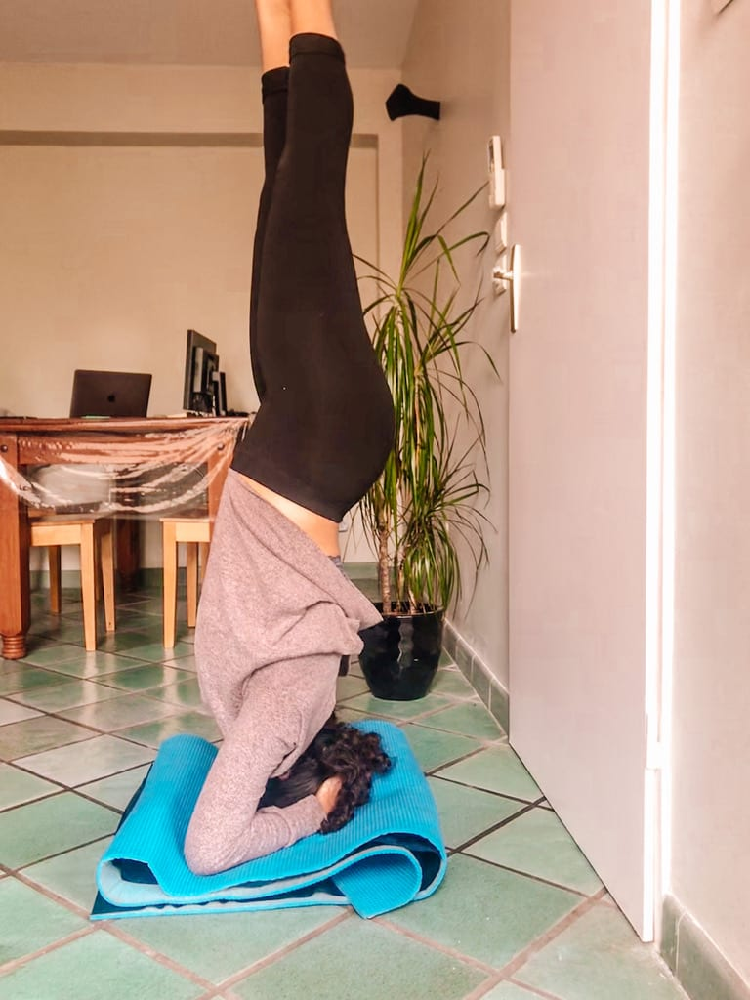
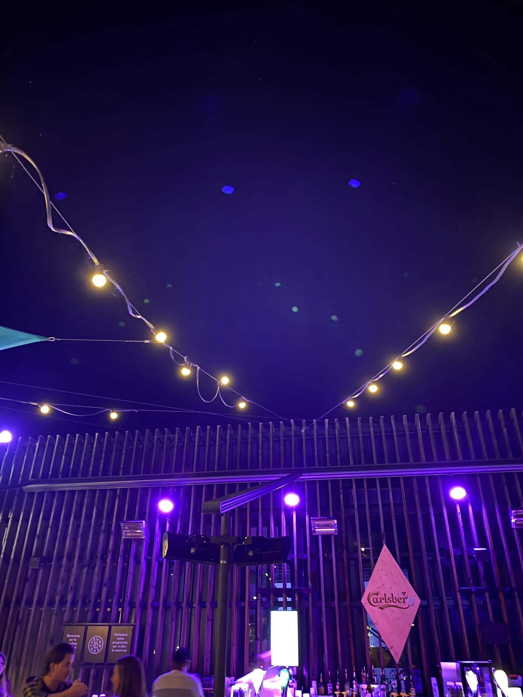
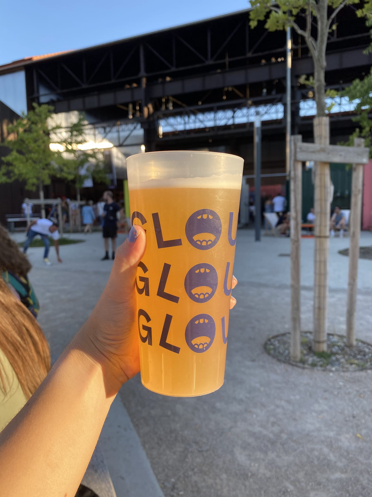
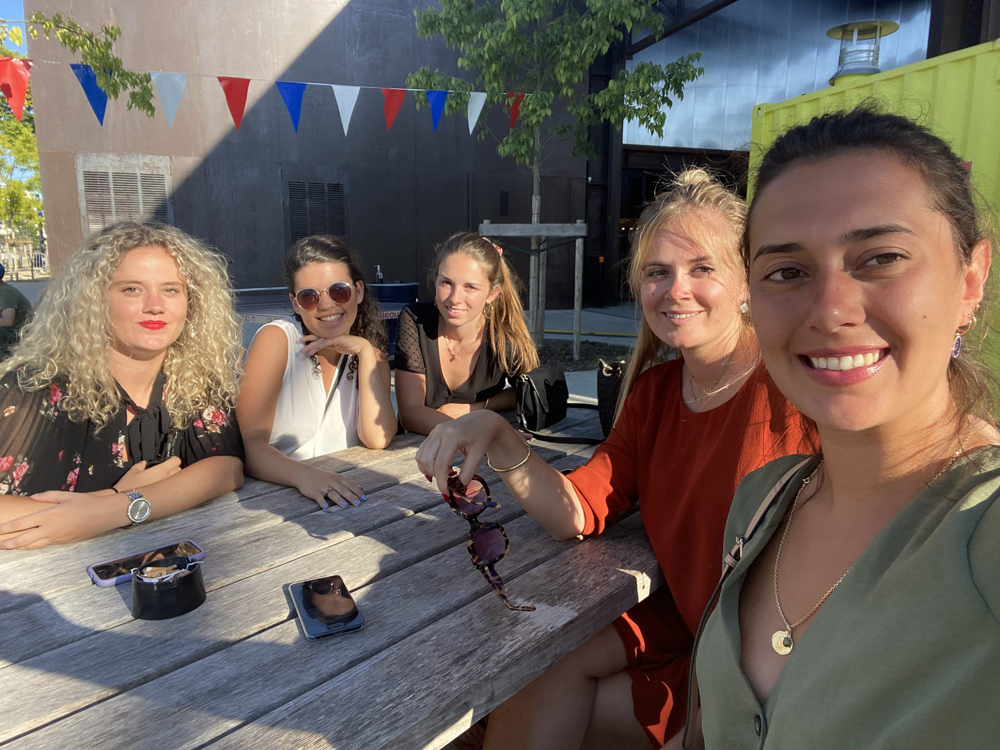

import Gallery from '../../../components/Gallery.astro';

Ah 2020, what a strange and unexpected year! I was planning to do lots of things (as I'm sure everyone was ... _duh_) like visit my sister in Paris, head to Spain with a friend, check out Amsterdam with one of my girlfriends, head back and see the fam! As Hillary Duff so eloquently said ..... _laugh out loud_ (+10 points if you get the ref)

So after one of my friends suggested we visit her in Lyon, I just about jumped at the possibility to get some fresh air and get my tourist on after those long, couple months stuck at home. Literally. The 14th of July, or _la fête nationale_ here was on a Tuesday so I did what is known as _faire le pont_ or quite literally "make the bridge" between the day off and the weekend to make a nice, long weekend!

My friend Louise and I left Toulouse early Saturday morning with the two others in our _covoiturage_ or carpool. I successfully DJ-ed and GPS-ed us all the way to Lyon and around 5 and a half hours later with only one wrong turn we arrived at the very cute village of _St Martin la Plaine_ where we met our other friend Cassandra for our getaway!

The rest of the afternoon was spent lounging by the _piscine_ and catching up before _le goûter_ or snack-time brought to your truly by _crêpes_ and homemade mint chocolate sorbet! Can you say _miam ?_

<Gallery post="a-great-weekend-getaway-and-i-ain-t-lyon" folder="general" />

That evening, we headed into Lyon and I was def hyped to check another new, French city off my list (especially since the fam had already been _sans moi_). We parked and got to check out a bit of city near _le Rhône_ river since Lyon actually has two rivers that divide it in half? thirds? Unclear.

We wandered along the banks of the river to the _peniches_ which are barges where you can get food or drinks on the boats themselves or on land right next to it. Cool, right? We met up with a friend of Louise who was a _fille au pair_ with her in New York and another couple of friends who we had met in Toulouse. And then it was (obviously) beer time! _Santé!_

<Gallery post="a-great-weekend-getaway-and-i-ain-t-lyon" folder="general-2" />

> I look like a child next to my friend's brother!

We headed to a rooftop bar after to end out the night and enjoyed a view over the river and Lyon after waiting a bit in _la queue_ [#SocialDistancing](https://www.forkspoonandstraw.com/home/hashtags/SocialDistancing) am I right?!

The next morning, we slept in a bit (_faire la grasse matinée_) after our long day. We packed a picnic and then headed to a nearby lake for some fun in the sun! We waited in another line (it's a trend!) and then spent the rest of the _après-midi_ enjoying the beautiful, blue lake.

<Gallery post="a-great-weekend-getaway-and-i-ain-t-lyon" folder="general-3" />

We played a typical European lawn game called _m__ölkky_ where basically you chuck a wooden cylinder at other wooden cylinders to try to get exactly 50 points. Aka wicked fun!

We got dressed and then headed back to Lyon to a neighborhood called _la Confluence_ which is like the up-and-coming area with plenty of start-ups and other cool buildings. There was an _open-air_ which I later learned is like a half-opened outside bar, but still slightly covered. It still confuses me when the French take English words and turn them into something new. [#FaireLeFooting](https://www.forkspoonandstraw.com/home/hashtags/FaireLeFooting) [#UnBrushing](https://www.forkspoonandstraw.com/home/hashtags/UnBrushing)

We met up with another group of friends who live/lived in Toulouse and had a fun evening with some food and music before I headed to the countryside to end the evening with a dance party at one of our friend's grandmother's house!

Monday was our last full day in Lyon and we grabbed brunch in town in the _quartier_ called _Croix-Rousse_ which is the _Montmartre_ of Lyon if you get the ref. Brunch was excellent and I was a happy camper with my pancakes, eggs and bacon!

<Gallery post="a-great-weekend-getaway-and-i-ain-t-lyon" folder="general-4" />

We wandered down into the main part of the city, stopping at little shops here and there and checking out some of the local sites like the other river, _La Saône._ We ended up in _Vieux-Lyon_ where we grabbed a smoothie and beat the heat since it was about 32°C or 95°F in town! Summer is here in France, and it's no laughing matter!

<Gallery post="a-great-weekend-getaway-and-i-ain-t-lyon" folder="general-5" />

There was another _open-air_ that night at the same place we were the evening before and we decided to head back over since it was _la semaine française_ or French Week due to the national holiday. We played _pétanque_ to end the evening before heading back to Cass's house.

Tuesday morning, we packed up and packed a _pique-nique_ for one last adventure at the _Gorges de la Loire_ which were _gorges_\-ous (pun definitely intended 😂). We enjoyed the stunning view before heading back on the road, and back into some long weekend traffic to end our _vacances._

<Gallery post="a-great-weekend-getaway-and-i-ain-t-lyon" folder="general-6" />

Lyon was a super cool city and I already want to go back to check out the things we didn't have time to see, and eat!

_Aux prochains aventures,_

