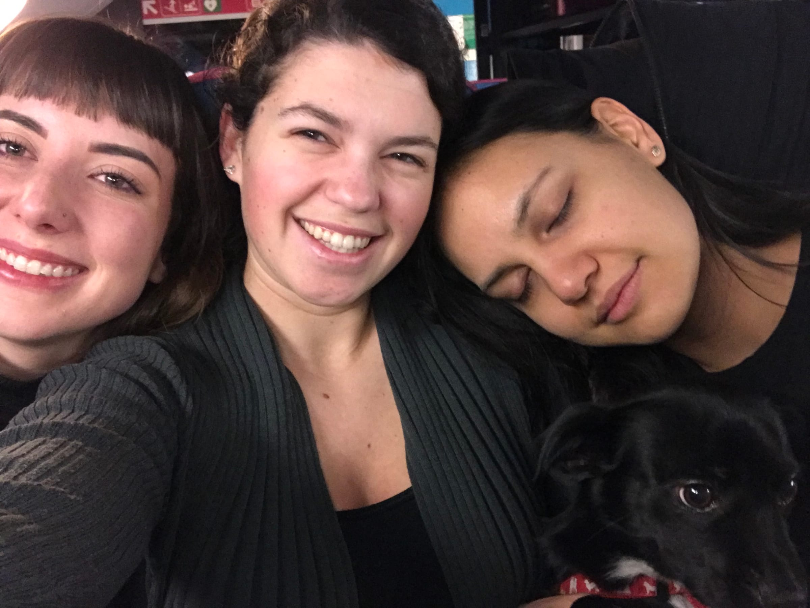

_Youpi !_ The only thing worth waking up for at 5 am for is a weekend trip to Paris – and what better way to _commencer_ our February break? _Les filles de Chateauneuf_ headed out of the apartment before the sun was up and only stopped once to pee on the walk to the train station (not naming names .. \*cough cough\* **Hallie**). We managed to get into our little trio of seats and tried to sleep for a little bit …

UNTIL we were rudely awoken by a lady asking if Melissa’s suitcase belonged to anyone and then tossing it from the luggage rack onto the aisle. Apparently during our nap, this woman decided Katie and Melissa’s bags were too small to be on the rack. We tried (unsuccessfully at first) to argue because we had paid for luggage space and there was no way Katie’s backpack was fitting under the seat with us. Luckily, a mom with her kids stood up for us and told the woman the same things we were saying. Things escalated even further when Katie turned around after hearing a loud thud, and thinking it was her bag, just to have the woman scream at her to mind her own business.

After all this drama, there was no way we were sleeping, so we decided to indulge in our _petit déj_ (breakfast) of sweet and savory pastries and watched the French countryside whiz by on the high-speed train.

> Gotta love travel

After a bit of delay, we made it to _Gare de Lyon_ in Paris and bought our metro tickets to get to the hotel. We were about to get on _ligne 1_ when disaster struck again, this time in the form of RATP (Paris transportation) agents asking if we had a ticket for Hallie. Long story short, we were confused, there were 6 agents talking very loudly at us all at the same time and Mel had to pay a fine. We did discover for every bad thing that happened, there was always a kind bystander willing to stand up for us.

We made it to the hotel and freshened up, all while swearing we were just getting all the bad things out of the way first. Our first stop was to _République_. We all felt we deserved a drink (even though it was barely 2 in the afternoon) since it was already such a long day. Then we darted through the rain over to my favorite bakery _Du Pain et des Idées_! The _pistache escargot_ pastries were warm in our cold hands, and we tried some savory pastries as well.

:::gallery{folder="general"}

> the best kind of snail

From there, we metro-ed over to _Montmartre_ to see the famous _Maison Rose_ and _Sacre Cœur._ We snapped some pics and then wandered our way back down the hill to the 2nd _arrondisement_ to Frog and the Underground. Katie had been talking about wings for weeks, and I knew the perfect spot for dinner for my housemates. I grabbed a drink and then with a quick _à toute à l’heure_ I hopped back on the metro to my old host-family’s apartment for dinner!

:::gallery{folder="general-2"}

As luck would have it, there was a problem with _ligne 13_ and I had to let 2 metros go by before there was enough space to squeeze into one. It was a classic moment and I felt like I was back to my junior-year self stressing about getting back to my homestay dinner on time. I followed my instincts to my host fam's building and hopped up on the new _ascenseur_ (elevator), which would have been helpful to have 2 years ago, and made my way up to the 4th floor.

Dinner with my host fam was great. We caught up, and I ended up staying for 3 hours talking and explaining what I had been up to since I left them in April 2017. And I didn’t even need metro directions even after 2 years!

Saturday morning, we woke up and got ready after grabbing breakfast in the hotel. Our first stop was _Trocadéro_ for some Eiffel Tower fun! We were having a blast taking pictures of each other, when this Brazilian photography student came over and showed us a picture he had taken of us (taking pictures of course!). He asked if we wanted a copy, and the three of us being extra as we are, talked him into taking more photos. We basically had a professional photo shoot in front of the _Tour_!

:::gallery{folder="general-3"}

After about an hour and a half, and over 800 pictures later, we headed over to _Palais Royal_, giggling all the way about what had just happened. There was a cool, umbrella exhibit that we checked out before we ended up on _Rue Crémieux_ aka the insta-worthy rainbow street near _Bastille_.

:::gallery{folder="general-4"}

Tired (and feeling snacky), we stopped at _Le Bastille_ for some truffle fries and a beer. I had timed it perfectly, so we were heading over to the _Oberkampf_ neighborhood, just in time to wait in a little line for dinner at the classic _Obermama_! Dinner was a heavenly combination of beef carpaccio with a killer balsamic reduction, burrata pizza, and (of course) truffle pasta! We enjoyed some cocktails and wine and _santé_\-ed to a great first full day in Paris.

:::gallery{folder="general-5"}

_Les filles_ caught a second wind after all that food and grabbed a bottle of wine to take with us to watch the Eiffel Tower at might from _Pont d’Alma_. It’s the small moments like these – taking a million silly Boomerangs, dancing and singing as the Tower sparkles behind us and the rain begins to fall. _Paris, t’as toujours mon cœur_.

:::gallery{folder="general-6"}

The next morning, I caught a glimpse of blue in the sky! We left with the intention of grabbing pastries from a _patisserie_ recommended to me by one of my foodie-friends, but got way distracted by the sun peeking out as we walked by _Notre Dame_! After more pictures, we found a _créperie_ close by in _Saint Michel_ to fuel up for lunch.

:::gallery{folder="general-7"}

Melissa had to go take her online class, so Katie and I walked by the _pyramides de Louvre_ and _Pont Alexandre III_ for some windy photos. We tried to go to _Musée d’Orsay_ but the line was crazy. An excursion for next time!

:::gallery{folder="general-8"}

We ducked back into the _café_ where Melissa had just finished up, just as the rain began. We took shelter inside for a bit. It was another unexpected, happy Paris moment – sitting in the little café, eavesdropping on the waiters and locals. The Paris price shock kicked in when we had to pay though ….

Katie and I headed towards the _Arc de Triomphe_ and Mel took the pup back to the hotel for the night. We planned to wait in the line to get tickets to walk up the stairs to the top of the Arc, but to our surprise, there was no line! I guess the rain comes in handy. (Pro tip: it’s free to climb since it’s a national monument if you are an EU citizen … aka anyone with a student/long-stay visa!)

We climbed up the steps to a killer view of _Place d’étoile_ and the 12 streets that fork away from the monument. From the top, you can see all the way to _Montmarte_ and _La Défense_ as well as the Eiffel Tower, so close it towers over you. We snapped a bunch of pictures and then decided to head back down to the little waiting area before the last flight of stairs to warm up, and wait a bit longer for sunset.

:::gallery{folder="general-9"}

Katie spotted some pink in the sky and we headed back up. Luckily for us, the clouds let in a little sunset and we stayed rain-free! We hung out on top, looking at the beautiful city turn her lights on and the Tower light up for the evening.

:::gallery{folder="general-10"}

Freezing cold, we practically ran down all 284 steps and grabbed the metro to _Le Marais_ or the Jewish Quarter. I knew the perfect dinner to warm us up and we waited in a short line (and for Melissa!) before going into _L’as du Fallafel_. Lenny Kravitz’s favorite restaurant in Paris is also in my top 3 and we enjoyed our falafel and schwarma after a long day.

:::gallery{folder="general-11"}

> Holy _crêpe_ we love Paris

I took _les filles_ to one of my favorite bars for some cheap drinks and to meet a friend who was studying abroad who went to my university. Sadly, the bar closed at 9:30 pm on Sunday nights (I guess some people have work on Monday mornings …) but we grabbed a crêpe for dessert next door to keep our night going.

We ended up going to one more bar down the street to end our night and as we were walking back to the metro to head home one last time, Katie spotted a rat along the side of the street we were on. Bucket list in Paris achieved.

The next morning, I woke up _très tôt_ and snuck off to grab the tram to take the OrlyBus to the airport. The flight back to Nice was uneventful, although the final descent along the coast always makes me smile.

We’ll always have Paris,

Lele
