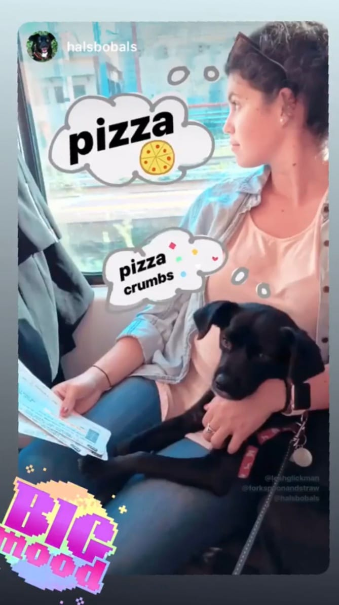
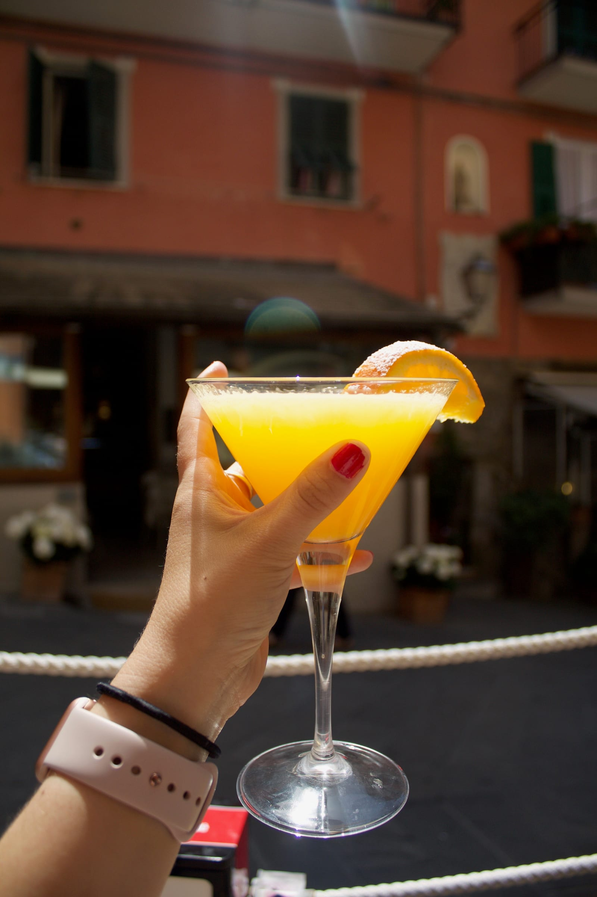

Tuesday morning I got up bright and early to meet my (ex 😭) housemate Melissa at her new apartment ... we were doing a little getaway to Cinque Terre! We grabbed our bags, the dog and some pastries and headed to the train station.

We made it to Ventimiglia, just across the Italian border, when the first disaster struck. We were a bit delayed from Nice and arrived at our next platform to see our train pulling away ...

We dejectedly went inside and ended up buying some new replacement tickets to try to make up for our lost time. We made it from Ventimiglia to Genova but on the train from Genova to La Spezia, our second disaster struck. The ticket inspector informed us that the ticket wasn’t valid since we had to change the type of train we were on and we were slapped with another charge. It was not looking great for us so far.

We made it to La Spezia with no other excitement and then transferred to Riomaggiore (#1), our “terre” of choice as a home base. After checking into our hotel, we set off to explore as it was meant to rain for the next few days.

We wandered around the cute little town and stumbled upon a place with some seafood cones to take away and grabbed a quick snack to ward off our hangry selves. The three of us walked along the marina to the ocean and checked out some spots to get food and drinks before sitting at a bar for a _limoncino\*_ spritz. _Cin cin_ to a few days in Italy!

\*limoncino is the name for the lemon liqueur in the North, limoncello in the South!

:::gallery{folder="general"}

> you've got to be \[squid\]ing me with this seafood cone and pesto on _farinata_

We walked around some more and after looking at (almost) every menu, we settled on a little _trattoria_. Mel got a seafood risotto and I settled on a pasta with porcini mushrooms in a cream sauce. The dinner was a little lacking in flavor, but the carafe of red wine we shared made up for it! We caught the tail end of the sunset and headed back for an early night in.

:::gallery{folder="general-2"}

The next morning we braced ourselves for some rain but were pleasantly surprised to find only some cloudy weather. We grabbed some _focaccia_ for breakfast with cappuccinos and took the train to Monterosso al Mare (Terre [#5](https://www.forkspoonandstraw.com/home/hashtags/5)). We walked around the little village on the beach for a bit before starting our hike. We headed up, up, up and found ourselves at the booth to begin the trail. The man at the booth was denying people access who weren’t properly prepared for the hike since it had rained and it was going to rain later, and we crossed our fingers. He checked the soles of our shoes and gave us the all clear. We headed up a bunch of rocky steps and started the actual hike (stopping to take pictures every 10 minutes of course)!

:::gallery{folder="general-3"}

The hike took about 2 hours since it was a little slippery and rainy but we made it to Vernazza (Terre [#4](https://www.forkspoonandstraw.com/home/hashtags/4))! The colors of the town were crazy against the blue of the sea. We walked around the main square for a bit and then headed to get lunch!

:::gallery{folder="general-4"}

We had some more seafood spaghetti (for Mel) and local pasta with pesto (for _moi_). And some more wine. We treated ourselves to gelato after lunch and sat in the center of town before it started to rain.

We popped in and out of some shops and then decided to take the train back to Riomaggiore before dinner.

:::gallery{folder="general-5"}

> we \[seafood\], we eat food ... repeat as necessary

We ate at a place around the corner from our hotel since it was pouring rain. We shared a type of ravioli with spinach in a creamy walnut sauce and ravioli in a meat and mushroom sauce. We also got some more _tiramisu_ - when in Italy am I right?

:::gallery{folder="general-6"}

> snuggle sesh!

The next morning we completely lucked out with sun all day (we even got a bit burnt) since the forecast had said rain! We got up, grabbed a _cornetto_ and cappuccino and hit the train to go to Manarola (Terre [#3](https://www.forkspoonandstraw.com/home/hashtags/3)).

We walked down the main path from the station and immediately headed up near the view point, stopping to take some pictures along the way. We wanted to get to our lunch place right before they opened at noon. _Nessun Dorma_ is perched on a cliff overlooking Manarola and was on my bucket list - especially since it was sunny!

:::gallery{folder="general-7"}

We grabbed a table by the edge and looked out over Manarola as we ordered our Aperol and Campari Spritzs, _charcuterie_ and _formaggio_ board, and _bruschetta_ and _caprese salad._

:::gallery{folder="general-8"}

> brusch-get all this in my mouth!

The view was amazing. The food was so fresh and tasty. And the sun was shining. I could not have been happier and we extended our time with a half a liter of red wine - again, when in Italy am I right??

:::gallery{folder="general-9"}

> this is my happy place

We walked around the town after our long lunch l, grabbed more gelato, and popped in a few stores. We wanted to take full advantage of the _bella_ day and went to the last village, Terre [#3](https://www.forkspoonandstraw.com/home/hashtags/3), Corniglia.

:::gallery{folder="general-10"}

After we left the station, we had to walk up the 389 stairs to the actual village but it was definitely worth it. The views were stunning and there seemed to be less tourists and a calmer vibe there. We grabbed another Aperol and Limoncino Spritz after walking around the town and watched the sun sink down as the perfect day came to an end.

:::gallery{folder="general-11"}

We quickly train-ed back to Riomaggiore, grabbed a coat and got some take away pasta to eat and watch the sunset. And (of course) got some more gelato. Hey, in our defense, the girls basically waved us in the shop!

:::gallery{folder="general-12"}

Our last morning, we packed up, got one last cappuccino and took a pizza to go. We ate _al fresco_ on a bench on the street, since food really does taste better outside. Melissa finally bought a hat (I’m pretty sure we went in every shop looking for hats and a leather purse for me) and we celebrated a good 3 days with a _bellini_.

Our train back home was relatively uneventful as compared with the way there even though we only had 5 minutes to transfer in Genova ... we made it though \*phew!\*

As many tourists as there was, I’m really happy we went to Cinque Terre. Every village is so different and so gorgeous too!

:::gallery{folder="general-13"}

> 1 Lele, 5 _terre_s, waaaaay too much Italian food ...

Ciao for now,

