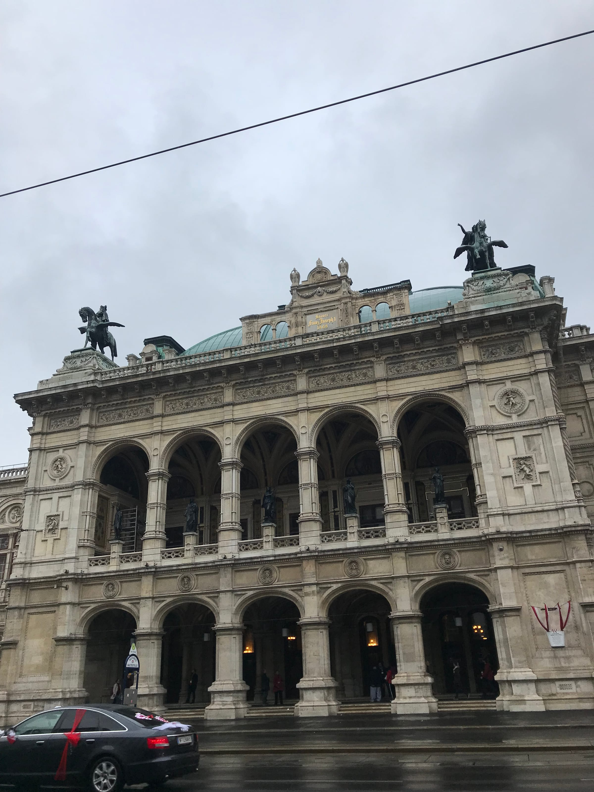

The next morning, the Prague pals split and I headed to Vienna. Or at least tried to. I left the AirBnb with a little under hour to take the 20 minute walk to the station and some extra time to grab a coffee for my train ride. Suitcase in hand, I had an average walk ... until the last 5 minutes. I crossed the street thinking it could save me time a little later. Mistake [#1](https://www.forkspoonandstraw.com/home/hashtags/1). I ended up in a median area at a dead end with no way to go except back the way I came. I walked up to the train station, thinking that I was there but there was no way for me to cross the busy street because of the construction. So, I continued and made a giant loop around the station. After finally using some sketchy back entrance, I made it in. I found a board to check my platform number and headed to a little store to spend the last of my Czech _kronors_ on a cappuccino. I don't know what made me do it (God? Fate? Anxiety?) but I decided to check the time and thank goodness I did! My train was supposed to leave at 9:21 and it was 9:18! I literally sprinted through the station and was pulled on the train by an attendant **as it left the station!**

After that drama, the 4-hour train ride flew by and I was in Austria before I knew it. Turns out I had arrived on Vienna National Day and so public transport was kind of a nightmare as most tram lines were on reduced service or not running. But I finally made it to the apartment and the other assistant who I was traveling with for the rest of break. After taking a second to unwind, we set out to find some food. Since it was around 3 pm by this point, we just grabbed gyros for lunch/dinner and explored Vienna near our apartment.

:::gallery{folder="general"}

Saturday morning kicked off with _apfelstrudel_ for breakfast – when in Vienna, right? We went to Kaffee Alt Wien for this classic treat. Inside the cafe has so many cool, vintage decorations. It was cold and rainy so we headed over to the Mozarthaus museum. The highlight was the fact that they transformed Mozart's actual apartment into the museum ... and the fact that it was warm indoors. Vienna sure is chillier than Nice!

:::gallery{folder="general-2"}

> A strudel-ly delish breakfast!

We wandered around the downtown area before getting caught in a rainstorm. Luckily, the _très_ famous Opera house was just next door to provide us some shelter from the storm. Lunch was classic Austrian food which also helped warm us up. I munched on a potato and egg bowl. We rested back at the AirBnb before heading to a bar and meeting up with 2 other assistants who teach in Avignon. They were super cool and one of them also turned 21 at midnight, so of course we had to celebrate with her!

Sunday was sunny and slightly warmer, so after a breakfast of Austrian chopped pancakes with stewed fruit, we headed to the castle. It reminded me of Versailles and there were cool gardens and _Gloriette,_ which had an amazing view of the castle and the city. There were ruins to see, and labyrinths to escape, and even a zoo for a longer day!

:::gallery{folder="general-3"}

Dinner was _wiener schnitzel_ and _Sachertorte_ which hit the spot after a long day of walking. My dad recommended we try the traditional Viennese dessert which was a favorite of his when he studied abroad. We tried to get cheap, standing seats at the opera, but sadly were too late. Instead, we just walked around the city at night which gave us a lovely view of some statues and buildings. I only wished we had more time to see it during the day.

:::gallery{folder="general-4"}

Monday was a new week and a new city! Before catching a bus to Bratislava, I snagged a _käsekrainer_, or a cheese-filled sausage for one last Vienna treat.

Feeling full, Lele
