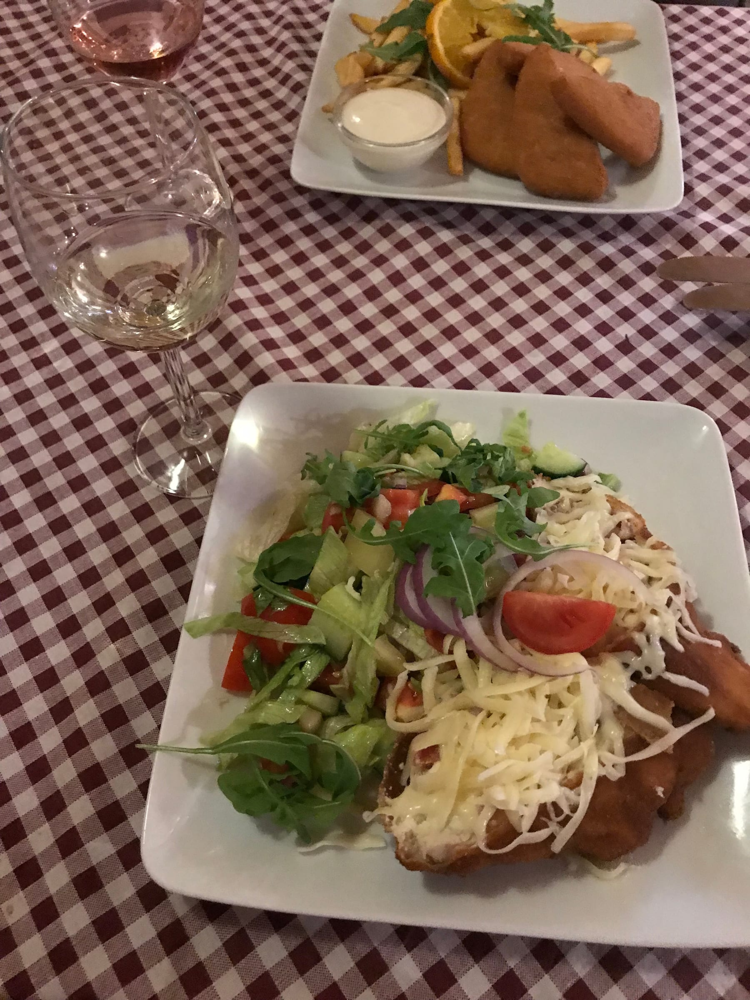
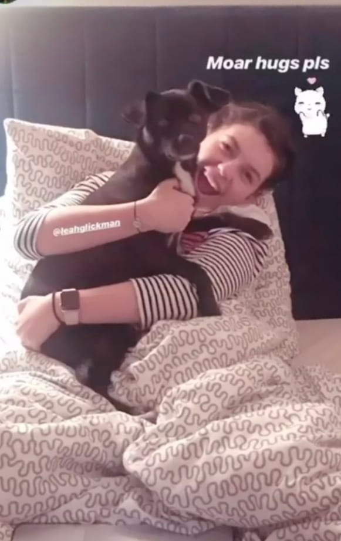

This stuffed chicken with tomatoes and feta left me stuffed

We got to Budapest in about 3 hours from Bratislava and checked into our super nice AirBnb! We stayed in Buda, pretty close to the river. The city is actually two cities - Buda and Pest which were combined 1873. After enjoying the complimentary chocolates from our host, we ventured out to find some food. After our first two options were closed, we found a small restaurant with some Hungarian food and decided to give it a shot. Let me tell you - what an intro to this city it was because a glass of wine was about the equivalent of 1 euro and cost less than a metro ticket. After dinner we grabbed a drink (pear cider _pour moi_) and crashed early since we had big plans for the next day.

Halloween morning, we headed across the river to Pest up to the Fisherman’s Bastion (to try to avoid the crowds) and snapped some cool shots of the Danube and the city below. After breakfast at a small outdoor café, we hiked up towards the castle again (3 castles, in 3 countries, in 3 days – just Euro things). We explored the castle area for a bit then wandered back across the famous Széchenyi Chain Bridge to Buda. We spent the rest of the sunny afternoon exploring the city and seeing Parlament, the Shoes by the Danube memorial, and (of course) getting another _trtlnik_ … or _kürtoskàlac_ in Hungarian.

:::gallery{folder="general"}

> what a Buda-ful view

Dinner was a tasty falafel sandwich (my body needed some veggies!) and then we got dressed up in costumes since it was Halloween! We met another assistant from Nice and her boyfriend at a bar crawl and had some Halloween fun in different bars and clubs! I was happy to do something fun and American on Halloween since we usually go all out back home. Plus there was beer pong and flip cup, so if that doesn't bring me back to the good ole' US of A, I don't know what does.

:::gallery{folder="general-2"}

> Check meow-t in my costume!

A pistachio croissant and cappuccino was the perfect start to November, and to our day. It also fueled us to climb 365 stairs (one for each day of the year!) up to the top of St. Stephens Basilica in Buda. What a killer view from the top – and a nice little workout for the day. We wandered around the town a little bit more before the next meal aka the story of this trip. Lunch/dinner was an all you can eat buffet … of Hungarian food! Highlights included sweet chili chicken, stuffed cabbage, _goulash_, creamy pumpkin soup and desserts galore! So much good food and I almost fell into a food coma, but had to wake up for our night cruise.

:::gallery{folder="general-3"}

The views from the boat were killer and it was so nice to see the city lit up at night. We rode down the Danube past Parlament, the Castle and the Bastion, the bridge and then further down near where we were staying before turning around and heading back. The other assistant we met the night before invited us to go out to a ruin bar with her and her boyfriend and we had a fun night exploring the cool bar.

:::gallery{folder="general-4"}

Our final full day was at the baths! It was so relaxing and my poor, aching, blistered feet needed some time soaking in the mineral waters. We spent about 2 hours in the different Széchenyi baths. For lunch, we found làgos (fried dough with sour cream and cheese) and I, of course, had to have one last _kürtoskàlac_ before leaving Eastern Europe. We were supposed to do a tour of the Jewish quarter but didn't have time, happily we stumbled across the Doheny St. Synagogue which was cool to see. All the assistants met up to climb the Citadel and catch the sunset on our last evening in Budapest. We came full circle and ended up back at the first bar and I had another killer pear cider – gosh I’ve missed fall foods!

:::gallery{folder="general-5"}

> Bath time! (bubbles not included)

Our flight back to Nice was uneventful and I ended up actually helping an Italian guy navigate himself to the bus station in Nice before grabbing a much-needed salad and crashing back in my own bed. There's something about eating a bunch of carbs and fried foods for over a week that really makes you want to only eat salads and veggies ... maybe I'm onto a new diet idea.

Break was super awesome – but sadly not that much of a break as I was running around seeing (and eating) all of Eastern Europe. Melissa brought her pup back with her when she came back and it was nice to meet her!

I’m back at school right now after a full day of classes. Turns out 2 weeks without any French really does a number on my vocab and speaking and I’m struggling a little bit to find _des mots_ to talk to the other teachers. Here’s hoping it comes back soon!

Love & chimney cakes,

Lele
