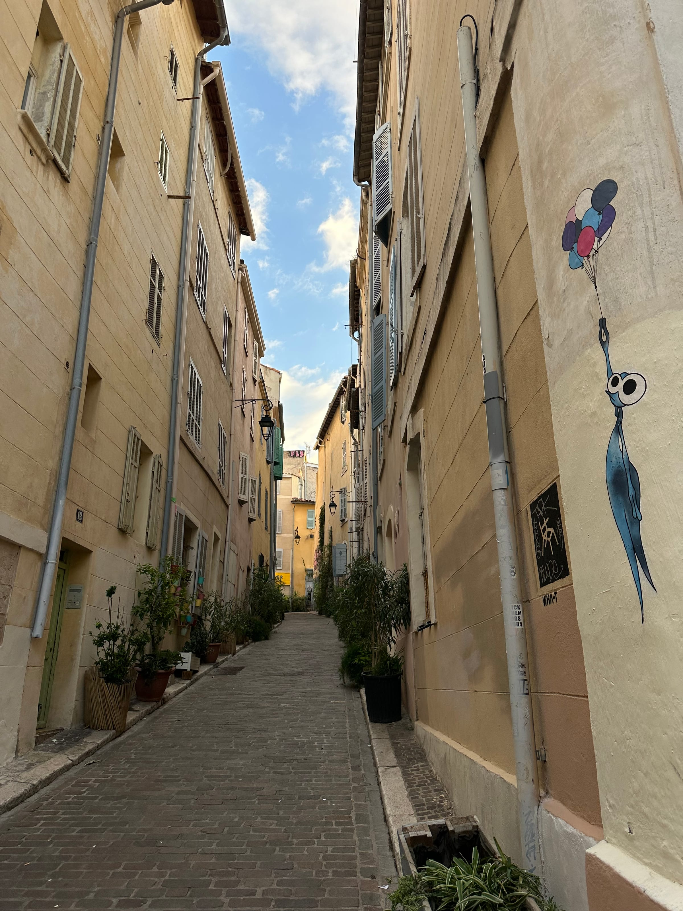

_C'est pas la capitale ..._ but it's perfect for a weekend or even week trip getaway! We set off on a sunny September day, taking the train from Toulouse. About 4 hours (and a quick nap) later, we found ourselves at Marseille-Saint-Charles train station, right in the heart of the city.

Now I feel like it's important to note here, Marseille gets a bad rap as French cities go. It's not the cleanest, not the safest, and well ... not the quietest! Heck, I even tried to do a day trip with the family back in 2019 and it was definitely not what we expected. But, with a little planning (and an open mind), it's more than possible to fall in love with this vibrant and urban southern city.

##### notre logement / our stay

a quaint _Panier_ street

About a 20-minute walk from the train station lies a quaint, tourist neighborhood - _le Panier._ The oldest district in Marseille and the original Greek stomping grounds way back in 600 BC, this hilly area is truly an open-air museum! With street art, local boutiques, and windy staircases _partout_, _le Panier_ is a great home base for a stay in Marseille.

We found an AirBnB that fit our criteria nestled in a calm alleyway. That being said _le Panier_ is a hub for AirBnBs ... we found many a street corner loaded up with lockboxes and even some graffiti that confirmed our suspicions, the tourists staying in _le Panier_ have driven up prices and moved locals out. It is important to note that Marseille is the second-largest city in France as well as a popular vacation spot, and with it comes classic big-city problems.

Other places to stay are in and around _le Vieux-Port_, the Vauban neighborhood in the _6e arrondissement_, or even Joliette or _Le Pharo_. You could even head up to l'Estaque which is a little schlep into the downtown city spots for a calmer Marseille experience. Places to avoid would be the _quartiers nords_ (13th, 14th, 15th _arrondissements_) which are generally considered less-safe.

##### à voir _/ what to do_

Marseille is definitely a walkable city, so I recommend heading out _à pied_ to see the sights! We took a bus once to head to Cassis and the _calanques_ and a boat to the _Îles du Frioul_ but other than that, we definitely got our steps in!

*   Get lost in the charming streets of _Le Panier_ and keep your eyes open for art of all kinds! From street art to local boutiques to tags and more

*   Take a walk down to Fort Saint-Jean (and the MUCEM museum!) along the waterfront. This free 17th century fortress is a step back in time, and a great view from the towers looking out over the _Vieux-Port_

*   and speaking of _le Vieux-Port_, it's just as it sounds ... an old port! Filled with boats of all sizes (but not the cruise ships and ferries), this is the heart of Marseille. Lots of bars and restaurants line the port, but I'd advise staying away from those and heading to my top spots instead (more on that to come!)

*   _Cours Julien_ is a lively hipster district in the center area. Filled with Marseille restaurants, farmers markets and more, this makes for an authentic _marseillais_ experience!

*   Sainte-Marie-Majeure Cathedral (or "_la Major"_ as the locals call it) is the largest cathedral in Marseille located in the Joliette neighborhood. She really is quite impressive ...

*   ... but not as impressive as the Notre-Dame de la Garde Basilica (aka _"la Bonne Mère_"), located on the tippy-top of a hill overlooking the Phoenician city. Grab your walking shoes and your camera and head up, up, up with 360° views of Marseille, the _Vieux-Port_ and even the surrounding neighborhoods. Legend has it that there is a _guinguette_ once you get to the top for a refreshing beverage!

*   _Le Palais Longchamp_ is located nearish to the train station and is the perfect afternoon spot! Home to the Natural History and _Beaux-Arts_ museums, and hiding a very cute park with a zoo behind its impressive facade, this was one of my favorite spots on our trip to walk around and explore!

*   You can't mention a trip to Marseille without mentioning _les Calanques_ (natural inlets and creeks along the coast in the region). This turquoise blue waters and stunning white cliffs are worth the hike into! They can be found all along the southern coast of the city but my favorites can be found near the cute nearby city of Cassis.

*   Cassis (sadly, not the name of the black-current fruit and liqueur but is thought to come from an old Latin word meaning “rocky place" ... _coucou les Calanques !_) is a train or bus-ride away from Marseille and the perfect _complement_ as a calmer, smaller city. Quaint city-streets and the nearby _calanques_ make for a perfect day trip!

*   We also visited _les Îles du Frioul_ which is an island archipelago a quick boat-ride away. With boats leaving from the _Vieux-Port_, it's quite accessible to get to! Literature fans unite for the first stop on the boat ride - _le Chateau d'Îf_ aka the Count of Monte-Cristo's old stomping ground. We didn't do the tour, but it's definitely a great idea. The small island where we stayed the day was full of little walking paths and of course, _calanques_! My advice? Grab sandwiches from Marseille and enjoy the day _en pleine nature_ stopping for a cool beverage near the port area if needed.

*   Head up to l'Estaque, a beachfront neighborhood known for its inspiration for painters (hello Cézanne!) and it's tasty oceanside treats! Originally a port, this area is also home to the _chemin des peintres_ a 3 kilometer walk through the city, taking you along some of the most famous spots.

*   Marseille is also known for it's rock-climbing spots in the Calanques National Park for any _escalade_ fans. There are also loads of great hikes in the area.

:::gallery{folder="voir-what-to-do"}

##### à déguster / to eat

Marseille is a foodie paradise ... and I should know, we are [_bien gâtés_](/posts/touloused-confused-my-coup-de-coeur-restaurants) [in Toulouse](/posts/touloused-confused-my-coup-de-coeur-restaurants)! From restaurants with that classic Provincial cooking and dishes to cool, hipster small-plated restaurants (and some seafood in between!); here are some of my favorite Marseille eateries!

*   **L'écaillerie**: Located in the Vauban neighborhood and the perfect _réconfort après l'effort_ of climbing up to see the Notre-Dame de la Garde Basilica, this was one of my favorite spots to try! With a name like _l'écaillerie_, seafood and crustaceans are sure to be on the menu! Some of the freshest and pinkest shrimp I have ever eaten ... Choose from oysters, whelks, clams and more for a taste of the _mer_. Not into seafood, not a problem! Their small sharing plates change seasonally and are full of unique flavors. My _coup de cœur ?_ Their _merguez_ sausages with a homemade harissa sauce that blew my tastebuds away! Grab a table on the _terrasse_ for some al-fresco dining and people-watching.

*   Not far from the _Cours Julien_ lies **Caterine** (surprise surprise) another small-sharing-plates restaurant! Convivial and presenting itself as a _cantine marseillaise libérée_, this restaurant was definitely full of good vibes ... and good food! Unique flavors line the always-changing menu with pairings like butternut squash-bacon-miso-peanuts that are sure to _titiller_ your tastebuds. We threw in a classic Marseille classic - _les panisses_ (little chickpea flour fries or beignets) and homemade aïoli for the added fun. And boy we were not disappointed.

*   **Vanille Noire**: While not a restaurant, this _glacier_ is a Marseille-staple with their iconic (and namesake) "black vanilla" ice cream staple. A scoop of this dark gray (ok, black!) ice cream is a must-try. The classic ingredients (local cream, milk, eggs, vanilla) with an added secret one are what gives this unique flavor ... its unique flavor! Briny, salty, fishy, _iodé_ ... call it what you will. (and try to guess what it is!) If you're not as adventurous (I don't blame you, I tried one bite and it was not for me), they have many other flavors; ranging from unique (Apple & Spicy Pepper) to classic (Passion fruit) that are sure to please.

*   Nestled in _le Panier_ neighborhood, **Ripaille** was on our "to-eat list" ... yet we had to late until the last night we were there to get a reservation! With its self-proclaimed "_cuisine familiale_ _et vins naturels_", their menu is a hodge-podge of flavors and small-plates dishes that will leave you satisfied and already thinking about what you'd order next time.

*   **Local must-try dishes:**

    *   **Panisses:** Chickpea flour, salt, water and pan-fried in olive oil ... these little snacks or appetizers and perfectly-paired with a homemade aïoli and best-enjoyed walking along the port of _l'Estaque_.

    *   **Chichi frégi (or frégit)**: No no, please don't mistake this deep-fried pastry for its churro cousin! Made with olive oil (_c'est le Sud hein !_), chickpea flour and orange blossom water (typical of the region), this tasty dessert again, is best-enjoyed _sur la pouce_ while out and about exploring! Extra _gourmandise_ points if you add Nutella!

    *   **Les Navettes**: Not to be confused with _les navets_ (turnips), these crunchy cookies look like little boats ... or shuttles (for my weaving friends out there!) as their name indicates. Originally created for the _Chandeleur_ holiday, these typical provincial cookies are traditionally flavored with orange blossom water (sensing a theme here?) but can be found with different spices and flavors nowadays. Dunk them in your tea or coffee for the perfect wake up call!

    *   **Bouillabaisse**: Fish stew with tomatoes, saffron, and various herbs and spices (and so not a lele-approved dish!) is probably Marseille's most-famous dish! Even though I didn't try it, I can give a helpful tip: you usually need to reserve in advance for this slow-cooked soup.

    *   **Pistou**: Pesto's French little brother, _pistou_ is (like pesto) an uncooked, green sauce. Basil, garlic, and olive oil are the main ingredients with some modern recipes adding in a hard cheese. But no pine nuts! Never the pine nuts for _pistou_ ...

    *   **Daube provençal****_:_** This slow-cooked beef or mutton stew flavored with local wine, seasonal vegetables and _herbes de Provence_ is a must-try in the winter months! (or the summer ones, who am I to judge). It rounds out the regional cuisine with other classics like **_les légumes farcis_** (stuffed veggies), **_tapenade_** and/or **_anchoïade_**, **_pastis_** (a anis-flavored liquor diluted with ice cubes and water) and even North African/Mahgreb-influenced dishes like **_couscous_** or **_tagine_**!

:::gallery{folder="d-guster-to-eat"}

Let me know if you have any other Marseille reccs! I'm always on the lookout for hidden _pépites_!

_À la prochaine_ _sur le Vieux-Port_,
