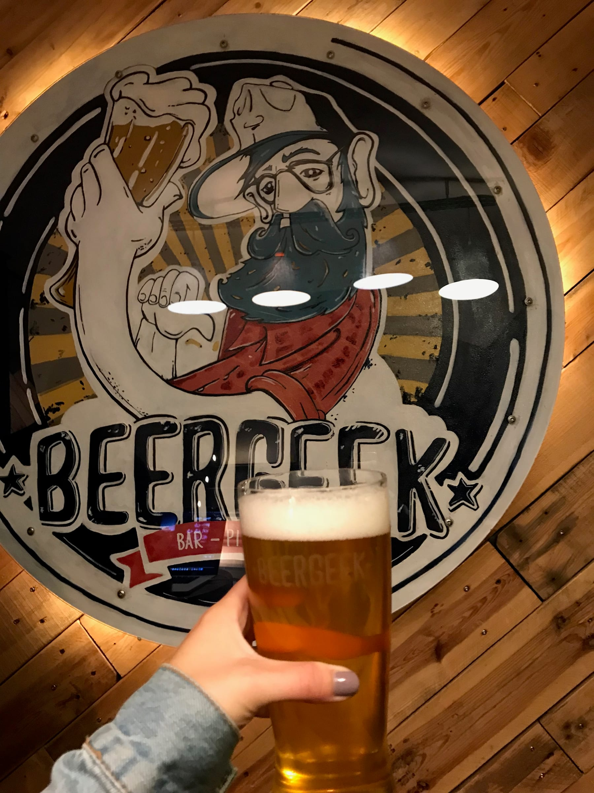
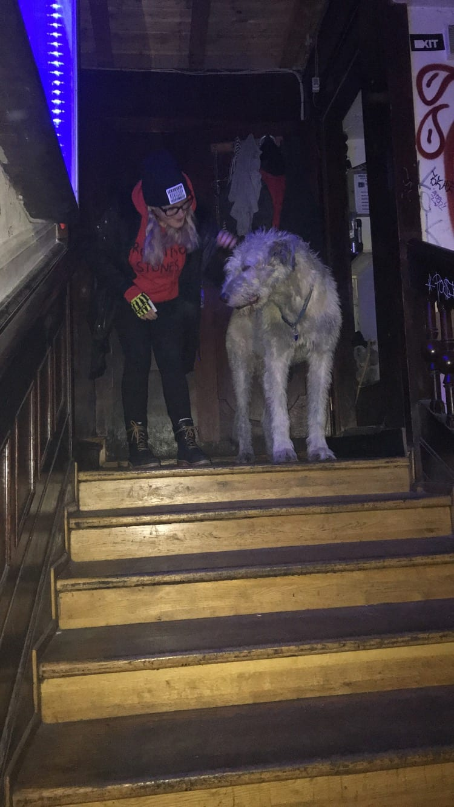
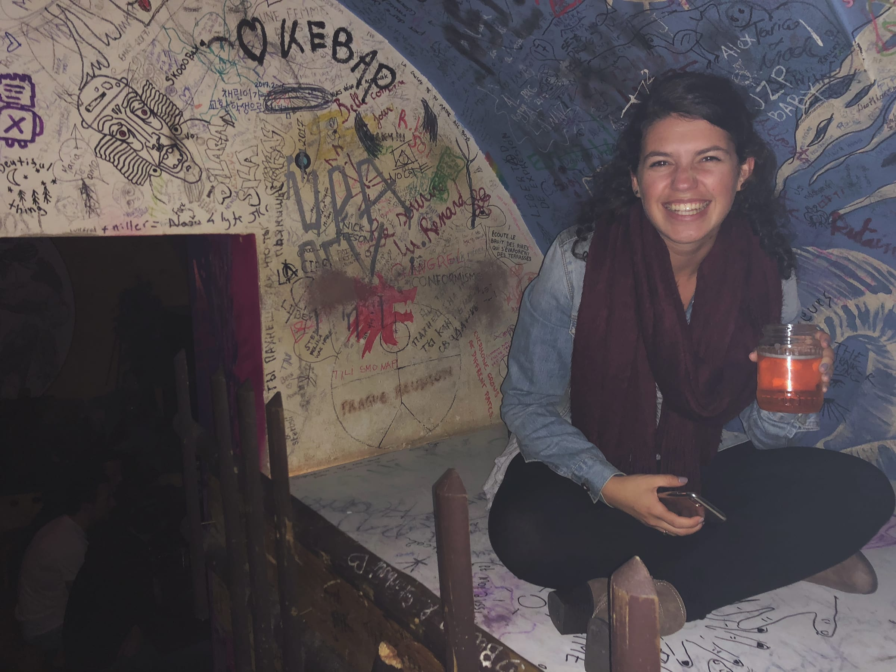
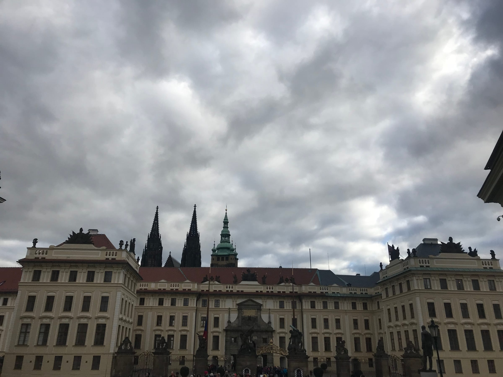

you better beer-lieve we had a great time in Prague

Tuesday morning, I left Madrid (with one last _bocadillo_ sandwich) and spent most of the day at the airport or in the air or on the Prague metro to get to my next break location – the Czech Republic! The metro was pretty easy to use and I was at the AirBnb with no problems. The two other assistants (who I was traveling with in Prague) and I grabbed beer from a local brewery and went to a dog bar to celebrate our first evening. (That’s not actually the name but there is a _grand chien_ who wanders around the bar so that’s what it’s known as). The bar was super cool and the drinks were delish (and cheap!). My drink of choice was a delicious pear and honey cocktail - perfect for this fall weather.

The next morning, we got up and grabbed coffee and pho since it was a dreary, cold _matin_ and then headed into the Old Town to see the Charles Bridge. We ended up braving the cold weather to walk closer to town which was fun to see the downtown area with the little shops and pedestrian zone. When we finally got to the bridge it was absolutely flooded with tourists (I don’t even want to imagine what it looks like in on-season). We snapped a few pics before deciding we needed a little more space to breathe.

:::gallery{folder="general"}

> no Prague-lems here ... except the wind!

Next stop was the Lennon Wall, just across the river, where we had a mini-photoshoot and listened to a group of French teens sing “Imagine.” It was pretty funny seeing as all three of us work in high schools and were technically on break from them. The wall was a must-see! It was so bright and colorful with art and quotes spray painted all along the facade. Coffee break at the _chic_ and famous Café Savoy and then a _trtlnik_ (chimney cake) after in the main square (side note: this is the only world I retained from my trip to Prague, Czech is a wild language)!

:::gallery{folder="general-2"}

> just Lennon against the wall

Dinner was traditional Czech food at a beer hall before going back to our AirBnb for a little _repose_ before heading back to our favorite dog bar for the night. I snuck out earlier (safely past the big boy guarding the door) as I was getting up early the next morning.

Thursday, I left the apartment and hiked to the castle since my travel pals had already seen it. It was quite the trek up a hill and I treated myself to a well-deserved _trtlnik_ for breakfast.

Met the Prague pals at the bus station for a day trip to Cesky Krumlov which is a cute, little town about 3 hours south of Prague. The bus was a breeze, it was totally decked out with little screens on the back of the seats and even a free coffee! Our first stop once we got to Cesky Krumlov was coffee (and another _trtlnik_ – that makes 2 in one day & no other food for those who are counting). Fueled by caffeine and sugar, we hiked up to the castle after wandering around the town. It was a beautiful view … except for the tourists who were aggressive and pushy, literally. The castle sits on a hill above the town and you can see all the way to a small mountain range with the trees dressed in their autumn colors.

We had two hours before we had to catch the bus back to Prague, so we hung out in a cool apothecary bar (your favorite Czech mark got an espresso to keep the fun going). The bus ride home was lowkey, Casablanca and a hot chocolate made the three hours fly by. We ended our time in Prague back at the beer brewery with some wings (real food - what's that?) and an early night in.

:::gallery{folder="general-3"}

Peace, love, and _trtlniks_,

Lele
