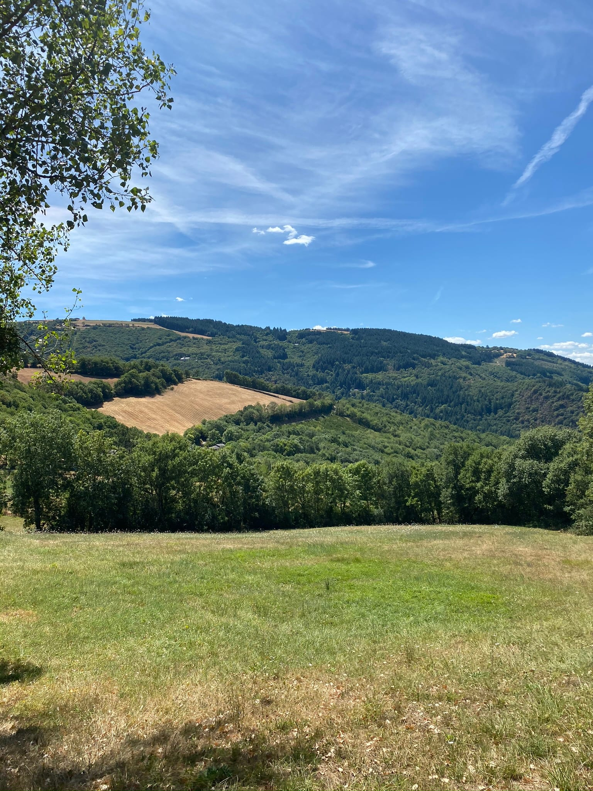
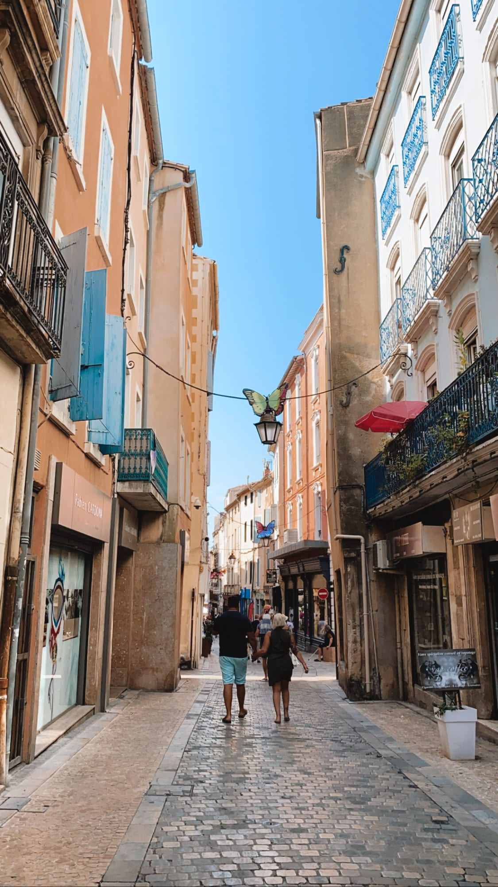

To say 2020 has been different than I imagined is the understatement of the year. Although I was supposed to visit my sister and some friends from Nice in Paris in April, Amsterdam to see one of my besties, a tour of the south of Spain in May (_merci les jours fériés_!) and then heading to Maine in July to finally see the fam, Miss Corona gave those plans a big, fat no.

The good news with all this craziness is that I have accumulated _pas mal des congés._ One of my housemates Noémie suggested we take a week _dans le coin_ aka stay local this year since we didn't really know how things would shape up with confinements and all that good stuff. Our original plans were to head to her grandparents' house with a pool near Narbonne, aka beach time! But life decided to throw another curve ball at us and we settled on visiting her family's cabin in _l'Averyon_ which is a department in France near-ish to Toulouse. It was settled and we started getting pumped and planning, _comme on aime bien faire_!

Océane, Noémie, Gwen and I all headed to _Béziers_ where to spend the weekend at Nono's parent's house. Our first stop? _La plage ... avec beaucoup de vent !_ We had our picnic, splashed in the waves, napped, the perfect start to _les vacances._

That night Noémie's fam was having a little GNO (let me know if you have the ref 😉) so we had an _apéro dinatoire_ or little appetizers before heading to an open-air restaurant to continue the evening! It was a fun evening full of socially-distanced dancing, Moscow mules and lots of laughs - the recipe for a good time!

:::gallery{folder="general"}

Sunday morning we packed up our picnic, stopped at _la boulangerie_ for baguettes, and headed to a nearby lake, _Lac Salagou._ The red rocks provided a stark contrast against the blue water with the sun shining and a light breeze blowing. We ate and swam and laid out before finding an abandoned village _au bord du lac._ Legend has it that when they created the artificial lake, the nearby village flooded and some say you can still see the bell-tower of the church if you dive in the lake!

:::gallery{folder="general-2"}

After an afternoon _bien reposant,_ we headed to Montpellier to pick up one of Nono's friends, Mélanie, from Amiens and then hit up a beach-side restaurant for dinner.

:::gallery{folder="general-3"}

> let the good times Aperol!

Monday morning rolled around and we packed up the car and all 5 of us piled in for 2.5 hours on the road before we got to _Réquista_, the little village where we'd be staying. Highlights included: the car struggling to get up the hilly _autoroute_ because of how loaded-up we were, going through some pretty creepy tunnels, and cows!

Our first step was to unload the car and clear the house from the spiders that decided to call the house their own. _Travail d'équipe_ makes the dream work (and lots of screams, _bien sûr)._ We headed to the grocery store in town to grab food for the week and discovered that we had landed in perhaps the only French town with no _boulangerie!_ Were we even in France? 😮 Then we cracked open the meat and cheese we bought ... and some beers to celebrate our first night!

:::gallery{folder="general-4"}

_Le lendemain_, we decided to tackle a nearby hike since we wanted to wait for the last member of the _tribu_ to arrive. We drove to the village next to ours called _Brousse-le-Château_ to start our 8 km hike. It was cool hiking in a village because we got to walk through the cute town before hitting the open road. We stopped in a field for our lunch and decided we had earned a _Monaco_ (a beer with grenadine and Sprite) after our long day. When I tell you, I have never seen 5 girls power-walk at the end of a hike like we did ...

:::gallery{folder="general-5"}

The rest of the afternoon was spent _au bord de la rivière_ splashing in the water and relaxing before heading back to the house for some _rillettes du canard_. (We might have gone a little overboard with the quantity ...)

:::gallery{folder="general-6"}

It was hump-day which was a lazy morning hanging around the house after doing our workout! We took advantage of the hot day -- we were really blessed with the weather -- to hit up another lake! We did our crossword puzzles, a newfound passion rediscovered on this trip, while we waited for Océ's friend, Mathilde to meet us.

_Et c'etait parti_ for 2 hours of pedal boating and paddle-boarding, _faire du pedalo et faire du paddle_ in case you were curious! We had a blast exploring the lake and hanging out and taking lots of photos. Dinner was a homemade _tarte_ with lots of veggies followed by some card games to end the night.

:::gallery{folder="general-7"}

Our biggest day yet, we were up and at 'em to call every _canoë-kayak_ place in the area to see if we could reserve for the same day ... with success! We packed our lunches and set off towards the Tarn river. We got our gear and life-vests and paired off in kayaks to head off on our 14 km adventure.

In classic Lele fashion, Gwen and I managed to hit the first rapids at the wrong angle, got stuck on a rock and promptly overturned our boat. _[#LaLoose](https://www.forkspoonandstraw.com/home/hashtags/LaLoose)_ But, we dusted ourselves off and had no troubles the rest of the way. We paddled down the river, taking on rapids and stopping to swim and change up boat partners every so often.

:::gallery{folder="general-8"}

About 2/3rds of the way through we came to the famous _toboggan_ that we had been warned about before we left. Fun fact, this was right next to _Brousse-Le-Château,_ where we had hiked and swam the other day! Basically there was a dam and we were meant to slide down the left side of it. Mathilde and I were leading the pack and got out on foot to investigate as this was no joking dam! Sure enough, there was a slide down ...

We paddled down and then screamed for our lives - it was like Splash Mountain on steroids! Apparently behind us, all the girls could see was the back end of our kayak disappear and then our screams for a couple seconds. Safe to say, _on a toutes survécu_ and had a blast doing it, definitely one of the highlights!

We were all _KO_ when we arrived at the end and the two drivers grabbed the cars as we laid on the grass and waited. We quickly went back home, showered, and got ready since we had dinner reservations (one of the only restaurants in the area, and it was 30 min away). The views were gorgeous and the food was amazing! If you are ever _dans le coin_, I recommend it - 5 stars!

:::gallery{folder="general-9"}

> coloc de rêve

Our last night was spent lying on the grass and watching the stars, and counting shooting stars ... which we are sure were real and not bats. A lovely way to end an activity-packed week!

Friday morning we lounged around, worked out, and cleaned the house to pack up and leave. We stopped at our final lake, since it was a scorcher, for our final few hours together. Océ and Mat headed down to Marseille, we dropped Mel off at the airport, and Gwen, Nono and I all grabbed a _Macdo_ and chilled in the hot tub back in Beziers.

I was dropped off at Narbonne Saturday morning to take the train back to Toulouse and I got to walk around and explore the town a bit. Then a 1.5 hour TER ride later and I arrived in the sweltering, pink city I call home.

_Les vacances_ were super fun and exciting, and Monday morning back in the office was a bit tricky. I'm super lucky I had friends and _collocs_ that had vacation time that lined up and that we all got to do something together. I also realized after the fact that it was a solid week _sans anglais_ so that was pretty cool!

_Aux prochaines vacances_ (I hope!),

