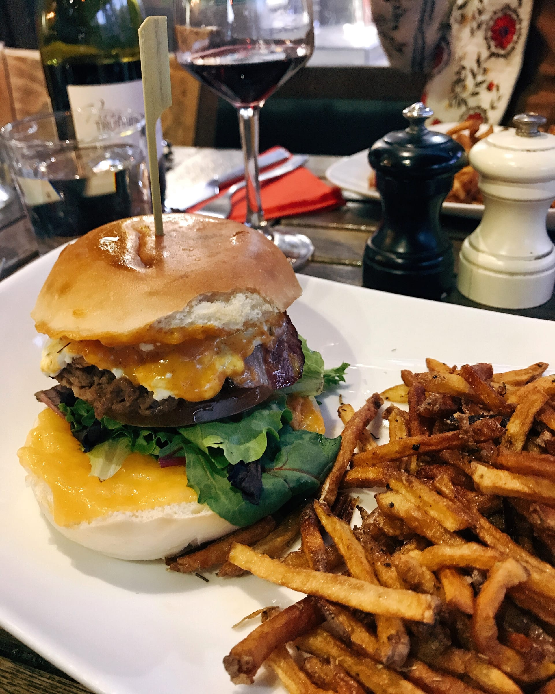

import Gallery from '../../../components/Gallery.astro';

## Villefranche sur Mer

The weather has been so gorgeous, we all wanted to go to a sandy beach! Nice is nice, but we needed a change from the pebbles and rocks. Friday morning, Katie and I headed out on 2 stops on the train to _Villefranche-sur-Mer_ for the afternoon. We had some _rosé_, _une baguette_, _Boursin_, truffle sausage, truffle cheese ... (sensing a theme here?)

<Gallery post="des-voyages-entre-villes" folder="villefranche-sur-mer" />

> la vie en _rosé_

The train station dropped us off across the street from the beaches and we spend the rest of the day lounging and _pique-nique_ing and taking plenty of photos on the gorgeous golden _sable_. Abby met us in the afternoon and we got our tan on! Then, we wandered around the cute, little streets of the Old Town and even popped in some little shops. As the sun set, we took the bus back to Nice for some evening mojitos for _apéro_ and some tacos for dinner.

<Gallery post="des-voyages-entre-villes" folder="villefranche-sur-mer-2" />

## Èze

The next weekend, we headed out to _Èze_, a medieval city perched on a hill known for its botanical gardens! Katie and I took the 20 minute bus ride along the coast and got to the town in no time.

We wandered through the hilly, narrow streets before deciding to grab a _bière_ and wait for Melissa.

<Gallery post="des-voyages-entre-villes" folder="ze" />

After looking at the clock, we quickly ran up the hill to the gardens since it was due to close in a half hour! We got to the top and found ourselves among cacti and blooming flowers! Spring on the Riviera is beautiful. We had a blast taking a bunch of pictures in and among the plants (I only hit my head on a cactus once [#dedicatedphotographer](https://www.forkspoonandstraw.com/home/hashtags/dedicatedphotographer)). Before long, we heard the closing announcement and meandered back down the town, which was beginning to close for the evening.

<Gallery post="des-voyages-entre-villes" folder="ze-2" />

> taking it _Èze_ (pronounced like all the Americans ... Ez)

After the crowded bus ride back to Nice, we decided to stop for dinner and grab some burgers! The juicy burger with goat cheese, bacon and honey hit the spot after a tiring afternoon walking uphill.

you've GOAT to be kidding me ...

## Cap d'Ail

It was due to be a beautiful day and Abby, Katie and I all headed Cap d'Ail and met Melissa for another beach day at _Plage de la Mala_. This secluded beach is sheltered in a little cove and has some stunning rock formations as a backdrop to the blue sea. We grabbed some sandwiches from the _boulangerie_ in town after getting off the train and walked about 15 minutes to the beach.

<Gallery post="des-voyages-entre-villes" folder="cap-d-ail" />

The weather could not have been more perfect and we has a blast laying on the beach, reading and ever popping into the Mediterranean for a few minutes at a time (hey! it was only the last weekend in March at this point ...) We snapped some pictures against the rocks when a man came over and asked if we had any _crème solaire_ (sunscreen) he could borrow. As a thanks, he let us borrow his little plastic kayak and we all climbed in and tried not to flip or sink the boat! I paddled us over to a cave we had seen earlier and we checked it out. We made it back in one piece and only 2/4 of _les filles_ tipped the kayak!

<Gallery post="des-voyages-entre-villes" folder="cap-d-ail-2" />

## Monaco

It was our last day all together ... and _Les Filles de Chateauneuf_ headed out to Monaco! We were going to a concert! We had always talked about going to see an orchestra or a ballet and now we were actually doing it.

We grabbed some French tacos (for the memories— it was our first meal all together in the apartment!) and headed out on the train. We made it to the station in a little under a half-hour and walked into town.

<Gallery post="des-voyages-entre-villes" folder="monaco" />

We met our [old-Bla Bla Car driver](https://www.forkspoonandstraw.com/home/ski-you-later) to pick up our tickets. Fun fact- we heard about the Monaco Orchestra through her since she plays first-violin and helped us get tickets! We found our seats and before we knew it the concert was beginning

.

We were in for a shock when the first performance was a contemporary piece, but nothing could have prepared us when a man walked out on stage, literally screaming. I couldn’t tell you how the rest of the 10-minute piece went, but there was loud screaming, talking, and a harpsichord. I’ll let your imagination fill in the blanks ...

<Gallery post="des-voyages-entre-villes" folder="monaco-2" />

Luckily, the actual orchestral performance was much better. The first piece was a Brahms symphony and after intermission we listened to a Brahms concerto. Feeling quite proper and cultures, we called our fancy outing a _succès!_

Always having fun on the French Riviera, whether its Nice or anywhere along the coast!

<Gallery post="des-voyages-entre-villes" folder="monaco-3" />

Bisous,

