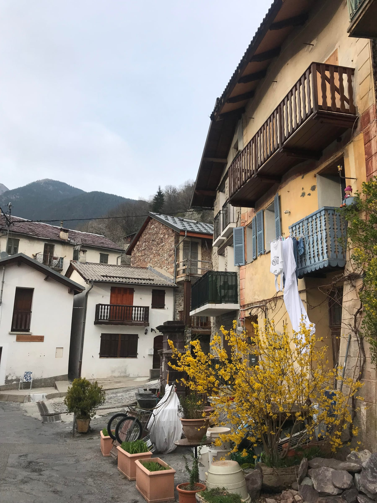
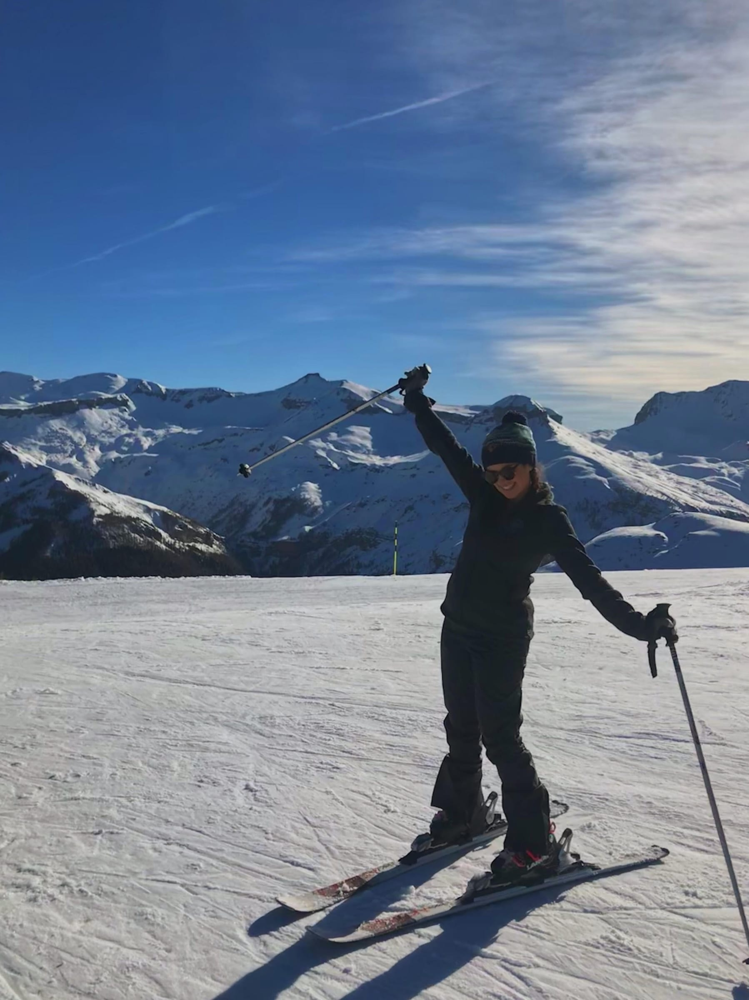

_Imaginez que_ you work 12 hours a week, 2-3 days a week, with minimal outside work except for creating the occasional PowerPoint on Halloween or popular American songs …

Sounds like a dream, doesn’t it?! Well welcome to my life for the past seven months. As an English Language Assistant through the CIEP (TAPIF for all my Americans out there!), I worked at a high school in Nice, France and spent the rest of my 156 hours of my weeks figuring out what to do with my life.

Kidding! France may or may not have made me 20% more dramatic than I already was but it was a nice life [#nopunintended](https://www.forkspoonandstraw.com/home/hashtags/nopunintended). So, I’m here to break it down for you all – the Good, the Bad, and the Ugly (…ok just complicated) of being an English Assistant _C’est parti!_

**Le Good** : I was super lucky to only work two days a week, Monday and Tuesday, while I was here. That’s because my situation was a little unique, but we’ll get into that with The Complicated. My school was also super welcoming and nice, and I’ve even made a few teacher/colleague friends here! My lesson planning was so low-key and I usually tried to include conversations and a lot of either pop culture or American culture and holidays to keep my students interested. Nothing was better than the day we learned American slang and after lunch I heard all my students greeting me as I walked down the hallway saying “Skrrt!” And truly, even as much as I dread walking down the halls (flashbacks to my high school days and also, I'm about 4 inches shorter than most of my students) it does always put a smile on my face when I hear all the "Bonjour ... er 'ello"s. I also was on the luckier end of things with housing and even roomed with two of my super close friends I met here, as well as made other assistant friends to share delish meals with, hang out on the beach with, or even just get together on a Saturday night in the Old Town. My landlord is really kind and was able to accept us to live in the apartment without too big of a _caution_ or a guarantor in France.

The free time has allowed me to explore the city of Nice and the surrounding areas, as well as perfect my French cooking – I have mastered quiches, pastas, and even _ratatouille!_ The beach is a mere 15-minute walk from my door and the weather in the South of France has been so much better than Upstate New York where I went to school. Plus, who can complain when we get a two-week (paid!) vacation every six-weeks … I’ve gotten to travel all over Europe and have some friends and family visit!

:::gallery{folder="general"}

**Le Bad :** France isn’t all sunshine and _rosé_, I have faced my fair share of catcalling and harassment here during my past year – some of it even driving me to tears from frustration. I also came into the program thinking that all the French kiddos would be super good at English since they start learning in middle school. Boy, could I not have been more wrong about that! I had some kids not knowing numbers, how to properly say their age, and even not knowing the English alphabet on my first day. It was an eye-opener, every time I asked (what I thought was) a simply “How’s everyone doing?” and was met with blank stares and the infamous French noise that I would come to learn was the equivalent of “I have no idea what she’s talking about.”

Opening a bank account here was also a huge struggle, I technically didn’t have everything finalized until well into November, and even then, I received a scary email saying my account was in danger of being closed permanently because of a problem with the rent contract I provided. Also, as lovely as Nice is, there is a huge stereotype that the _niçois_ only associate with other _niçois_ and sadly we've come to find that one true. French friends are notoriously difficult to find, and it's been even trickier _dans Le Sud._

there must be more than this provençal life!

**Le Complicated :** France’s bureaucracy always gets the best of me. For example, I applied for CAF which is basically public aid since we make such little money and (luckily!) received aid for my first two months here, but from then on, I was pretty much denied anything else since I was told “you make too much money”. Not quite sure what changed from month to month but I tried my best (aka pestered and sent many, many emails).

I came into this year knowing we would only make a little money, and spent all summer plumping up my savings account – however my rent was still much more than I expected and my plane ticket home also cut deep into my savings. Luckily, there are side hustles you can do as an assistant such as teach English online (@ me for my referral code) and babysit or tutor.

I also had much more free time than most other assistants I know because I only work Monday and Tuesday since my school is about two hours from my apartment. My school is a boarding school so I’m allowed to stay there Monday nights (an extra night of rent holla!) and my secretary and I worked together to make sure I was able to fit all my hours in the two days. Personally, the biggest downfall with this is finding someone to take me back down to Nice on Tuesday nights since I hate asking people for favors. But that seems like a personal problem.

All in all, I feel like my time in France was fun, served with a side of “It’s Complicated.” Again, pretty sure France has just enhanced my complaining as I slowly assimilate. This past week at school has probably been the most fun, since I have basically been just doing chocolate-chip cookie _goûters_ and American dances and games with my students and making cookies for all my colleagues. I also had some crazy, high expectations which is why I think things were grayer as opposed to black and white.

I went into this year also thinking I would renew my contract (and put off the real world and a “real job”) for one more year. I applied for my renewal, but when the time came around to accept, I couldn’t bring myself to decide to accept. The coordinator emailed me saying the deadline had passed and I sort-of just accepted my fate. So here I sit, heading into my last week as an employed person, searching for jobs in the States and France and (again) still trying to figure out my next move.

Let’s raise a glass to employment – _santé_!

Lele
