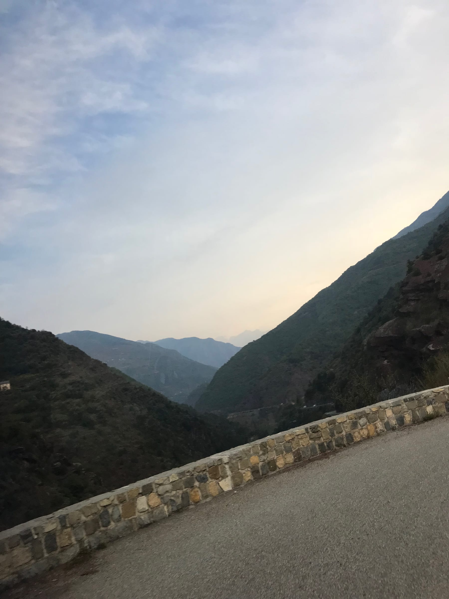
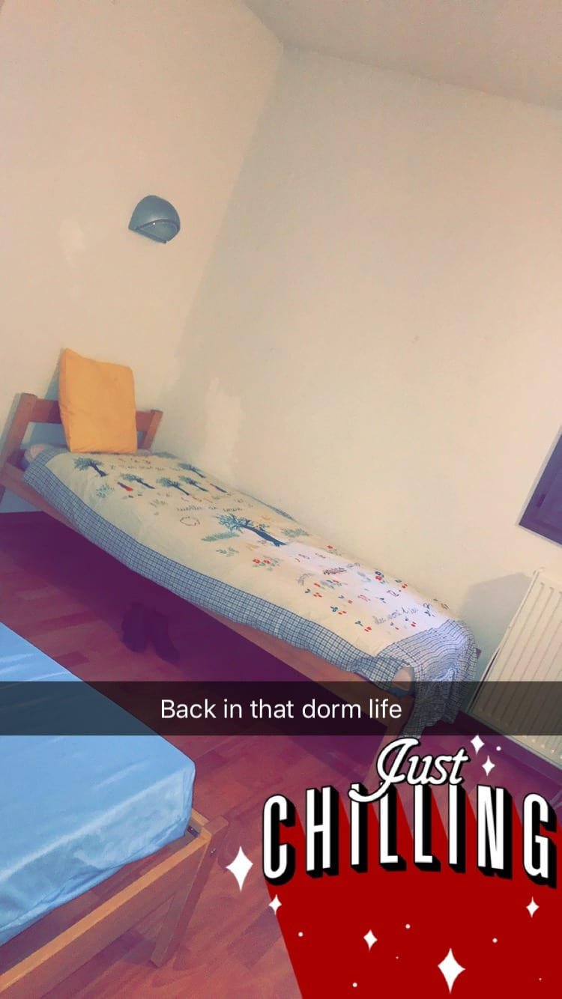
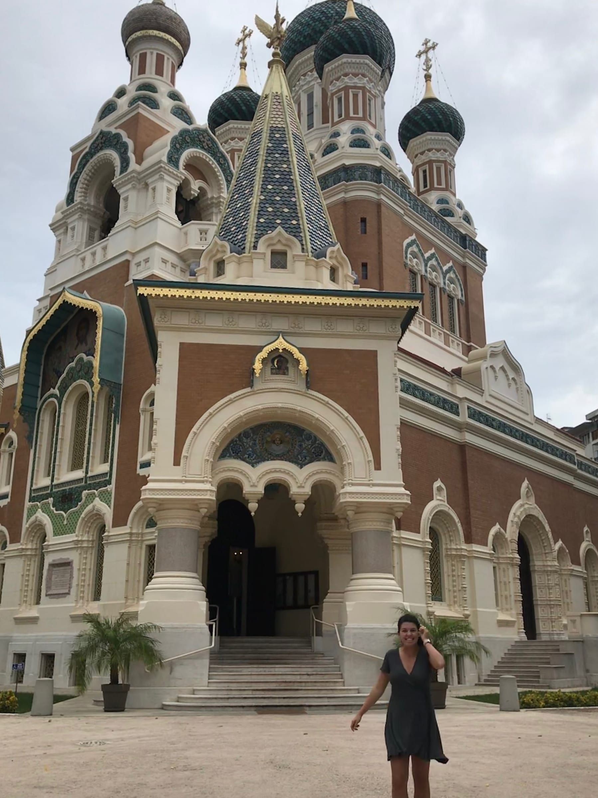
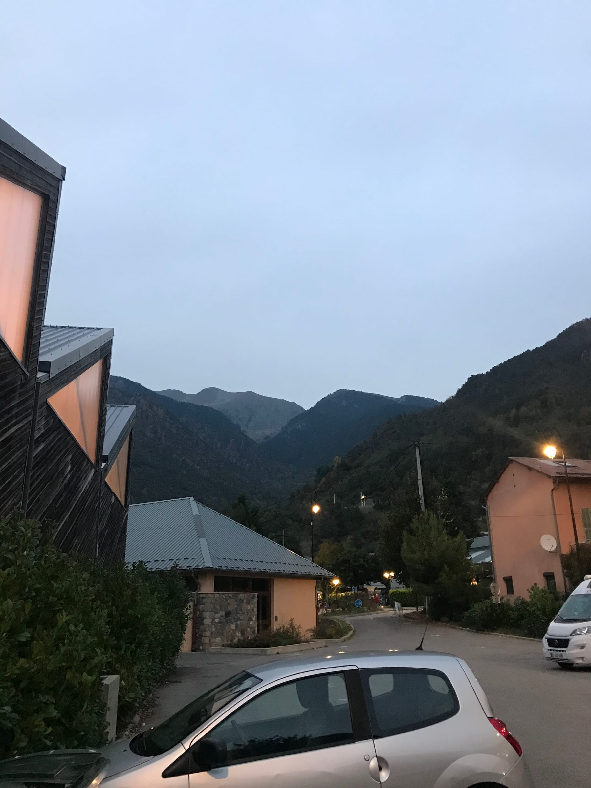

What better way to start the next year of your life in a foreign country! Birthday week kicked off with a 5:45 am wakeup call to _prendre le bus_ with the students to go to school. I even managed to sleep (I think) for a bit on the hour and a half ride up. I arrived at school and learned I would be observing some more classes this week – one of my profs joked that I could do my All About Me powerpoint in my sleep and that was pretty accurate. Mondays are a rough and early start but apparently, the teachers like to make sweets on Sunday and bring them in! _Pas mal!_

Not going to sugar coat it, the first night in the _internat_ or boarding school was a little lonely. I hung out in my internet-less room and had dinner alone in the teacher’s lounge. Things turned around when my “roommate” aka another professor who stayed over Monday night came back and we ended up talking for about an hour about food, differences in France, places to travel too … _très sympa !_

Caught a ride down the next day with a French professor (if that’s not intimidating when trying to speak French after a day of speaking in English in classes I don’t know what is!). and was about to hop on the tram home when it seemed a little too quiet. _La grève !_ The strike! I had forgotten there was a transportation and school strike and only about 6 bus lines were running, none of which were headed in the direction of my apartment, of course. So I trekked home with my winter-mountain clothes and joked about it with the housemates before crashing early.

Wednesday and Thursday were spent trying to convince different banks to give me an appointment ASAP. Turns out when you say it is _très urgent_ the soonest they can help you is a week. Again, gotta love French bureaucracy.

we were Russian around all week (jk this church is only 5 min from our apt)

Friday rolled around and Melissa and I woke up and went for a birthday run (and then grabbed a _pain au chocolat_) on the way back because _pourquoi pas_. Then I taught for a little bit before Katie and I headed to the beach for a birthday beer. We met back up with Melissa for a _kir_ and planned the evening.

> cass-Is this real life?

Katie’s professor had invited her to a wine tasting so we tagged along and _tant mieux!_ There was some good wine and cheese but the star was truffle ham! I want to go back and eat about 2 kilos worth of it! Katie went with her prof to dinner and Melissa, our friend Abby and I headed back to the Old Town to find some cheap eats. We stumbled upon a strange Italian street food place with calzones? But French? Anyways it was good and we got to practice our _Grazi_s! We ended up at Fenocchio (love of my life!) and I finally got my _pistache_ ice cream before we went to a bar in the Old Town called Wayne’s. The live music was good and we ended up chatting with a British guy on vacation.

> Pist-ask me how great this day (and ice cream) was!

:::gallery{folder="general"}

The next morning Melissa and I headed to the beach for our _assistant de langue_ beach picnic! We posted on Facebook and quite a few assistants showed up which was fun. Who can complain when there’s wine, cheese, snacks and even a little birthday cake! We went out that night to a tapas bar with a group of assistants.

:::gallery{folder="general-2"}

Currently I’m back at _Le Lycée de la Montagne_, chilling in the Teacher’s Lounge after dinner with two Euro-volunteers from Germany and Italy who are here for the year at the school too. Had my first classes today and it was wild trying to match schedules with profs, students and myself and I have some things to switch around _demain._ Besides that, this week will be spent relaxing and working before 2 weeks of vacation! It feels like we just got here and we’re already going on break. I mean no complaints … _il faut profiter !_

À toute à l'heure,  Lele xx
