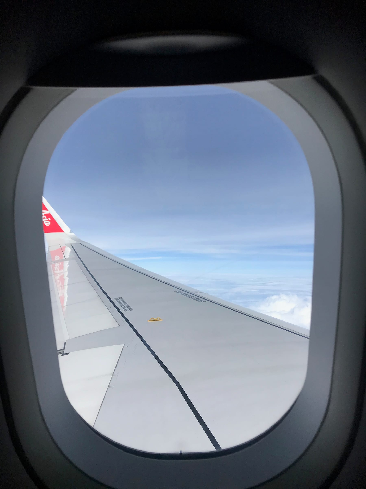
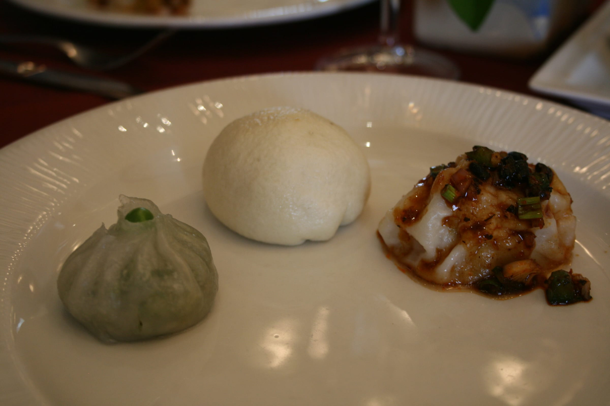
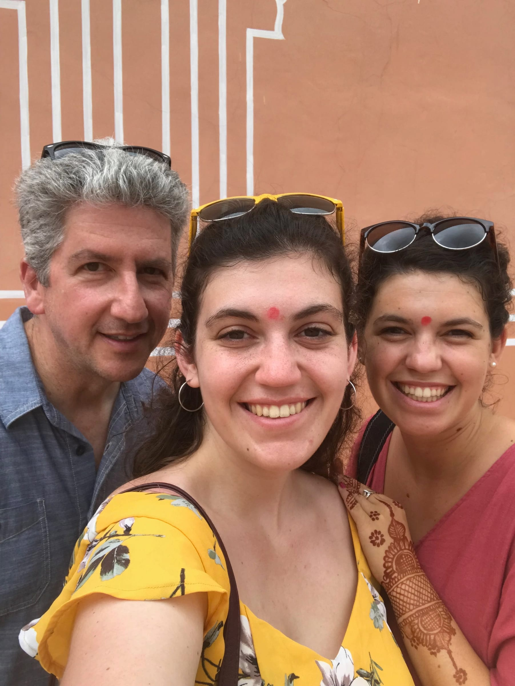

_if you're just tuning in, i'm on holiday in South Asia! check out_ [_part 1_](/posts/mumbye-america-hello-india)_,_ [_part 2_](/posts/let-s-maldives-right-in)_, and_ [_part 3._](/posts/let-s-go-a)

We had another early morning flight from Goa and we braved the monsoon while driving to the airport. The flight was pretty uneventful except for some turbulence in the beginning and we touched down in New Delhi about 2.5 hours later.

Our driver Vickram (who Claire had used when she did a similar trip) met us at the airport and greeted us with leis and some cold water! We set off towards the city as the sun tried to peek out from the clouds.

Vickram gave us a mini-tour of the government center (the India version of Capital Hill) and we drove down a grass-lined wide road (the India version of the Champs-Élysées) and then saw The Gateway to Delhi (the India version of the Arc de Triomphe). We also drove by all the embassies before going to our first official stop - Humayun’s Tomb.

We were dropped off and we walked the 5 minutes to the site and bought our tickets. India pro tip: check the lines for purchasing tickets! Just like how security has separate lines for males/females, they usually have separate lines for foreigners!

:::gallery{folder="general"}

Humayun was a Mughal emperor and this mausoleum was built to house his tomb in the late 1600s. It’s a UNESCO site with gardens and everything. While we walked down to the actual building, Claire gave us a brief overview of the Mughals. They were a group of people who ruled over the Indian subcontinent for about 300 years. They used a bunch of fancy symbols, one example is a six-pointed star (yup, like the Star of David) but there is no connection between the two. Our overheating tour guide and walking history book finished by telling us the Mughals were less fancy than the Muslims so we should make sure to take note of differences in the different styles when we got to Jaipur.

Let me tell you, without the monsoon rain to cool it down, and the sun blaring down (behind clouds) it was hot! We lasted maybe a half-hour total before the heat/sweat got to us. The site was beautiful and the red sandstone was something different that we hadn’t seen yet! We quickly walked out the exit, warded off the taxi/rickshaw drivers asking if we needed a ride and took solace in Vickram’s air-conditioned car.

:::gallery{folder="general-2"}

> ^^ this is the face of a very overheated girl

We decided to go to lunch and got a recommendation for some tasty options in a really nice hotel. We settled on some _dim sum_ before we headed to the Lotus Temple.

words cannot express my \[fillings\] for these dumplings!

This _Bahá'í_ faith non-denominational temple is also located in New Dehli. But the best part is clearly the architecture! It looks like a white lotus, complete with some pools surrounding it. And if you don't like crowds of people, I'd advise you to go early ... I don't know if I've ever seen that many people in one space!

:::gallery{folder="general-3"}

The drive was about 3.5 hours and we came into the city greeted by cows hanging out in the middle of the street. We got dropped off at our hotel - the only heritage hotel in Agra and checked out our upgraded room. Then, we headed down to the courtyard for some traditional Indian _henna_. There was a girl doing them for free and Claire and I each got a beautiful design on our hands. We were meant to head to a rooftop restaurant for dinner to try to peep the Taj Mahal at sunset, but the _henna_ took a little longer than expected and there was no visibility because of the rain. Full from our Indian dinner, we headed to bed early since we'd be waking up before the sun!

:::gallery{folder="general-4"}

> she did this with no stencil or anything!

We were definitely tired but happy with our decision to beat the heat (and the crowds) by getting to the Taj just as it opened at sunrise. With the foreigner ticket, you get a free buggy ride to the actual site, water, and some super fashionable booties for when you actually go into the mausoleum.

:::gallery{folder="general-5"}

The marble Taj Mahal really is breathtaking. It's huge and white and even at sunrise ... there were so many people! We snapped our pictures (peep the pinching picture, we began a trend!) and then headed to the mosque. This is where I'd heard you can get a really good empty picture of the Taj from a different angle and it didn't disappoint ... except for the scaffolding. We spotted some monkeys chewing on a man's flip-flop outside the mausoleum and headed in.

:::gallery{folder="general-6"}

:::gallery{folder="general-7"}

> sure glad I Taj Maha(u)led myself to India!

Honestly, the inside was much less impressive. We didn't spend too much time inside but walked around the outside and looked at the Yamuna river. If we weren't so exhausted we would have gone to the Agra Fort, but since Claire had already been and we were going to a fort in Jaipur we decided to skip it in favor of a morning nap.

:::gallery{folder="general-8"}

After breakfast we hit the road again, first finishing in Agra with the Baby Taj, or _Itmad-ud-Daulah_'s tomb. The Taj was based on this smaller marble building, which was more colorful, and whose inside was a bit more impressive in my opinion. We got our pictures in, and then were accosted by a family who quickly snapped a selfie with us. [#InstaSweat](https://www.forkspoonandstraw.com/home/hashtags/InstaSweat) Feeling hot again, we quickly found Vickram and the car and set off to Jaipur.

:::gallery{folder="general-9"}

We made it after a stop for gas and headed to a local jewelry store to look for a gift for Momma and for ourselves and friends! We were shown how the polish the precious and semi-precious stones and then they gave us some of the most delicious chai we had on the trip! Claire got a ring and I decided on a ruby bracelet - for the pink cities of Jaipur and Toulouse! We then popped into a cashmere store and I bought a Sunday/Monday scarf which was reversible!

:::gallery{folder="general-10"}

> we also may or may not have found the Black Panther necklace [#wakandaforever](https://www.forkspoonandstraw.com/home/hashtags/wakandaforever)

We checked into our last hotel - also a heritage hotel and grabbed dinner in the outdoor patio restaurant. It was super tasty but the highlight was the French bulldog who was also visiting the hotel.

:::gallery{folder="general-11"}

> we lovingly named him "Chonk"

Our final morning in India, Vickram got us _samosas_ and _lassi_ (much better than last time!) and we first drove through the old city to see the _Hawa Mahal_ which was the old queen's stalking palace. Totally kidding! But in reality, the palace has a wall of windows so that the royals inside could see out, but others couldn't see in. We then set off to the _Amer_ Fort, trying to outrun the afternoon storms. We walked up the hill instead of taking an elephant ride since we were already upset about how they were treated. The fort has a wall surrounding the city and it reminded me of the Great Wall of China! It was hot, hot, hot (sense a theme here?) and we explored the fort in record time to get back to the car.

:::gallery{folder="general-12"}

:::gallery{folder="general-13"}

> Claire was really trying to get this trip sponsored by a bottled water company

We stopped at the Water Palace to snap some pictures (and have a family try to take a picture with us ... we knew to say "no" this time!) before our final stop in Jaipur at the City Palace. We chose to skip some of the sections since we were all so wiped at this point, but we definitely enjoyed the exhibits and all the pink walls! Highlights included some killer chandeliers and a giant pot that was bigger than I am!

:::gallery{folder="general-14"}

> water we looking at?

:::gallery{folder="general-15"}

We stopped for lunch in town at a hotel and I finally got some _chana masala_ and was in chickpea heaven. We had some time to kill, but during our leisurely lunch, it started raining. And raining. And raining. It rained so hard for an hour that the streets were already beginning to flood and we had to hang out in the hotel lobby since we couldn't forge the river that once was the street. Vickram met us on a side alley and we decided to end our day early and just hang out in the airport so we wouldn't miss our flight.

:::gallery{folder="general-16"}

> _lassi_ but not least

We landed around midnight in Mumbai and checked into our 3 different flights before going through security one last time together. We dropped Claire off at her gate first, then I headed onto my plane, and Dad brought up the rear. Dad and Claire landed on time in LA and I was so exhausted when I finally landed in Boston, I decided to spend the night with Kass in New Hampshire instead of driving all the way back to Maine.

:::gallery{folder="general-17"}

> it's not a family trip of we don't take a pic of Dad sleeping on some kind of transport! / i fell asleep at 9:30 with my glasses on [#wipedout](https://www.forkspoonandstraw.com/home/hashtags/wipedout)

India was a wild and fun adventure. I recommend going into the trip with an open mind and being flexible if plans change, or the monsoons suddenly dump a ton of water. We paid attention and were careful with what we ate and drank and the Dehli Belly only hit me at the very end [#thankgosh](https://www.forkspoonandstraw.com/home/hashtags/thankgosh)

the travel trio!

धन्यवाद India (Thank you India!)

