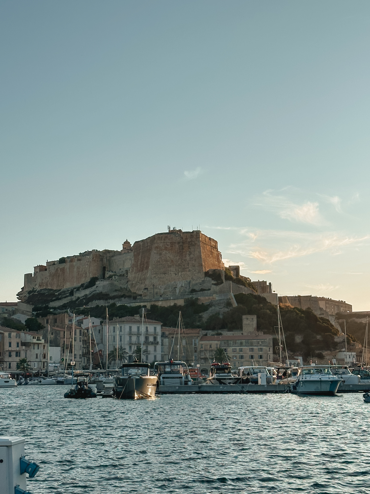

About a week into our _voyage en Corse_ and we definitely understood why they call it _Île de beauté_ ... from the dramatic mountains to the shiny turquoise water, everything was beautiful! 

##### bonifacio? more like _Beau_-nifacio! 

After our [couple of days in the mountains](https://forkspoonandstraw.com/posts/ile-de-beaute-corse-pt-1), we were equally as happy to head back down to the coast for some ocean _aventures_. We drove a few hours (still amazed by the winding roads that took us back down to sea level) until we hit Bonifacio on the southern tip of the island. 

We checked into our hotel and quickly showered off the dust and sweat from our hike in the morning (Corsica will never cease to amaze me for the number of times we were at the beach in the morning and then on top of a mountain in the afternoon or vice verse!) before heading out to explore the fortified old city. 

The _haute ville_ isn't that big and we had a lovely late afternoon wandering around the alleys and small streets (weaving in and out of the tourists _bien sûr_) before coming to stunning views of the limestone cliffs, the paths along the ocean, and the _citadel_ perched up top. 

All this walking around gave us quite the appetite for an _apéro_ and we headed down to the marina to gawk at the fancy boats in the port, and find a quiet spot to grab a drink! We found a cute wine bar that we kept walking past and decided to grab a cheese plate and a glass to wait for sunset, and rest our feet. The cheese? Incredible ... some soft and creamy, others harder with more character. The wine? Refreshing and the perfect way to end the day and start the evening! (Have I mentioned I love this island?)

:::gallery{folder="boni1"}

Then, as the clock ticked closer to _20h_ we headed back up to the old city and the _citadel_ to find our spots on the cliff overlooking the city as the lights came on and the sun went down. The moon was even out and about, making for some truly stunning photos. 

We had managed to snag a late dinner reservation an hour later and decided to take in the nightlife of the quaint city streets, filled with local music and even some dancing.

>Pro-traveler trip: Bonifacio and almost all the other cities we stayed in were still pretty busy even in September and reservations for dinner are highly advised

Dinner was delicious, fresh seafood pasta for _monsieur_ and a spicy tomato pasta with a creamy burrata for _moi_ and a bottle of wine to celebrate our first night in this beautiful city. 

:::gallery{folder="boni-pm"}

Day 2 was jam-packed with adventures and we decided the best way to start off our first full day back on the coast was with a coffee and pastry at our fancy hotel. Expensive? _Oui_. Worth it with the views over the ocean? Also _oui_. 

And then we were off, first to find some bread and _charcuterie_ for our lunch, and then along our favorite ocean path to the beach! The views along the cliff walk were killer and the bright blue sea to our right was the perfect motivation to keep walking under the hot sun ... even with my blisters making an epic comeback. 

:::gallery{folder="boni-2"}

>At one point I was walking with one of my sandals and one of Louis' flip-flops for the fashion statement of the century. 

We made it to our final destination _la grotte de Saint-Antoine_ and _la plage_ to enjoy our sandwiches in the shade before spending the afternoon splashing in the sea and looking for colorful fish. 

The trek back was a bit longer ... and a bit hotter ... and a bit more painful with my blisters. But nothing a refreshing ice cream couldn't fix as we arrived back at the hotel to shower and change before our second sunset in Bonifacio. 

Dinner was a wild adventure, we had a hard time making a reservation and ended up squeezing in the second service at a restaurant recommended to us by a friend. A good half hour after we had the reservation, we finally sat down at the table ... to an incredible view looking out over the cliffs and the oceans with the moonlight reflecting on the waves. **worth it.** 

The next morning we loaded up the car and headed down to the _Escalier du Roi d'Aragon_ for 189 stairs carved into the limestone cliffs and a walk along the water before grabbing a well-deserved coffee with another great view to say _au revoir_ to Bonifacio and _bonjour_ to _la plage de Roccapina_, our afternoon destination!

:::gallery{folder="boni-3"}

##### a lion watches over us on the beach

Getting to _la plage de Roccapina_ means being prepared for an adventure filled with small, bumpy roads ... nothing our _titine_ couldn't handle. And once we arrived, we had the beach, almost all to ourselves! 

The rocks overlooking the cove of the beach are shaped like a lion laying down and sunbathing and we enjoyed the killer views while snacking on our focaccia sandwiches and filling out our _mots-flechés_ in between snorkeling sessions. That's the good life! 

:::gallery{folder="rocca"}

As the sun rays faded, we headed back to the city we landed in off the ferry - _Propriano_ to actually explore this neck of the woods. I found a cute little restaurant perched up above the city that seemed like it would be perfect for a sunset and a great dinner. The dinner was pretty good, the sunset was a bit blocked by clouds (a first for us on this trip!). 

##### popping around Propriano

The city itself is nice, but the beaches around are even nicer! Our _plage du jour_ was another recommendation - _Porto Pollo_ which seemed a bit less touristy than some of the other beaches we had explored before. Maybe it was the marine layer. Maybe it was the many cactuses along the path to the little coves. 

We found a little inlet all to ourselves, aside from some fisherman passing by _du temps en temps._ The tides brought in some new ocean friends, from sea tomatoes to little shrimps and of course, lots of fish. 

:::gallery{folder="propri"}

We had worked up quite the appetite with our little walk to the end of the point and back and were very happy to have found a little wine bar with _tapas_ for dinner ... even without a reservation! 

Our last morning in Propriano led us down a mountain pass and over to the _presque-île de l'Isolella_ which was a stunning find. The morning clouds and slight drizzle in the mountains cleared up by the time we got to the beach and the fish were out and about for our viewing pleasure! 

:::gallery{folder="iso"}

*I do feel like it is important to note that we did have a bedbug scare at this point in our Corsican adventure unfortunately. Louis got bitten a few times and we had a lovely evening sorting through all of our belongings to make sure none of the little bugs decided to join us for the next part of our journey.*

Stay tuned for the next part of our adventures that take us further up the coast. Spoiler alert, there are new hikes (new blisters) and even some _toulousain_ pals along the way! 