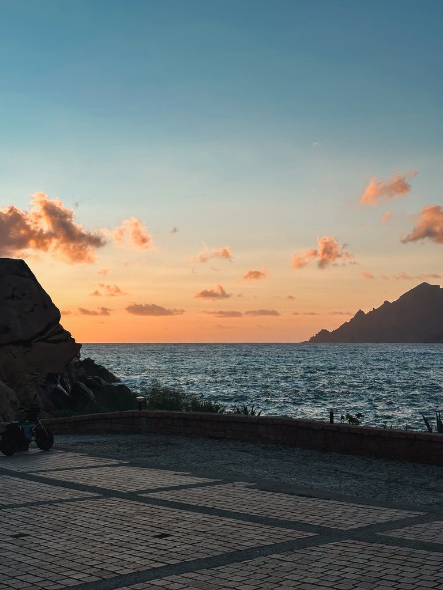

We had seen the [mountains](https://forkspoonandstraw.com/posts/ile-de-beaute-corse-pt1), we had discovered the [beautiful blue water on the plages](https://forkspoonandstraw.com/posts/ile-de-beaute-corse-pt-2) ... but we had yet to head into any of the "big" cities on the island.

##### ajaccio adventures

We drove up the coast from Isolella to Ajaccio, the capital of one of the two Corsican departments (sort of the equivalent of states), and luckily were able to find a free parking spot not too far from our hotel! After a quick check in, we headed out into the big, bustling city ... or at least the old town to wander around a bit before dinner.

:::gallery{folder="ajaccio"}

Dinner was some great pasta (it had been a minute!) at a cute spot tucked away in a little alleyway. The noodles were fresh, the sauce was _nappante_ and the flavors were delish! As part of our post-meal _balade digestive_, we found a cute (and Napoleon Bonaparte-themed) ice cream spot, and shared a scoop for dessert! 

> Fun fact: Napoleon was born in Ajaccio and they still are huge fans to this day, from museums to street names, to restaurant names to even street art! 

After an early evening in to sort through all of our affairs for a bedbug check, we deserved a treat the next morning. _Direction un torréfacteur_ for a latte to kick off our gray day. The sun popped in and out as we strolled around Ajaccio, in between cute little old town streets, cathedrals, and the ocean. We even stumbled across the covered market, filled with delicious looking _charcuterie_ and _fromage_ before grabbing some sandwich supplies and packing up the car to go to _les Îles Sanguinaires_. 

:::gallery{folder="ajaccio-2"}

Spoiler alert, normally this peninsula and islands are supposed to be a pretty vivid red color. We didn't quite get the full effect since we had some clouds along the way. We walked along the path, stopping for a quick lunch of sandwiches along the way. Luckily for my poor, blistered feet, the walk wasn't too long - a quick lap around the end of the peninsula with some killer views of the neighboring islands and some boat-spotting along the way. 

:::gallery{folder="iles"}

##### we meet up with some friends for the evening

As luck would have it, we had some _toulousain_ pals that were also in Corsica at the same time as us and we ended up being able to meet up for the evening at their ~~AirBnB~~ villa! Ocean views, a pool, ocean views **from** the pool!, a cute patio area, and a great _apéro_ greeted us as we arrived. We spent the evening hanging out and chatting, and swapping Corsican adventure stories before treating ourselves to a quick dip in the pool the next morning. 

:::gallery{folder="cargese"}

> a girl could get used to this life! 

Fueled up and ready for our next stop, we headed out ... _direction : Capo Rosso !_

This stunning (and bright red!) cape is a long stretch of land, accessible only by foot. Fun fact: it is the westernmost point in Corsica. We parked the car and followed the trail, making good note of the bar waiting for us when we returned next to the parking lot! 

The hike was really nice ... and hot! under the sun of an Indian summer as we made our way down, and then back up, and then up again to the top of the highest point on the cape and the Genoese tower on the tippy top. 

:::gallery{folder="capo"}

And of course, all along the way, incredible and breathtaking views of the bright blue sea against the vivid red rocks along the shore. It was one of my favorite hike we did on the trip and I recommend it to anyone in the area. We ended this 10km trip with a well-deserved cool drink at the bar, obviously keeping the views of the ocean not too far away. 

Back in the car and back to our next stop ... Piana

##### playing (in) Piana

:::gallery{folder="calanques"}

The road to get to Porto (or Piana) (or Porto-Ota) which are all next to each other is amazing. You get to drive (or cruise!!) between the UNESCO _Calanques de Piana_ which are red, granite cliffs that plunge into the water. It almost felt like driving through a different planet, with the sunset making the orange-red colors of the cliffs pop at golden hour. We booked it down to Porto which is the marine side of the municipality of Porto-Ota where we were staying to try to find a parking spot and scoot down to the beach for a sunset since we were on the western side of the island. 

We dropped our bags at our mountain-facing hotel room and then headed out in search of dinner after our hiking-filled day! Pizza was calling our name and we managed to snag a table at a restaurant not too far from our hotel after a little wait. A big pizza and a bottle of _muscat pétillant_ or sparkling, sweet white wine that Corsica is known for was the perfect way to end the evening. 

:::gallery{folder="ota"}

The views of the mountain with the sun shining and a coffee were the perfect way to start the day. We didn't really have a plan in Ota, we just knew the area looked cool and we decided to stroll around town and see what we could find. **Good news:** turns out we were perfectly positioned for the departure of the boat tours to visit the _Réserve Naturel de Scandola_ - a preserved, UNESCO nature reserve only accessible really by boat. **Bad news**: we were in a period of high tides and some crazy waves and none of the boat tours were operating that day ... or potentially the next day. 

We decided to hop back in the car and drive back through the _calanques_ to Piana to a beach we had spotted the day before. A little 20 min walk later (those Corsican beaches are wild!) and we found ourselves on the cutest (and wavy!) pebble beach for the afternoon. 

:::gallery{folder="piana"}

After our beach picnic, snorkeling, and _mots-fléchés_-filled afternoon (sensing a theme here?) we stopped by Piana before heading back to Ota to explore the cute village with views of the natural reserve. Dinner was strategic - a happy hour at the pizza restaurant from the night before for BOGO Corsican cocktails and an amazing view of the mountains before heading down into the port to a little hole-in-the-wall restaurant we had spotted. 

And what an experience the restaurant was. There was only one guy for the 10 seats they had on the little _terasse_ of the restaurant ... so he was our host, bartender, server and cook (and entertainment tbh!). How to describe him? Gruff, I think, is probably the best way. He was to the point, with his (understandably) short menu and *no phones allowed* policy. We were hooked! 

We ordered our dishes and glass of wine to go along with it - only fish options here! - and dug in. It was **delicious**! One of the best meals we had on the island. Louis enjoyed his Corsican x Pad Thai inspired noodle dish with a _langoustine_ and I feasted on my seared tuna burger with a lemongrass sauce. We ended up chatting with the (self-proclaimed) grumpy owner about how the restaurant came to be and his travel-inspired themed dishes from all over the world. 

:::gallery{folder="stretta"}

The next morning was an early one, we were up and at 'em to pack up, move the car and grab our swimsuits ... that's right folks, we had managed to book a _Scandola_ boat tour! The afternoon before there were a few different companies that had said that the sea was calming down enough for tours to head out the next morning and we jumped at the chance after spending 3 days looking at the reserve from afar. 

The waves were bumpy ... at best (at one point I think we all flew out of our seats!) and our first stop on our speedboat was to the _calanques_ but by water this time! We got to even go in a few caves and secret passages and see the differences between the types of granite and stone along the coast. The sun even came out to greet us as we headed across the bay (and a 20 min crazy rollercoaster ride) to the _réserve naturelle_. 

:::gallery{folder="scandola"}

The views were pretty special and it was amazing to see a piece of land, untouched by humans. Pair that with some emotional Corsican music and I will admit, it brought a tear to my eye! We were able to spot a few mountain goats on the granite cliffs and apparently it's a very popular scuba diving and snorkeling spot. 

Our last stop on the tour was the fishing village of _Girolata_, accessible by a 11 km hiking trail - the "Postman's Path" (_Le Sentier du Facteur_), or by boat. That's it. Secluded pretty much describes it to a t. We had a quick stop where we were greeted with cows just chilling on the beach before hiking up in and around the cute little houses before stopping for a coffee. 
`
And before we knew it we were back on solid ground, a bit wetter and a bit more bruised, than that morning ... but with _des étoiles dans les yeux_ as we say! 