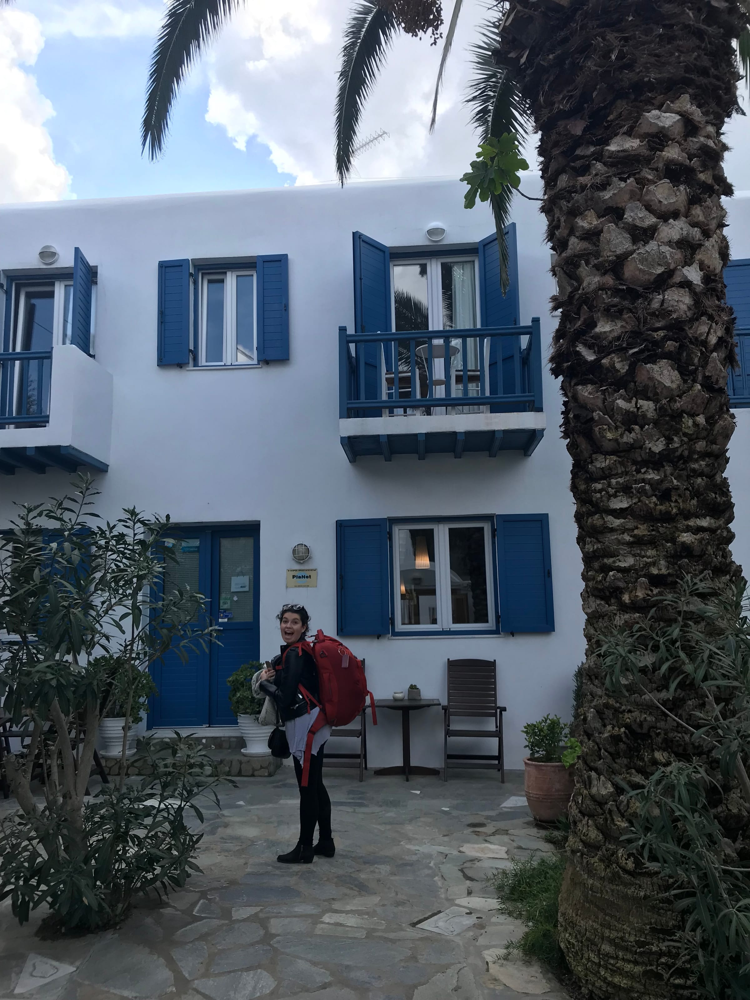
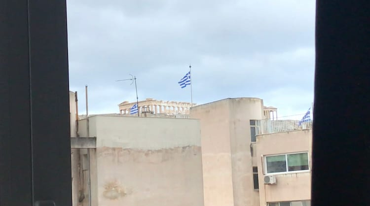

Mamma Mia vibes only for these past 2 weeks! I headed off to school with a huge, orange backpack (borrowed from Katie - thanks bud!) with everything I would need for 10 days in Athens and a few Greek islands ... that’s right, it was my little sister Claire’s spring break and we were putting the SISTERHOOD in the traveling pants, if you know what I mean!

literally as big as my torso

My flight from Nice kept getting delayed, but I got to Paris late on Tuesday night and miraculously met Claire in the RER station to go to our AirBnB for the night. If that’s not amazing Paris planning then I don’t know what is! The good news was that we were staying close to Orly airport, the bad news was that we ended up going to sleep around 1:30 am with a flight that took off at 6 am ...

After a small bump in the road where the AirBnB host didn’t wake up on time, we were on our way to the airport. We dropped off our checked bag and went through security (RIP to Claire’s face wash and moisturizer who didn’t make it through). Before we knew it we were in the air on the way to Athens!

We landed late in the morning in and by the time we took the bus to the city center, it was about noon. We checked into our super-cool AirBnB apartment (view of Acropolis & free wine/coffee/fruit/snacks holla!) and ended up napping for a couple hours.

We slept through the rain and ventured out in the afternoon to the (sadly closed) Temple of Zeus which was near our apartment. We walked around Athens and ended up popping in a jewelry shop to pass some time and buy a cool ring for our Mom [#bestdaughtersever](https://www.forkspoonandstraw.com/home/hashtags/bestdaughtersever)!

:::gallery{folder="general"}

Next stop was a rooftop bar called A for Athens for a happy hour with a view of the Acropolis. I enjoyed a tasty green tea cocktail and Claire sipped on something sweet with passion fruit and lichee. We cheers-ed to our first night in Greece and enjoyed our first (of many!) _gyros_ and _tzatziki_ for dinner!

:::gallery{folder="general-2"}

> the gyros were the real heroes tonight

We slept in the next morning and grabbed some breakfast at another rooftop bar with a killer view called Couleur Locale. We had some traditional Greek _frappes_ (iced coffee for the win!) and yogurt with honey. Fueled and ready to take on the beautiful day, we headed to Acropolis.

Pro tip ... go early in the morning because even in off-season, there were so many tourists!! That being said, it was super cool to see and we even took advantage of the student discounted tickets! We hung out on the hill and soaked up the sun before walking to the Agora. Personally, I liked the Agora more since there were less people around and it seemed more natural with olive trees surrounding the temples and the outdoor museum.

:::gallery{folder="general-3"}

> @forkspoonandstraw in her natural habitat

:::gallery{folder="general-4"}

:::gallery{folder="general-5"}

We stopped in a little _taverna_ for some local wine and a spicy feta dip to refuel before walking across town for some frozen yogurt - hey, when in Greece right?!

Dinner was at another _taverna_ where we indulged in balls of meat and balls of cheese! Super delish, sadly we didn’t get any _baklava_ (but the free warm honey and cinnamon liquor made up for it)! Full and tired, we headed home to crash for the night.

:::gallery{folder="general-6"}

> you \[feta\] believe we crushed all this food!

We slept in a bit before heading for some brunch near our AirBnB. I had some kind of Greek omelet and Claire opted for a smoothie bowl with yogurt. We grabbed our bags and headed to the metro ... when things started to go downhill. We were already rushing a bit to get to the metro and after we bought our airport tickets, I accidentally took us to the wrong metro line and then exited the metro. Aka our tickets were now invalid. We quickly repurchased the tickets, headed to the right airport line and waited for the train. I thought we were in the clear as the next metro was coming in 3 minutes, unfortunately it was not a train to the airport. We took the train as far as we could and then waited for a half hour for the next airport train. By the time we got to the airport, our flight was boarding and we still had to get from the station into the terminal.

:::gallery{folder="general-7"}

> you _bougasta_ be kidding me ... this brunch was so good!

We ran (weighted sprints as Claire called it) and passed through security all while panicking. I spotted on the sign that our flight was gate 28 and we headed to our gates. The signs now said flight closed and we tried our best to run faster, which is not easy when you’re wearing a huge backpack (me) or a duffle bag with a backpack (Claire). Plus we both were getting over colds so we were wheezing as we ran. It was definitely a sight to see. The real kicker was when we looked at all the gate signs and saw 15-23, 23-27, 29-32 but 28 was nowhere to be found! A woman pointed us in the direction downstairs and we (sweatily) ran up to the gate. Wildly, 5 other people got on the bus to the plane after us. What a time!

After that drama, the flight to Mykonos seemed to fly by, to be fair it was only a 30 minute flight. We left the airport and waited for a cab, which we ended up sharing with another couple into Mykonos Town. We checked into our hotel and got the lay of the land and some restaurant recommendations before heading out to explore a bit and grab a coffee (and _spanikopita_, why not!). We walked along the little beach and through the windmills, saying hi to all the cats on the way. Off-season in the islands means getting ready for on-season, and the locals were hard at work with construction or painting (we wondered how many gallons of white paint they go through). Lots of restaurants and shops were closed and at times, I half-expected a tumbleweed to roll through!

:::gallery{folder="general-8"}

> it's never too cold for ice cream!

We relaxed back at our hotel before heading out to dinner near the water. Much to our surprise, so many more shops and restaurants were open. I guess Mykonos really is a nightlife town (that, or everyone knew a cruise ship was about to stop for the night)! We enjoyed some _mezze_, the Greek version of tapas with a glass of wine and beer. We started with _saganaki_, fried cheese, with some sweet chili sauce before moving into shrimp with a roasted red pepper sauce that was to die for! We had a typical Greek omelet with potatoes and Mykonian sausage and some killer _baklava_ for dessert! We snuggled in bed with She’s the Man to end our first, rainy night on the island.

:::gallery{folder="general-9"}

> omelet me at all this good food!

We were blessed with weather the rest of our trip and woke up on the early-side to take advantage of it! We grabbed a _frappe_ and yogurt (I’m going through withdrawals already) before starting our 40 minute walk to Ornos Beach. The walk was along the road, so in the on-season I’m not sure I would recommend it then, however, we only had 3 or 4 cars pass us! We easily found the beach among all the seaside villas and laid out our towels on the super empty beach (again cue the tumbleweeds!). To be fair, it was only March and only about 18°C but it felt so good in the sun, and Claire was pleased with any temperature over freezing with no snow. So we got our tan on!

:::gallery{folder="general-10"}

> honey, honey! how \[the yogurt\] thrills me! ♪♪

We grabbed a snack of fried phyllo-wrapped feta with honey and nuts and sat and chatted a bit more before walking back. We even spotted some donkeys! We hung out before catching the sunset by the windmills and Little Venice. The sky was streaked in pink and orange and was a dream among the old fishing village. We walked through the streets and stumbled across a little boutique that was open. Claire had been saying she wanted some lightweight pants for when she goes to India to do research this summer, so we stuck our heads in. The owner said it was her first day open and basically said the whole store was on sale. Claire found a really cute pair of blue pants that were originally €130 and got them for €25! The shopkeeper was so excited to have business, she told us we could take something we wanted for free and I ended up with a funky ring!

:::gallery{folder="general-11"}

Excited and ready to eat, we took some more pictures of the cute churches as we walked back through town before stopping at the hole-in-the-wall restaurant recommended to us for dinner. Truly the locals had to wave us in to sit down since it didn’t really look open. We treated ourselves to a mojito and gin fizz, respectively, and ordered fried zucchini, Mykononian sausage, and _tzatziki_! We were all set to order _baklava_ and _kataifi_ (a similar dessert) to end the night on a sweet note, but we were told there were no desserts.

We must have stopped at every other restaurant and were either disappointed with the dessert selection, or the prices. We ended up looking at a menu when a local couple came up and told us this place had the best banoffee pie in town. So we headed in, and it ended up being a delish dessert (we ordered a chocolate dish too!)

:::gallery{folder="general-12"}

Sunday morning, we followed the churchgoers into town for brunch and enjoyed _frappes_, yogurt, and a breakfast sandwich while people-watching the locals. We grabbed a cab back to the airport, went through the one line of security, and straight to our gate (1 of 3!).

We checked into our hotel for the night in Athens and headed to grab a snack of classic Greek donuts called _Lukamades_, since we were still full from brunch. We wandered around _Monastiraki_ and popped into a local bar for a drink (it was Saint Patrick’s Day after-all)! We ended the night with _souvlaki_ and _gyros_.

:::gallery{folder="general-13"}

It was the half-way point of our trip and we were super excited for the adventures to come (and of course, the food to eat!)

Here’s to more _baklava_,

Lele (& Claire)
