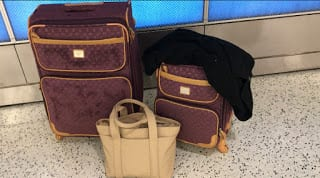
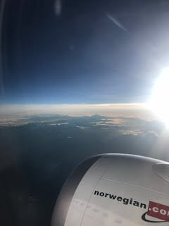
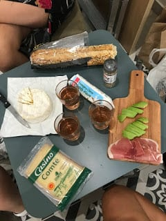

_Salut à tous_!

If you’re reading this, I am no longer homeless in Nice. And can breathe a (huge) sigh of relief. But I’ll back up a little and fill you all in on _mes aventures_ these past few days….

So I packed 2 days before I left for the airport, and then ended up repacking (and breaking down - not gonna lie) about 4 different times during the two days after trying to get my bags to fit the weight limit and amount of two separate flights. But I ended up making things work, or so I thought!

I left for the airport on Sunday morning after a last iced Pumpkin coffee run :( and grabbed lunch with my chauffeurs – sorry, grandparents before they dropped me off at Portland Jetport.

Flight [#1](https://www.forkspoonandstraw.com/home/hashtags/1): Portland à JFK

Airport time: 2.5 hours

Flight time: 1 hour

Total travels: 6.5 hours

Highlights: The lady at the Jetblue counter let me through even though my bag was 1 pound overweight!

Flight [#2](https://www.forkspoonandstraw.com/home/hashtags/2): JFK à Oslo

Airport time: 8 hours

Flight time: 6 hours

Total travels: 20.5 hours

Highlights: After spending an hour or two outside of customs repacking my bags, they were still both overweight. Protip: if you look like you have been crying/will cry at any moment, the people at the counter will just let you go! Got a free glass of wine with dinner which made up for the fact that the plane was delayed and managed to get a little sleep. PSA don't watch Eat, Pray, Love - you will cry on the plane and feel a strong emotional connection to Julia Roberts. 

peep the Alps!

Flight [#3](https://www.forkspoonandstraw.com/home/hashtags/3): Oslo à Nice

Airport time: 5 hours

Flight time: 3 hours

Total travels: 28.5 hours

Highlights: Not much, the sun was setting right as we descended into Nice and truthfully it was the first time I felt excited about this adventure!

Collected _mes valises_ \[my bags\] from the claim (turns out they were the last ones out and also my nail polish exploded, ruining my duffel bag) and was picked up by a family friend, who drove me to his apartment where he let me crash the first few days. Super lucky! Had a tarte and some bread and wine for dinner and promptly fell asleep (until 3 am – gotta love jet lag!)

Day 1

The next morning, I met some of the other assistants to try to find an apartment. We met at (the gorgeous) Place Massena and grabbed _un café_ to get to know each other before we saw the first apartment.

We bussed it over to Apartment [#1](https://www.forkspoonandstraw.com/home/hashtags/1) which was like a 5-minute walk from the ocean. The colors were astounding! The apartment was really nice and completely re-done on the inside. We wandered around the neighborhood and bought French SIM cards – I, of course bought the wrong size for my phone … and then we stopped for some lunch. The pizza was great and the woman who ran the shop gave us a free drink with flavored syrups and water. We decided to walk along the Promenade des Anglais since we didn’t have any other plans and the weather was gorgeous.

Went back to my temporary apartment and had a nice dinner in front of an old Disney movie which was perfect after my first full day! Life still feels confusing and not real that we live here for the next 7 months.

:::gallery{folder="general"}

so close to Italy- on a mission to eat all the pizza/pasta / RDV by the "naked man" statue

Day 2

Met up with a friend from yesterday to see about what we would need to open a bank account and was promptly denied at the first bank because I was American. Apparently, there is some foreign banking act that prohibited me but the cherry on top was when the banker (in French) said “You can thank your president”. I do every day buddy, why do you think I left?? It was also confusing because I had previously had an account at that bank when I studied in Paris 2 years ago.

Went to a few more banks to see and made an appointment for next week. Then we went back to her hostel to do more apartment research and made 3 meetings for that day and one for the next – two of them stood us up – _c’est la vie!_ Apartment [#2](https://www.forkspoonandstraw.com/home/hashtags/2) was a little further away from the town and beach but completely redone (in Ikea no less) and also close to one girl’s school! The landlord asked how long we all had known each other and we all laughed when we realized it has been a day! He thinks we’ll get along well though J

The rest of the day was spent drinking and eating, see attached photo! Don’t know why I didn’t get on that French beer trend last time – Kronenburg and Panaché have been refreshing and needed these past few days. And walking – 21,000 steps and 10.5 miles! Oh and two separate people asked if I was Spanish or South American (the trend continues) …

Day 3

Apartment [#3](https://www.forkspoonandstraw.com/home/hashtags/3) was the meeting spot in the morning – right on the Promenade des Anglais, but the apartment was in a half basement, so there wasn’t as much light and views. It also wasn’t redone but we weren’t saying no mainly because you could cross the street and be at the beach!

We went to a café to talk things over, and ended up finding a yummy falafel place with cheap coffee and beer (huge bonus)! We heard back from Apartment [#2](https://www.forkspoonandstraw.com/home/hashtags/2) that he had dropped the guarantor charges and also told us we could move in ASAP since the other two had to find a new AirBnb. We thought it over and decided yes! Turns out he isn’t completely done with the apartment but he is letting us stay rent free until we start the lease on the 1st !

After schlepping my suitcases in an Uber (where the driver had been to Culver City and told me my English was good – huge win!) I made it to my new apartment!

Unpacked and ordered Uber Eats where we had our first French taco experience – fries + chicken/beef + béchamel sauce all wrapped up. We grabbed a bottle of wine from the store and toasted to no longer searching!

:::gallery{folder="general-2"}

1) Fal-full after this lunch 2-3) Rue Châteauneuf 4) Taco-bout the size of these tacos!

Days 4 & 5:

First morning in the new apartment! Slept pretty well and even managed to have some coffee in the morning before we set out to grocery shop and house shop! We grabbed some stuff and came back for a little impromptu bread/cheese/avocado lunch! And of course ... rosé

the puns are so cheesy already!

Then, we headed back out to get more food and items for the apartment at Monoprix! We all were exhausted when we came back so it was a nice night in making dinner (chicken & salad & potatoes for _moi_).

Saturday, the _filles de Rue Chateauneuf_ all slept in before heading to _Jean-Medecin_ for a little shopping. Then, we (finally) hit the beach! Such nice weather and blue skies – I couldn’t have been happier. We had a nice walk back home (with lots of stops for photographs of the buildings). Then we met with our landlord who brought the housing contracts (and joked that we had to do homework by filling them out). I will say it is nice to feel like I am settled enough here that I can make jokes (and understand them) in French. We had dinner and listened to music on our Smart Mirror (our landlord is the coolest and the cutest) before heading to bed.

Feeling super lucky that I have a place to stay, my roommates are super cool and love food as much as I do, and that there hasn’t really been too much culture shock, especially compared with last time! On the downside I have been walking so much, I already have a blister - but hey, that's to be expected.

:::gallery{folder="general-3"}

Your favorite _niçoise_ is quite exhausted and looking forward to a good first Sunday with some house decorating and crêpes for dinner before orientation on Monday.

_Bises pour tous_,

