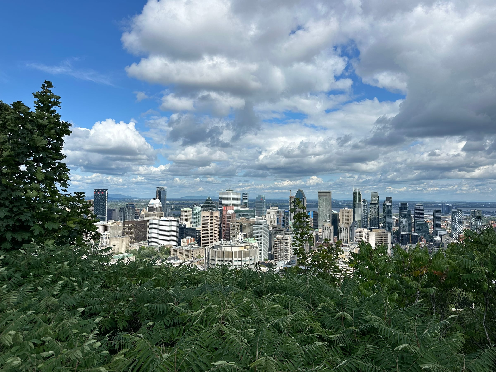

Let me be real with you: we didn’t _just_ go to Montreal for culture. I mean, we got culture - you can't walk two blocks without stumbling into something beautiful, or something French, or something covered in street art. (And trust me, my blisters knew a thing about walking a couple hundred blocks!). But we also went for the poutine. And the NEIPAs. And then more poutine. And then one more craft beer because the first one was so good we needed to verify.

3.5 days in Montreal is not a lot of time, but it turns out it's exactly enough to eat your body weight in cheese curds and bagels, develop a very serious hazy IPA habit, and fall completely in love with a city that somehow feels like home and vacation at the same time.

Here's everything we did, drank, and devoured. (Emphasis on devoured. Bien sûr.)

##### Day .5: Jetlagged and hungry

We hopped off the plane, a direct flight from Toulouse!, in the afternoon. After grabbing our bags and high-tailing it to grab the shuttle that takes you into the city (shout out to my personal tour guide who had lived there for a couple years!), we settled into our home sweet home for the next few days. A friend who lived in the Canadian Towers in downtown Montreal near the hockey arena was also on vacation during our trip and very kindly left us his keys. Needless to say we were really living large in a super fancy apartment with killer views over the city, and of Mont Royal!

Another Montreal-expat-local-university-friend of Louis’ was around during our trip and we met up for a well-deserved dinner of pastrami for _monsieur_ and a chicken caesar wrap for _moi._ Ah, a taste of home! We walked around a bit, trying to get our digestion _en route_ and trying to avoid the jet lag crash post-dinner. We decided to go up to a rooftop for a drink and look out over the city (a real nostalgia moment for Louis!) but our plans fell through once we headed up to the bar, checked out the view and snapped some shots, and then were invited to leave since the bar was closing early due to the storm.

:::gallery{folder="day-5-jetlagged-and-hungry"}

> Summer on the East Coast, always full of surprises!

We decided to run between the drops back to our tower apartment for a much needed nights sleep.

##### Day 1: Bagels, NEIPAs and lots of kilometers (oh my!)

Ok so that early night in the night before was both a good and bad idea. Good because we did get some hours of shut-eye, and bad because we ended up waking up early (before the sun!) nevertheless.

> Nothing like a sunrise in a high-rise to make it up to us …

And nothing like already being awake for a few hours to start the day early! We were out of the house before 8 am, which if you know us, is quite noteworthy. We headed out as people were heading into the office, oh-so-happy to be on vacation. Our first stop of the day was Griffintown, a neighborhood along the Canal Lachine for an everything bagel (or a _bagel tout garni_ for my francophones) and an iced coffee and if the day had stopped there, I would have been content!

We strolled along the canal and into the Old Port before heading to Old Montreal to wander the old streets. If you had plopped me down in the middle of the old town, I would have told you I was in any given French town! Montreal is truly a mix of modern North American cities with some of that old European charm sprinkled in.

:::gallery{folder="day-1-bagels-neipas-and-lots-of"}

We headed down closer to the more modern downtown area and stopped for lunch (and avoided a sudden summer downpour) at a cute café called Soupe Soupe (and wouldn’t you guess it, we got soup!).

Our next stop was to Louis’ old stomping grounds in his neighborhood where we checked out the ice rink that was literally a 2-minute walk from his apartment (I was super jealous!) before stopping at a pharmacy for some Band-Aids for my poor, poor feet. Then it was up, up, up and across the Saint Lawrence river and to one of the islands in the middle - Île Sainte-Hélène with the Parc Jean Drapeau, home to the 1967 World Fair Universal Expo.

It was fun to walk around and take in the different pavillons from the old World Fair as well as crossing over to the neighboring island and checking out the race track for the Grand Prix of Canada that doubles as a cycling track. We even saw a beaver and a family of wild turkeys, the first of our North American wild animals!

Montreal is something else, let me tell you. You turn your head to the left and spot an old church, looking like something out of a European storybook. Look to the right and there are high-rise skyscrapers, shiny and in their modern glory. “_Bonjour, hello!_’ greet you as you walk into every shop and bar, the epitome of quebecois culture. It's a taste of home (whether that be the North American/Boston vibes or the dusting of France and its architecture and language _un peu partout_) in every sense, from Maine to Toulouse.

:::gallery{folder="day-1-bagels-neipas-and-lots-of-2"}

Our long first day (and my screaming feet!) ended at one of Louis’ favorite brasseries after checking out Marché Atwater, a local covered market. Siboire lived up to its name and we got to try some different brews (and some sharing plates after all that walking) as night fell. Then we headed over to a falafel place for some hummus and HUGE falafel sandwiches to end our first day.

:::gallery{folder="day-1-bagels-neipas-and-lots-of-3"}

##### Day 2: A Bagel a Day … keeps the blisters away?

The jet lag was less intense our second day and we were ready to take full advantage of this. We strolled around the cute Plateau de Mont-Royal neighborhood in the Mile End, fun fact: home to lots of French expats.

Then, as our stomachs started to growl, we joined the line for Montreal’s most famous bagel spot\* … St. Viateur! We sat outside and enjoyed our bagel sandwiches (gotta change it up from just classic cream cheese) in the sun.

\*an important note here, Montreal bagels are not to be compared directly with New York style bagels. We’re talking different textures and shapes folks, they are cousins, not brothers!

:::gallery{folder="day-2-a-bagel-a-day-keeps-the-blisters"}

We meandered over to the neighboring Beaubien and Papineau neighborhoods, Louis chatting about different stories from way back when (ok back in 2019 and 2020 really) and stopping for a cold beer whenever we got a little too hot or tired. We tried the Isle-de-Garde brewery for a different type of beer, but still in the sun on their terrasse.

On our way to the Little Italy neighborhood (where we were sadly too full to try any Italian food, that’s for next time!) we stumbled along a spot for some authentic _pasteis de natas_ and some fresh (and super expensive!!!) blueberries at another local market which tided us over until dinner time.

:::gallery{folder="day-2-a-bagel-a-day-keeps-the-blisters-2"}

A quick stop back at Square Saint-Louis (no not my Louis’ probably one of the kings, but we’ll take it!) and some people and run-club watching in a nearby park and we were finally hungry enough for our big dinner … dueling poutines!

Some context: Yes, Montreal (and Quebec in general) is known for its poutine and the real debate for the locals is between the more touristy La Banquise, or the more funky Portuguese-inspired Ma Poule Mouillée. So we decided to do what any good tourists (or past locals!) should do, try them both! We divided and conquered and each of us hit up one of the famous poutine spots to take them to-go and then rendezvous-ed in the park across the street for a taste test.

> A taste test with a squirrel nearby. That kept harassing us. Because Montreal. (And because poutine).

:::gallery{folder="day-2-a-bagel-a-day-keeps-the-blisters-3"}

My final verdict? Both are hands-down the best poutines I’ve ever tried (and being in Maine every summer juuuust across the border means I’ve tried a few!). That being said, I think I’m a little bit more partial to the Ma Poule Mouillée poutine with its juicy, grilled chicken and spicy chorizo. BUT, the classic La Banquise poutine is right there behind it in second place.

We ended our evening with a sunset stroll on our way back to Avenue Mont-Royal where we started the day for a drink with our friend after work. Blueberry mojito anyone? (I was a little too full for a beer, a first on this trip!)

##### Day 3: We climb a mountain (ok the Mont Royal)

Our last full day started off slowly … in our apartment complex pool to take advantage of our super cool accommodation (my poor feet thanked me!). Feeling relaxed and ready to take on the rest of the day, we headed to a nearby grocery store to pick up some beers and sandwich supplies for our lunch picnic at the bottom of the Mont Royal Park.

:::gallery{folder="day-3-we-climb-a-mountain-ok-the-mont"}

Fueled up and ready to climb, we trekked up to the top of the park that overlooks the city. It really is a breath of fresh air and I totally understood why Louis loved to come walk, run, or bike here. The views of the city are unmatched and you don’t feel at all like you’re in the middle of one of the largest cities on the East Coast.

We snapped some pics and even saw a raccoon friend before heading down for a home cooked meal at our friend’s place in the Rosemont neighborhood, where we were yesterday. And then we were off for a night on the town meeting up with some ex-Toulouse pals at a bar in the Plateau-Mont-Royal area to end out the day. Our suitcases were packed, and we were ready for an early start to pick up our rental car and drive down to the States for the next part of our Great American Road Trip!

:::gallery{folder="day-3-we-climb-a-mountain-ok-the-mont-2"}

_Oh Canada_, full of way too many craft beers, poutines, and great sightseeing spots. We had also popped back to Montreal at the end of our trip before flying back to Toulouse and it was almost scary how much I felt like I had already lived in this city and I was just coming back. It’s a warm and welcoming feeling (even if the accents still trip me up). The perfect mashup between East Coast North American modernity and old-world French charm, all wrapped up into one.

Tabernak,
