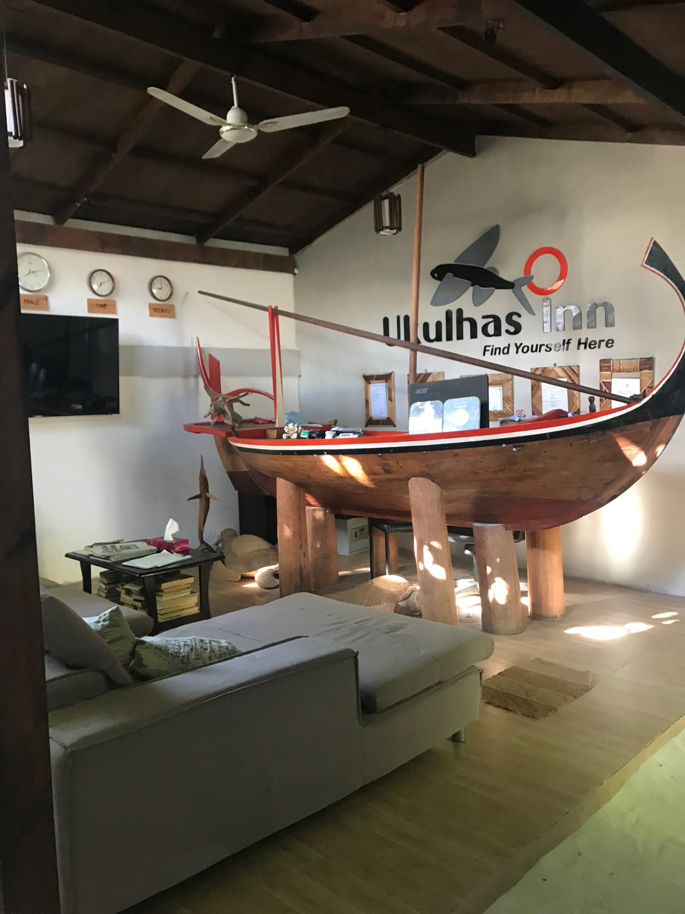
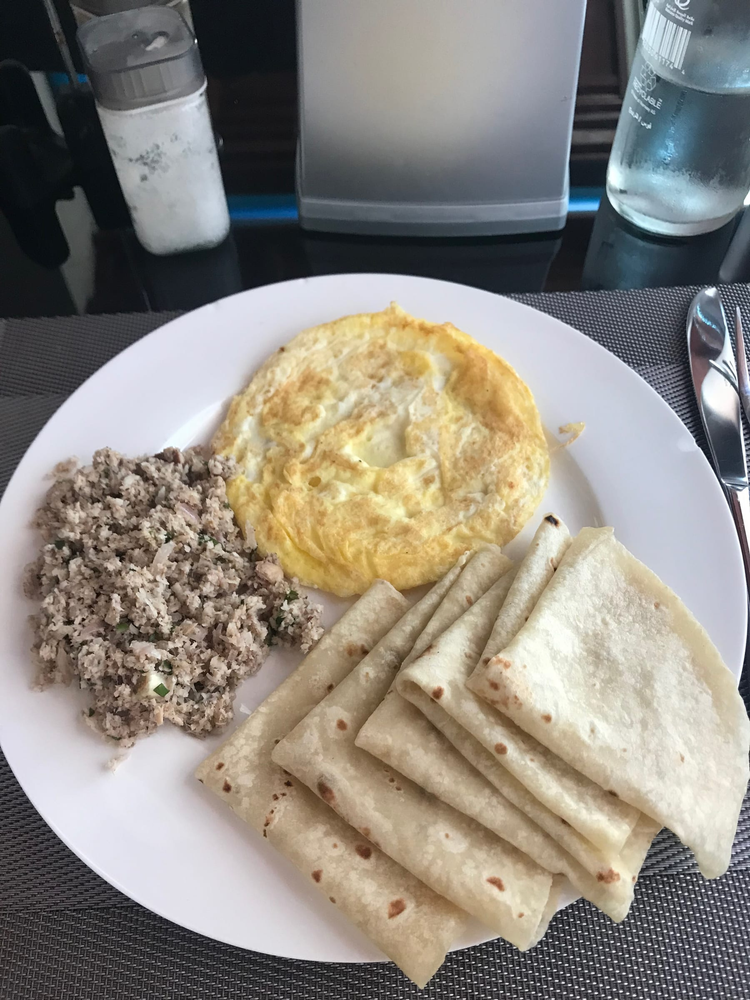
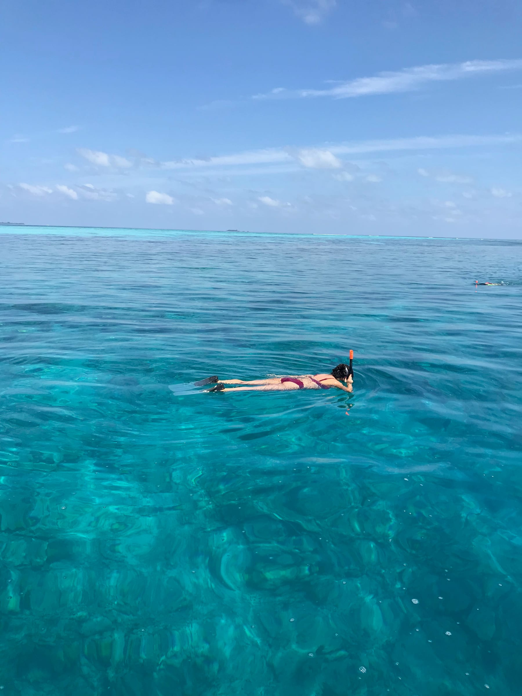

import Gallery from '../../../components/Gallery.astro';

\[We're on vacation in Southeast Asia! Read about part 1 in Mumbai [here.](/posts/mumbye-america-hello-india)\]

6 am came way too early for 2 jet lagged international travelers (Dad and I) and 1 overworked researcher (Claire) but we made it to the airport via taxi, with our suitcases riding on top. We went through security - boys and girls separate as per ushe in India! As we took off from Mumbai, we could see the largest slum in Asia. The blue tents stretched quite a ways and Claire told us about her visit to the slum called _Dharavi_. The slum is like a small city in itself, basically the cost of living in Mumbai is low, except for real estate and housing costs, so a lot of people are forced to live in the slums. Claire said when she visited people were working and kids were playing - just like any other city. Fun fact: _Dharavi_ was used a backdrop for Slumdog Milllionaire! We had a tight layover in Kochi so the airline had us upgrade to the fancy seats where we got breakfast on the plane (ramen and some delish mango juice) [#fancy](https://www.forkspoonandstraw.com/home/hashtags/fancy).

<Gallery post="let-s-maldives-right-in" folder="general" />

We practically ran off the plane in Kochi and were prepared to jog between terminals when a man called out “SpiceJet passengers going to Malé, going to Maldives” in a heavy Indian accent (this was an ongoing joke for the rest of the trip since we said it as every person who de-boarded the plane walked by) and we waited for the rest of our fellow passengers. We walked as a group to the international terminal, checked in for flight [#2](https://www.forkspoonandstraw.com/home/hashtags/2), and went through customs. Claire had some trouble with her fancy research visa and ended up having to explain her research and the groundbreaking discoveries her lab was involved in ... no big deal. My bag was selected to be rechecked and we ended up speed-walking to the very end of the terminal where our flight was “final call”ing.

The hour flight to the Maldives flew by (literally) and we were treated to some gorgeous views of the islands and atolls as we landed.

<Gallery post="let-s-maldives-right-in" folder="general-2" />

> \[isle\] be on island time if you need me!

We grabbed our luggage and looked around for someone from the hotel who was meeting us at the airport for our transfer. Maldives tip: there is a free phone to use at the information desk to the left of arrivals! We got in contact, got some lunch (Claire told us about her love for Indian KFC so we had to try out the Maldives) and then met our transfer guy to take the speedboat.

The ride was about an hour and a half and we zipped through the blue waters - Dad and Claire even saw a dolphin! We passed the fancy resorts with over-water bungalows, stopped at another island, and then made it to Ukulhas. The hotel manager met us at the boat and took our bags while we walked to the Inn ... a whole 5 minutes since the island isn’t that big. We passed some small, local shops and houses and a playground before turning on our street. The Ukulhas Inn is an eco friendly hotel with about 8 rooms and sand as carpeting in the common areas. We chose to go to a local island and do an environmentally friendly trip since the Maldives are under the threat of climate change. We also thought it would be different to stay on an island with locals as opposed to a resort by itself.

<Gallery post="let-s-maldives-right-in" folder="general-3" />

After checking in, we headed to the beach ... one minute away from the hotel. Since the Maldives is an Islamic country, there are tourist/bikini beaches where swimwear is allowed. Otherwise, it is advised to cover your knees and shoulders at minimum to respect the culture. Luckily for us, the tourist beach stretched almost the length of the island and was super close to our lodging!

<Gallery post="let-s-maldives-right-in" folder="general-4" />

We immediately jumped in the crazy blue water and watched the sun go down to our favorite (of the three) sunset. Dinner was at a Thai restaurant called SeaLaVie (puns for the win!) and we enjoyed our meal in the warm weather.

<Gallery post="let-s-maldives-right-in" folder="general-5" />

> we love thai-ing new foods!

The next morning we got breakfast at the hotel - a Maldivian classic called _Mas’huni_. The Maldives are known for their sea life and seafood, and tuna is one of their specialties. This dish is finely chopped tuna with some onions, lime and seasoning. It was served with eggs and _roshi_, similar to the Indian _roti_, which is kind of like a tortilla. Super delish!

a so\[fish\]ticated breakfast!

We grabbed our swimsuits and some snorkeling gear and headed to the beach! The water was even bluer then the day before and we decided to snorkel first. Ukulhas is also known for its coral reefs and there were so many fish! It felt like we were in Finding Nemo. It was a bit wavier, so when we came back for a break, we found most of our sandals missing from the waves and went on a small hunt for them!

<Gallery post="let-s-maldives-right-in" folder="general-6" />

> 50 shades of blue!

We relaxed in the sun and shade, looked at the water and even saw some crabs before lunch at Celeste which had food from around the world. After lunch, Claire was tired so Dad and I walked around a little bit more before headed back for a little siesta. (It was at this moment when I found my [“missing” phone](/posts/mumbye-america-hello-india)).

<Gallery post="let-s-maldives-right-in" folder="general-7" />

We headed back to the beach for another sunset and tried to snorkel again. Dad even saw some turtles, but sadly, Claire and I couldn’t swim out fast enough. We watched the sunset, listened to the nightly call to prayer and went to dinner for some seafood.

<Gallery post="let-s-maldives-right-in" folder="general-8" />

Morning number two in the Maldives was an early wake up call since we were doing an excursion of snorkeling! Originally, we were told it was at 7, but then we learned it was at 9:30. We had breakfast, and then walked to the port with a Portuguese/Russian family (jury is still out on what language they were speaking). The boat took us about 15 minutes away from Ukulhas and then dropped us in the middle of the sea. Just kidding (kind of!) there was a reef there. We got our gear on and jumped in! The fish were everywhere and there were even more variety than the day before. We saw 3 manta rays and 2 baby sharks (not actually baby sharks, that is their name). Our snorkel guide even dove down to show us a starfish and we got to hold it! We got back in the boat and headed to spot [#2](https://www.forkspoonandstraw.com/home/hashtags/2) - known for seeing sea turtles!! Sadly, there were no turtles to be found, we did see a heart-shaped coral and many many fish. We thought we were done, but then we headed to spot [#3](https://www.forkspoonandstraw.com/home/hashtags/3) and as luck would have it .... we found a turtle!! [#missionaccomplished](https://www.forkspoonandstraw.com/home/hashtags/missionaccomplished).

We headed back to the Inn, ready for lunch and feeling wiped out, and enjoyed some Indian fusion food. We hung out on the beach (in the shade since 2 of the three got a bit sunburnt from snorkeling ... guess who didn't!) and then watched our final sunset. We walked down the beach to Sunset Point and explored the last part of the island we hadn’t seen before dinner.

<Gallery post="let-s-maldives-right-in" folder="general-9" />

The next morning was an early call again since the boat back to Malé left at 7 am, for real this time. We took a ferry from the airport to the actual island of Malé and grabbed breakfast and went to a museum before our flight to Goa. Our plane was delayed and again, we found ourselves speed-walking between terminals in Kochi Airport to make our flight! We arrived in Goa, figured out how to take a taxi and got to our hotel around midnight ... what a day!

<Gallery post="let-s-maldives-right-in" folder="general-10" />

> a smooth(ie) criminal

Hugs from the turtles,

