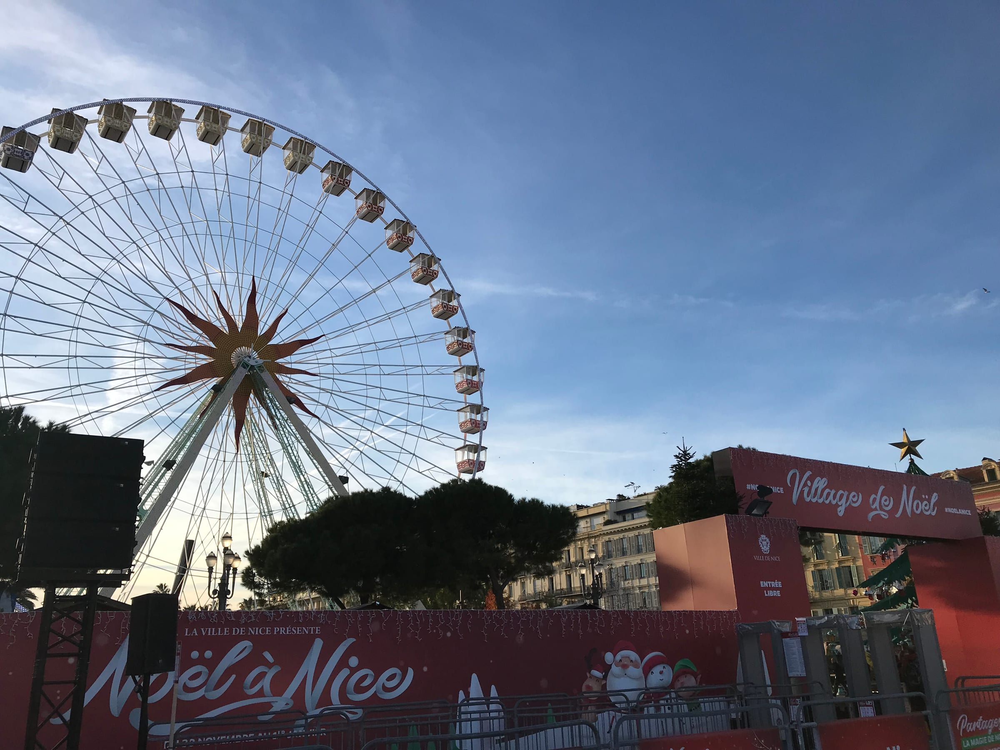
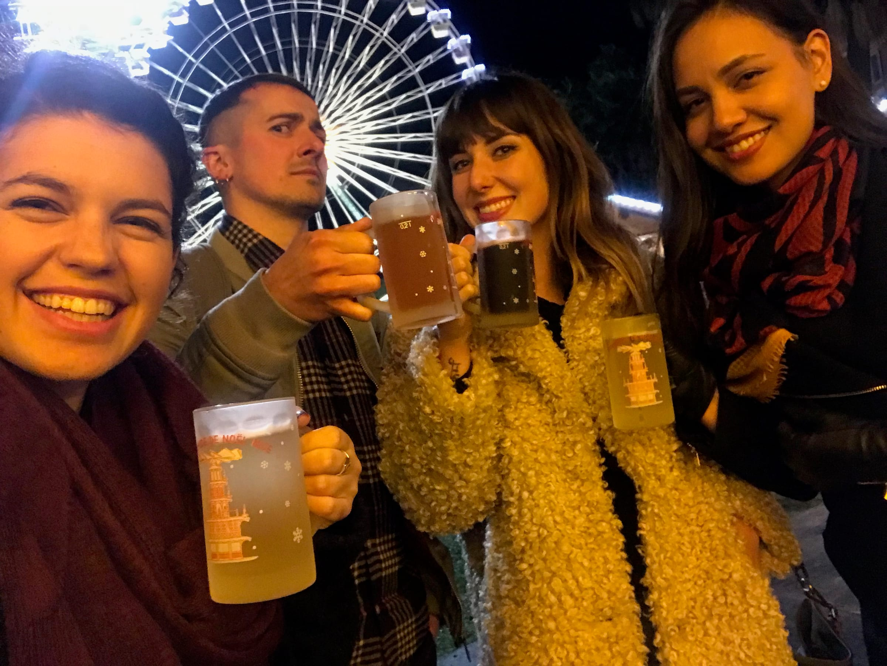
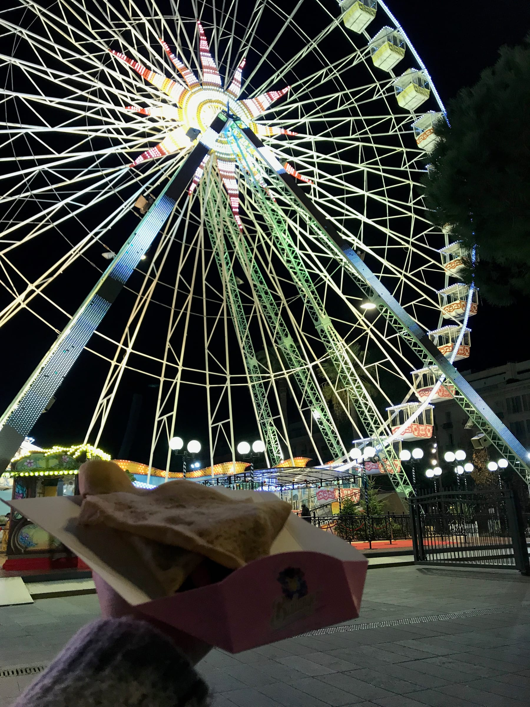
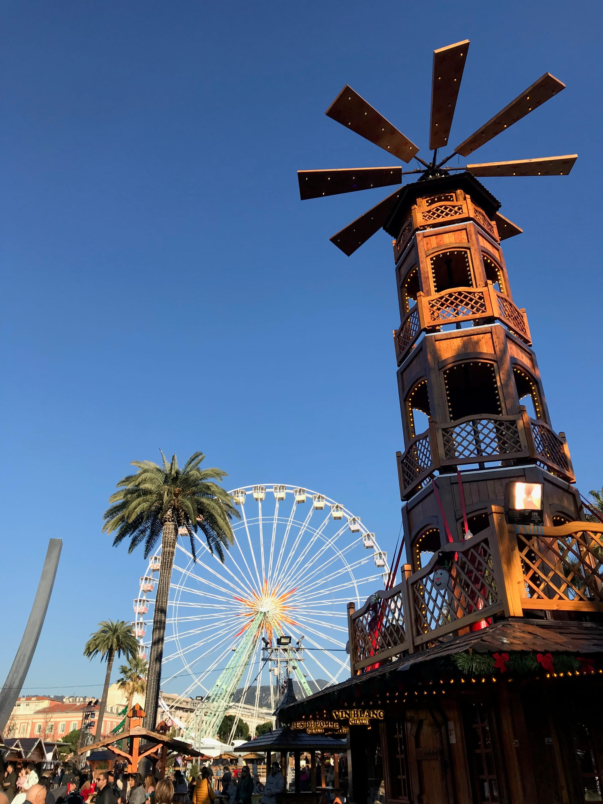

import Gallery from '../../../components/Gallery.astro';

It's the most _pun_derful time of the year ... and this year I'm in Europe to experience the markets! Around the beginning of December, we started to see the first steps of setting up the _Marché de Noël_ in Nice. The market is in _Jardin Albert 1er_ which is right downtown, next to the famous _Place Masséna_.

Our first adventure to the market was supposed to be ice skating, or _patinage ..._ but unfortunately we drank a little too much wine before and decided to just grab some snacks from all the different booths set up around the market. We sat outside and watched the light displays on _Galeries Lafayette_ and the buildings around _Place Masséna_ while we sat and talked and enjoyed the evening of people watching. The city of Nice has an app that you can download to control the different light shows. Hot, greasy churros with thick Nutella was a treat to kick off the holiday season!

<Gallery post="marching-around-the-christmas-markets" folder="general" />

> a wheel-y great time!

glühwein makes you glow!

The next trip to the market was better planned, and we started out at the big center booth ... for mulled wine of course! The _vin chaud_ was the perfect way to warm up, and put us in the holiday spirit as we wandered around and listened to the quiet tones of Celine Dion play through the speakers set up all around the market. The second round of mulled wine, I got adventurous and added amaretto to spike it even more and it was possibly the best decision I have made. The amaretto paired nicely with the mulled spices in the wine and added a sweet finish! Then, as luck would have it, I spotted a stand for chimney cakes (my one true Eastern European love) and made a beeline for one of those soft treats with Speculoos on the outside. _Miam Miam!_

About a week later, after dinner, Katie and I ventured across Old Town in search for something sweet and found ourselves right in front of the _marché_. We walked in only to find (almost) all the stalls closed. The market is open until 10 pm on weekends, but closes earlier at 9 pm during the week. We did find a churro stand and bought some (disappointing) churros and a crepe. We vowed to plan better and come back earlier next time.

Melissa and I finally made it ice skating that weekend! We rented our skates and paid admission all for under 5 euros. Stepping on the ice again was magical ... until I realized the rental skates didn't have a toe-pick and I promptly fell flat on my butt. The rest of our hour and a half skate was so fun! The small rink is right underneath the _Grande Roue_ (Ferris Wheel). Feeling accomplished, festive (and hungry) we grabbed some churros for our walk back home.

<Gallery post="marching-around-the-christmas-markets" folder="general-2" />

> N-Ice Skating

When the family was here, we stepped off the plane and out of the airport in Munich only to find ourselves right in the middle of a Christmas market - ice rink included! We wandered around with our luggage and I spotted a stand with _lágos_ - my Budapest bae! Unfortunately, we didn't have time to stop and eat and I vowed to find it again.

Nuremburg is one of the oldest markets in the world and was just and hour and a half away from our AirBnb in Germany. We braved the wind and rain to check out the huge market! We had just entered the main section of the market when we found a stand selling Nuremburg sausages and bought a few. They come 3 sausages in a hard roll and we topped ours with some mustard. It was the closest thing I've ever had to a breakfast sausage in Europe aka I was one happy camper! Since there were 7 of us, we decided to split up. Mom, Dad and I found so many fun treats at each of the booths - gingerbread, hard German candies, ornaments, and (of course) _glühwein_! The German _Christindlemarkt_ was so much bigger than the ones in Nice and Cannes and there was no way we could have seen it all.

<Gallery post="marching-around-the-christmas-markets" folder="general-3" />

> Ask me a-brat these sausages!

After we _rendez-vous_ed, Mom, Claire and I set out to find some eggnog. I successfully ordered in German and we all were shocked when it was hot! The creamy, warm drink was so delicious with the rum ad whipped cream, I could have drank about 5 or 6. We ended our tour of the market looking like drowned rats, and grabbed one more sausage for the road ... of course!

<Gallery post="marching-around-the-christmas-markets" folder="general-4" />

> Egg-cited about this 'nog

The next day was Christmas Eve and we found one market close by that was still open. The Christmas markets in Germany run from about the 1st to the 23rd of the month. We came to the small town of Forchheim and the cutest little market ever! We even saw the traditional Advent calendar on the windows of a church in the main square. I traded my traditional _gluühwein_ for some _Schneeman punsch_ aka snowman punch and traded sips with Mom for some of her amaretto hot cocoa. The highlight was definitely finding the _lágos_ again and getting to watch everyone try a bite of the fried, garlicky, cheesy dough.

<Gallery post="marching-around-the-christmas-markets" folder="general-5" />

If you get the chance, I highly advise you get to Europe in December for some true Christmas spirit. The food, booths, and atmosphere is like nothing I've ever experienced and there were so many other markets I wanted to visit in Germany, Strasbourg, Paris and Prague.

Here's to more _glühwein,_

Lele
