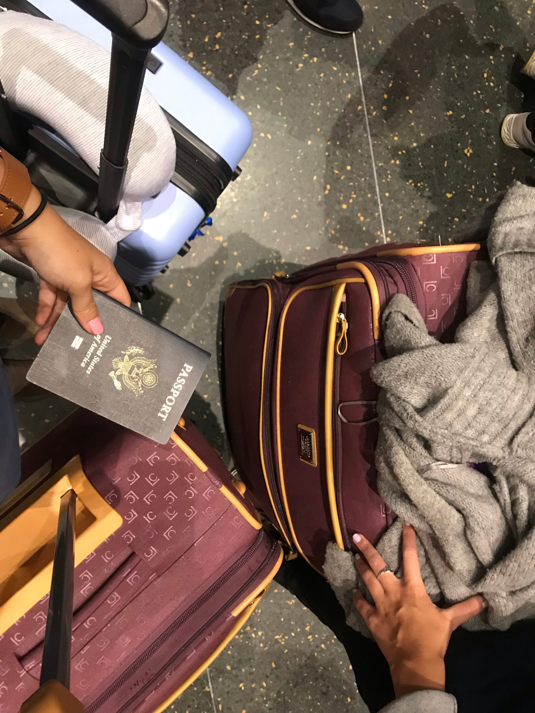
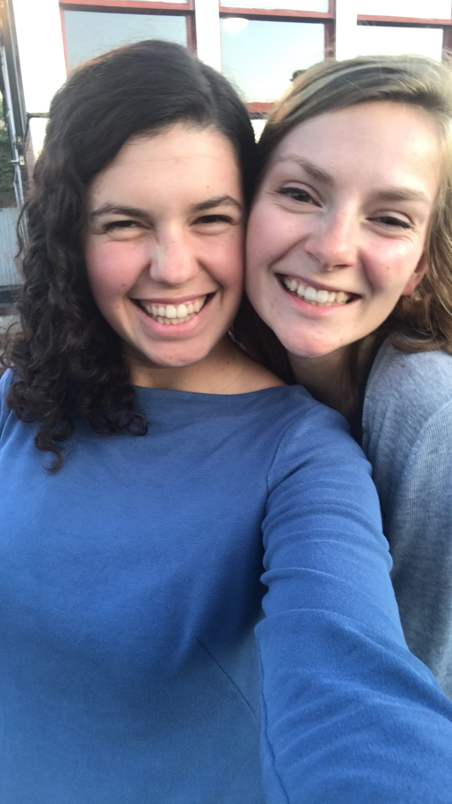
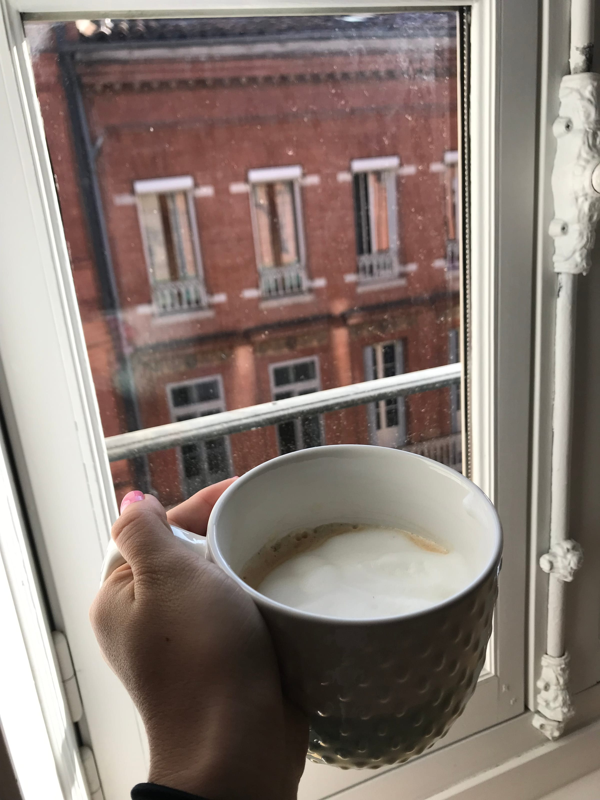
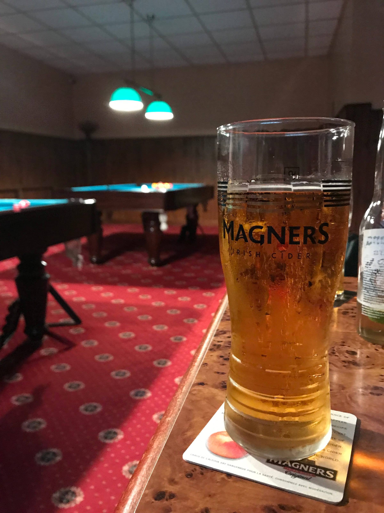
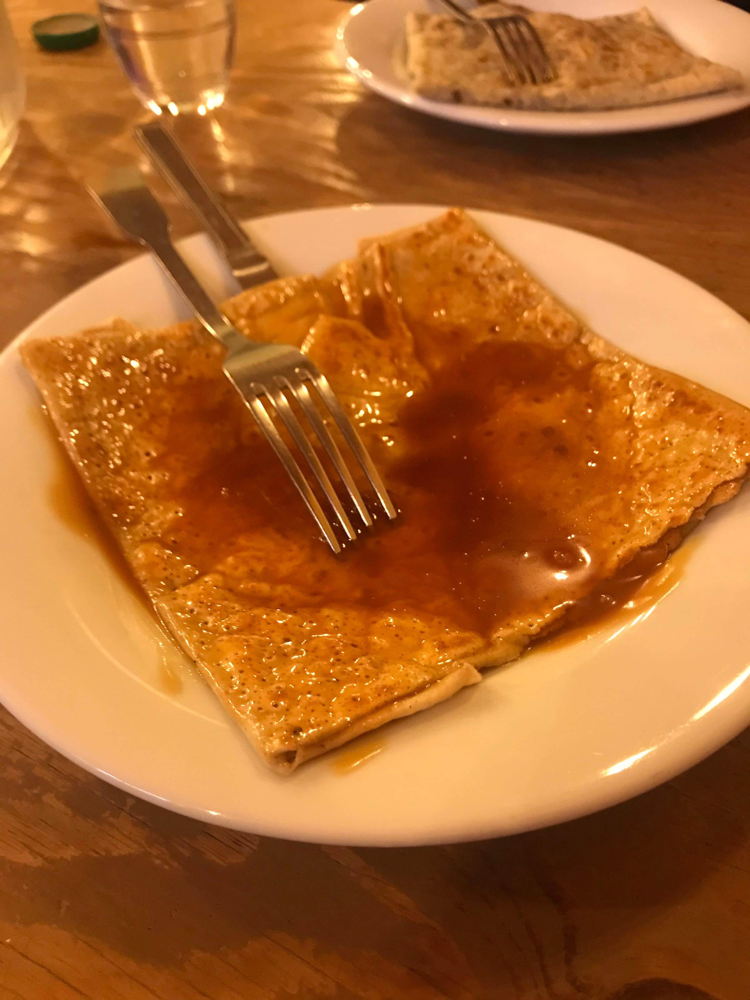
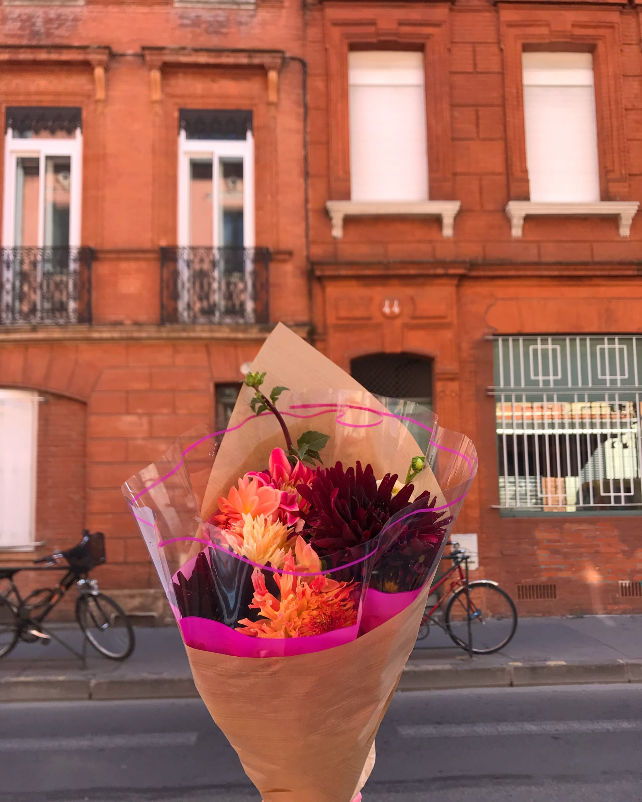

import Gallery from '../../../components/Gallery.astro';

I started my journey to Toulouse at 4 am on the 25th of September... Well not my journey so to speak, we had to drop Dad off at the airport and then head back to pack my last bag before we left for Boston. 2 suitcases, 1 carryon, and 1 shipped duffel later and I was _en route._

Allez c'est partie !

The 5 hour drive flew by and I even got to meet with Kristen for an hour before it was time to leave. We got dinner (shoutout to my very Amercan last meal of corn, bacon and cheese). Let me tell you, the tears were real all day. No matter how many goodbyes I do, they really don’t get any easier.

I relaxed in the international terminal for about an hour before we started to board. We left on time and I had my little dinner on the plane (with wine _bien sur_!) before falling asleep with my new foot hammock which was a lifesaver because ...

My seat neighbor was a total manspread-er!! And it got worse as the flight went on - at one point I was curled up in a ball on the seat just so I wouldn’t have to touch him. [#ugh](https://www.forkspoonandstraw.com/home/hashtags/ugh) So not ideal. We landed in Gatwick and I collected my bags to transfer terminals. I had booked using Gatwick Connect so all I had to do was drop my bags off and then take the tram straight to security. I did some blogging and apartment hunting before getting a burrito bowl for lunch as a last hurrah.

My second flight from London to Toulouse was delayed and y’all know the anticipation was building! A quick hour and a half flight later and I was back in France (like I never left but with a lot more belongings)! I breezed through customs and then collected my 2 checked bags and set off to try to remember what my coworkers looked like since they were picking me up. Luckily I didn’t have to remember too hard since they brought along a giant banner with the company name on it and everything! Eep! We snapped some pics in the airport, said goodbye to one coworker who was heading home, and then the two other Anglophone coworkers and I headed to town to drop off my stuff.

view from the apartment

We chatted on the way and then got to the apartment I’d be staying in for the next few weeks until I found a place of my own (which would be longer than I expected but don’t worry we’ll get to that later!). One of my coworker’s parents had an apartment in Toulouse that had unfortunately gone through some water damage but luckily they said I was more than welcome to stay on the pullout couch. The apartment is super nice and I’m definitely going to be a little sad to leave it ...

The three of us went to dinner around the corner and chatted over a classic steak-frites-salad French dinner. And _bien sur_ we had wine and even got a _café gourmand_ for dessert! They headed back to their homes and I pretty much passed out on the sofa [#jetlag](https://www.forkspoonandstraw.com/home/hashtags/jetlag).

<Gallery post="my-first-month-in-toulouse" folder="general" />

The next evening was Friday which means TGIF Apéro at work and I got an email from the office manager saying I could come too! It was at a pool bar in town and as tired and nervous as I was, I headed over. I met some more of my coworkers and had a beer (and learned I’m really bad at pool!) but all in all, it was a fun night and I was super glad I went to meet people before the first day. Everyone seemed really nice.

The rest of my weekend was spent setting up my metro pass, looking for more apartments, exploring Toulouse, and meeting a girl who had posted a roommate ad on Facebook (spoiler alert it went super well!). One of my coworkers (my French counterpart - we both are Growth Marketers and she does the French app and I work on the English apps) even invited me to hang out downtown with her! We strolled around, got crepes, got cocktails, and got tear-gassed. That’s right, my friends the Gilet Jaunes have quite the presence in Toulouse and I experienced first hand the excitement that is the Saturday protests. Except for that, the rest of the afternoon was so fun (and tasty!).

holy \[crêpe\]!

My first week at work was a whirlwind. Having taught 12 hours a week in Nice and then working mornings and nights over the summer did not prepare me for a classic 9-5 workday. My first day was mostly getting to know the office, signing contracts, meeting with my boss and the other heads of departments. I even got to experience the stress of the Metro again when I an alert my first morning that the metro was stopped (luckily it was just a 10 minute delay so I wasn’t too late). We had a welcome breakfast with croissants and it was a coworkers birthday so we had cake and champagne too (we’ve had 3 more since - my birthday, another October birthday and to celebrate a new baby!). I even got to go to a concert with my coworker for fun! But, I did finally get started with things at work and published my first blog article on Day 2- so things are off to a great start.

<Gallery post="my-first-month-in-toulouse" folder="general-2" />

I work on Instagram, Pinterest, forum websites and our blog as a Growth Marketer and it’s a blast! I even get to analyze what we do with statistics ... which is definitely not my forte but I’m working hard and it’s interesting to see the actual results. Everyone at work is super nice and supportive - it’s like a little family! The office atmosphere is amazing, one of my Growth coworkers plays music sometimes, we have office events every three months and get this - it's practically a _franglais_ office.

Since it's an American company, everyone takes English lessons and there's quite a few little snippets of English thrown in conversation about marketing or coding or products! And with the two other English speakers we really jump back and forth between languages. This [Pardon My Franglais](https://www.forkspoonandstraw.com/pardon-my-franglais) blogger couldn't be more _contente!_ (On that note...) French-wise I’m definitely not where I was when I left Nice and I still find myself getting flustered when I forget words or make silly mistakes. Listening to French is a breeze but I’m still struggling with the speaking part apparently. And turns out I still don’t like speaking in front of a group even in a different language! Red cheeks are for sure a thing.

French administration-wise it hasn’t been easy and my bank account took a week and two visits to set up and I still have yet to receive my bank card because of a delivery problem (going on three and a half weeks). Apartment-wise it’s also been a process ... the girl I met up with and I had a few “interviews” with other girls looking for flat shares and we decided on another girl - we all get along super well! We’ve researched apartments, made a bunch of calls, had a few visits and finally have an apartment!! Well not yet technically we still have to sign the rent and pay the deposit and all that good stuff. But I’m off to Ikea this weekend to check out beds!

I met up with a girl who was an au pair last year in New York and we’ve become friends! We’ve gotten drinks a few times and got crepes this past weekend - super yummy. And my French-counterpart coworker and I got birthday brunch and did some window shopping before another coworker joined us and we all got gassed again at a rooftop bar. A special birthday present for sure!

<Gallery post="my-first-month-in-toulouse" folder="general-3" />

So all in all things are going well! I’m quite pleased with work and I’m excited to move into my apartment. It is a bit lonely at times (how do adults make friends?) but everyone I’ve met is wicked nice and I’m grateful for my coworkers and the friends I’ve already made! November is on its way which means a half-day Halloween party at work and my appointment at the _Prefecture_ to get my long stay Visa card.

Thanks for reading along my life updates for the first few weeks in _la ville rose!_

_Bisous_,

