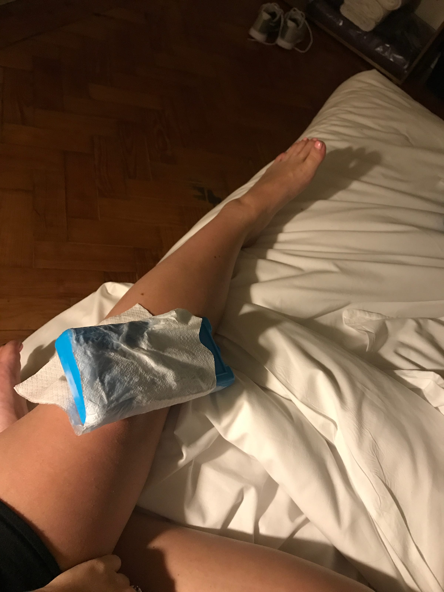
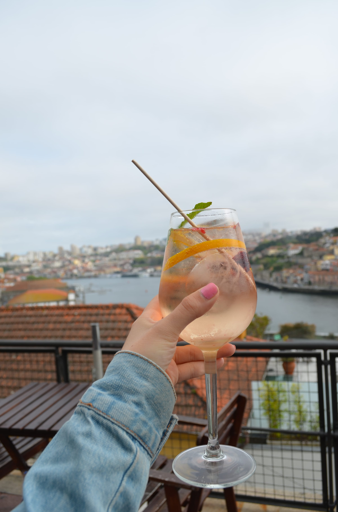
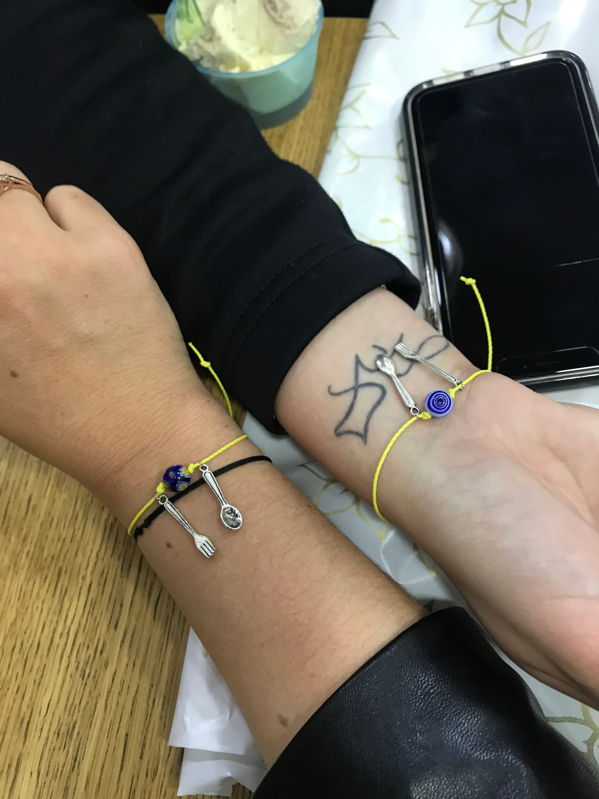

import Gallery from '../../../components/Gallery.astro';

We arrived in Porto late Saturday night and headed straight to our hostel. Luckily, it was right off the metro line since it had started to rain. We checked ourselves in to this escape-room style lodging with a code to get into the main building door, another code to get in our apartment door, a third code to get into the lockbox for our key to get into our room \*phew\*. Kassi was pretty shook from all the codes and instructions and we relaxed as the rain fell on our first night in Porto.

Around 10 pm, we were feeling snacky and since it was late, we settled for ordering UberEats for a little bite. Just after eating, we heard some strange noises from outside and as I stepped on the balcony to investigate... the wet tiles got me! I MMA-style slammed down my knee and slid across the other side of the balcony as Kass and I cracked up. I found some ice for my poor, swollen knee and limped my way into bed. At least now we both were “broken” ...

Our first morning in Porto was spent attacking brunch near our apartment. Let me tell you, I could get used to these prices! I got a cappuccino, fresh juice, tea, prosciutto, a fried egg, toast, 2 savory pastries, and a bagel sandwich all for 12€! Luckily we split the brunch so I didn’t have to attack it all on my own but it was safe to say we were stuffed for the rest of the day. After we carb-loaded, we set out to explore the town. The rain had stopped so after walking around the main square with the bell-tower and checking out the outside and the line for famous _Livraria Lello_ (JK Rowling’s inspiration!!) we headed to the botanical gardens after we found a lovely overlook featuring the cityscape and the river.

<Gallery post="obrigada-portugal" folder="general" />

It was gorgeous as everything was in full bloom. We wandered around catching beautiful views of the city and _Douro_ River as well as making some new peacock friends!

<Gallery post="obrigada-portugal" folder="general-2" />

> fun fact: the only reason we knew the peacock opened its feathers is because a French family we passed in the gardens was talking about it - gotta love those language skills!

We hustled back near our hostel for a tile-painting class (when in Portugal am I right!). We learned about the history of tiles (or _azulejos_ in Portuguese) and how this little non-profit is preserving them before diving in to make our own! It was pretty simple overall and I think the hardest part was choosing a design.

<Gallery post="obrigada-portugal" folder="general-3" />

We deserved a well-earned cocktail before dinner so we Uber-ed across town to a rooftop bar by the river that my housemate, Katie had told me about. We looked at the grand total for our 16 minute ride and were pleasantly surprised when the total only came out to 3 euros! We both decided on a tasty Port wine and tonic cocktail with some _croquetas_ to snack on as we looked at the beautiful views.

Soon, 7 pm rolled around and we headed to a little hole-in-the-wall restaurant for some _Francesinha_ sandwiches. Apparently, Anthony Bourdain had been here a few times and featured it on an episode of Parts Unknown. We happily split a bottle of local "green wine" before diving into our sandwiches which were heavily layered with ham, steak, and sausage between two fluffy pieces of white bread and smothered with a bright-red beer sauce and melty cheese. If that doesn't get your stomach rumbling ... you'll just have to try one yourself! We pretty much scarfed down our dinner in silence before I introduced Kassi to Amorino aka everyone's favorite gelato chain. We happily fell into a food coma moments after.

<Gallery post="obrigada-portugal" folder="general-4" />

> It was so nice to \[meat\] this sandwich!

Day 2 in Porto! We braved the morning rain and headed out for a smaller breakfast of coffee and quiches, _pastels de nata_ for me and a Nutella croissant for Kass. Then we tackled our long to-do list after picking up our finished tiles! First stop was a gorgeous blue-tiled church we had spotted a few times already, then we hit up _São Bento_ train station for some more blue tiles, then we saw the _Sé_ Cathedral and wandered down into the _Ribeira_ neighborhood filled with narrow staircases, cute apartments, and (you guessed it!) more _azulejos_!

<Gallery post="obrigada-portugal" folder="general-5" />

We settled for a light lunch of some killer sangria, local chorizo in a Port wine sauce and potatoes with an aioli sauce by the river and did some people-watching as a short rain shower passed over us. We hiked (and wheezed) our way back up the hill to walk over the _Ponte Luis 1_ bridge that crosses the _Duoro_ to _Gaia_ which is a suburb of Porto, home to many Port wineries.

<Gallery post="obrigada-portugal" folder="general-6" />

We arrived just in time for our tour and were a bit outnumbered as the only non-Germans in our group. The tour of _Porto Augusto's_ was only about 20 minutes and then we moved right into our tasting. The tour was pretty interesting since Port wine is made much differently than wine. Nothing could have prepared us for the first whiff and sip of the wine, however and I really though Kass was going to spit hers out! It really smelled like tequila and it was only when we tasted an older _tawny_ that we felt a little better about the wine.

After our tasting, we wandered along the banks of the river and bought some souvenirs (you know some postcards were involved!) before crossing back over the river and heading up to _Congo_ snack bar for an early dinner. We had small _bifana_ sandwiches, which are delicious beef sandwiches with a spicy sauce to start out and then ordered some potatoes and _croquetas_ to end our little meal. I think this was my favorite thing I ate in Portugal and I was so excited to have spice back in my life. France, _je t'aime beaucoup_ but the lack of spice is very disappointing ...

<Gallery post="obrigada-portugal" folder="general-7" />

> finally tried the port of Porto!

We grabbed Amorino and another _pastel de nata_ when suddenly my phone was blowing up with messages from my friend who is an assistant in Toulouse and my old group chat from when I was abroad in Paris. I stopped to check my messages and this is when we learned _Notre Dame_ was on fire. With my mood totally changed, we decided to go back to the hostel and I did some research as night fell. I was super sad and nervous for what would happen throughout the night, but after I called my mom and talked to Kassi, I realized how lucky we were to be able to have seen the cathedral in all her glory less than a week ago, and how fortunate I was to pass it on numerous occasions and have spent some of my favorite nights in Paris drinking wine right under her glow.

The next morning was nicer weather and we got up early to go to the _Bolsa_ palace. We decided we would rather enjoy the sunshine then walk around the inside on a guided tour so we found an outdoor cafe for some _natas_ and coffee on our last morning in Porto. We grabbed our bags and checked out, then took an Uber north to get some brunch.

<Gallery post="obrigada-portugal" folder="general-8" />

> Went \[bananas\] over this \[berry\] delish breakfast!

We enjoyed the delicious create-your-own pancakes with an Oreo cappuccino for me and a Nutella cappuccino for Kass. Before we knew it, we were ready to go and on the train to Lisbon!

The train was really nice and we were in _Lisboa_ in about three hours, or about 8 episodes of Brooklyn 99. We looked at Uber prices and decided to splurge on an extra 50 cents each to drive to our hostel instead of take the metro. Our hostel was finally a real-hostel! We dropped our bags off and freshened up before taking advantage of our only nice day to explore the _Alfama_ neighborhood.

<Gallery post="obrigada-portugal" folder="general-9" />

We headed up, up, up some steep hills and were rewarded by some gorgeous views at numerous _miraduoros_ or viewpoints. We took loads of pictures, listened to some traditional _Fado_ music and Kass bought a few pieces of art before we started to feel our stomachs growl ...

<Gallery post="obrigada-portugal" folder="general-10" />

Our plan was to eat at this nice rooftop restaurant, but things were not off to a good start after we realized we needed reservations for the seats with a view. Nevertheless, we decided to stay and finally found some things that looked good on the menu. We had sat there for 20 minutes, and decided that if no one came by to take our order, ask if we had questions, or even make eye contact with us, we were going to leave. The real kicker came when the table behind sat down, ordered and got drinks in a very impressive 2 minutes, while we still had been ignored ... travel isn't all good times y'all!

We ended up wandering by the river where I had researched a few other restaurants, before going into a smaller, local snack bar. We inhaled our dinner - traditional Portuguese sausage with rice and an egg for Kass, grilled pork with pineapple for me, and wine for the two of us! We planned on getting _natas_ for dessert, but got distracted by a gelato place and I happily enjoyed my Snickers ice cream. We ended our night making our own bracelets - it of course had to have a fork and spoon for our eating adventures and a blue tile to remember Portugal!

We were up and at 'em on Wednesday morning! We grabbed a quick (and slightly disappointing) breakfast in the hostel and headed through the rain to the train station. We were going to _Sintra,_ a neighboring town known for its castles!

We got a little bit past 9:30 am and caught the bus to our first stop - the Castle of the Moors. We walked uphill through a lush forest that looked like we had been dropped in a different land... all while Kass was singing the Game of Thrones theme song and channeling her inner Khaleesi.

<Gallery post="obrigada-portugal" folder="general-11" />

After we finally got to the castle, the rain continues to beat down but it really enhanced our Game of Thrones/Ireland mood as we hiked up the many stairs along the ramparts. The views would have been killer, if it hadn't been for the fog and clouds ...

Our next stop was a hike through a muddy trail where we ended at _Pena Palace._ Normally, the palace is very vibrant and colorful with the facade painted in yellow and red with blue tiles. Unfortunately, since we currently were in a cloud, we could barely see across the courtyard to the muted colors. We braved the rain (now coming down sideways) and took a lap around the castle. I could imagine how pretty it was on a nice day. We decided against waiting in the long line to get into the castle itself and opted to grab the train back to Lisbon for some food and a change of clothes.

<Gallery post="obrigada-portugal" folder="general-12" />

After a lunch of hot chocolate, kale and chorizo soup and sandwiches, we left the little restaurant to see ... the sun. As happy as we were to have some nicer weather, we were kicking ourselves for not braving out the tail-end of the storm in Sintra. We did a bit of souvenir shopping and went back to the hostel for a warm shower.

We tried to go to a cheap, local restaurant around the corner from our hostel for dinner, but it was closed for the week for an unknown reason (even with Google translate). We stumbled on a cute, small-plates style restaurant that ended up being one of our favorite meals at Prado.

We shared a bottle of wine and enjoyed our white asparagus with aioli, beef tartare with a crispy cabbage leaf, mushroom and rice with chicken broth, and rump-steak with carrots and an egg yolk. We had to grab a _nata_ since it had been a long day (ok a few hours) ...

<Gallery post="obrigada-portugal" folder="general-13" />

> you \[butter\] believe we finished all these small plates!

Our final morning together in Lisbon was ... sunny?! Again, we were super disappointed that we didn't choose to do the Sintra trip today (even though the weather app said it was going to thunderstorm). We grabbed breakfast at Fruitaria before we set off to do some Lisbon exploring. We walked over to the remains of a church that was destroyed in the Lisbon earthquake in 1755. Fun fact: Lisbon is one of the oldest cities in Europe, up there with Rome and Athens!

We then followed the famous 28 tram up to the _Barrio Alto_ neighborhood and took some pictures on the famous street with the funicular. After pushing through the tourists, we found ourselves at the _Time Out Lisbon_ market. We grabbed some _croquetas_ - curry chicken and goat cheese with caramelized onion, as well as a pastry from Sintra since we didn't have time when we were there.

<Gallery post="obrigada-portugal" folder="general-14" />

We took a bus over to the suburb of _Belem_ and tried to go to the botanical gardens, which were actually closed until an unknown date for restoration. We also tried to go to the _Belem Palace_ but the lines were insane, and the crowds of tourists made the experience seem a lot less enticing, Instead, we explored the little park in front of the palace and made some turtle friends, before sitting by the river for a little bit.

We headed back to the market for more _croquetas_ and _natas_ before we went back to the hostel to pack for the morning and head to dinner. We enjoyed a romantic meal by candlelight as the electricity went out during our sangria, stuffed peppers and cheese and ham board.

<Gallery post="obrigada-portugal" folder="general-15" />

> pointing to Nice on the map ... home base!

We ended our last night on a sweet note with some Amorino and a _nata,_ and celebrated our success of a trip!

<Gallery post="obrigada-portugal" folder="general-16" />

Kass headed out in the morning so I solo-brunched by myself for a few hours before heading to the airport. My flight from Lisbon to Madrid was delayed and a group of us ended up missing our flight to Nice, so I extended my vacation in the airport by about seven hours.

It's safe to say I'm going to sleep well and only eat salads for a little while!

_Tchau_ for now,

