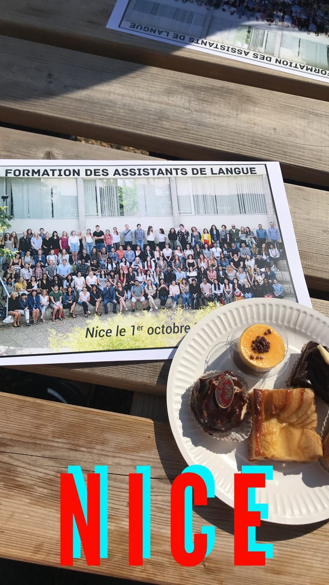
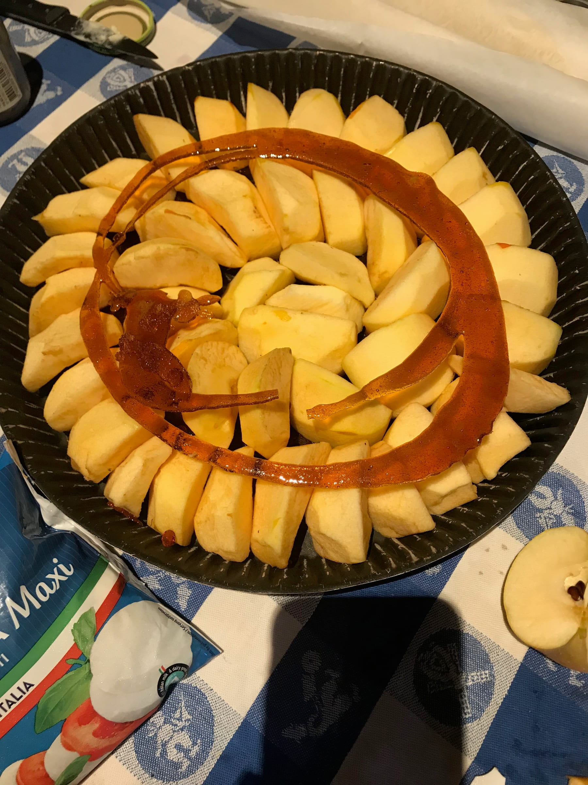
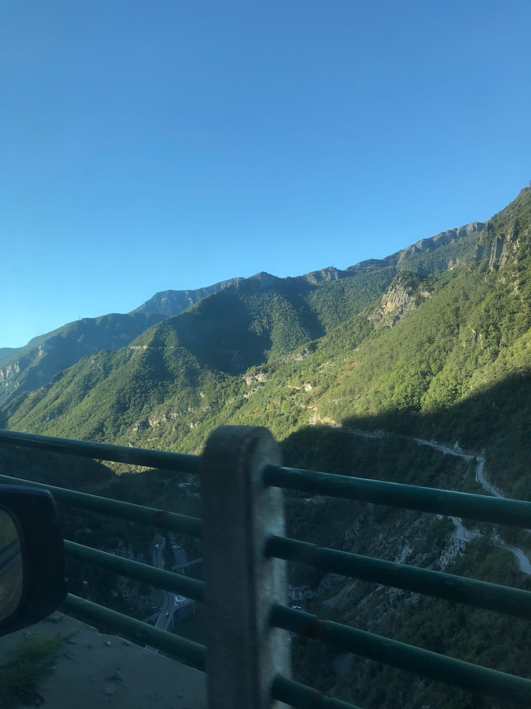

... aka Monday was our first "official" day of orientation! _Les filles de Châteauneuf_ woke up nice and early and managed to get halfway to the _rectorat_ (French school board building) without morning coffee. Our second bus was a little late but we managed to get to the _rectorat_ and hand in most of our forms and sign in without too much trouble.

The rest of the morning was mostly presentations by various school officials on the paperwork we need to fill out and some information about French schooling. We also took a super fun group picture (which they managed to print in 30 minutes to give each of us a copy\*) \*Side note - French bureaucracy is _très fou_ but somehow they can successfully & quickly print a photo

Lunch was some _hors d'œuvres_ and some good desserts! Then we split into groups to talk about French high schools and how we should teach - my head teacher actually led the session! Fun surprise for me, apparently I was supposed to bring my First-Day-Presentation to introduce myself to orientation so I had to present myself and a video I found on Google Drive to the other assistants. Not super ideal ...

Wednesday, I was _en route_ to my (second) bank appointment when my head teacher called and said she could pick me up and take me to school! So I hurried back home, quickly finished my potato, spinach, and goat cheese _quiche_ and threw my clothes in a bag to meet her and 2 other teachers. I spent the night at her house in a small village south of school and helped her make a _tarte tatin_ and pizza for dinner.

(s)tarte me up!

The next morning was my (second) first day of high school! And let me tell you, it felt a little bit like the first, first day. The windy mountain roads got even skinnier and even windier as we got to school and I even peeped the last fort on the _Maginot Line_ during WWII - which wasn't actually used. We pulled up to school - _Lycée de la Montagne_ and I was promptly left to introduce myself to the doorman and secretaries!

school route! don't look down!

I observed various classes during the day and one student even asked a teacher if I was a new student - felt a little like one tbh. I even presented my First-Day-Presentation (which I remembered to bring with me - you only make that mistake once!!) and did a chart on different stereotypes and/or clichés of France and the States. I was super wiped once the day was over but I carpooled back with some other teachers and we spoke French and English on the 1h30 drive back down to Nice.

Some highs were that the staff and teachers all seem very nice and they complimented my French and accent which was a boost! Lows are that high school students are (still) super intimidating and it's all new and a little nervewracking. I'm still _en train de_ open a bank account so hopefully that falls into place soon and I can get paid!

(as they said many times at school) _Ciao Ciao!_ Xx, Lele
