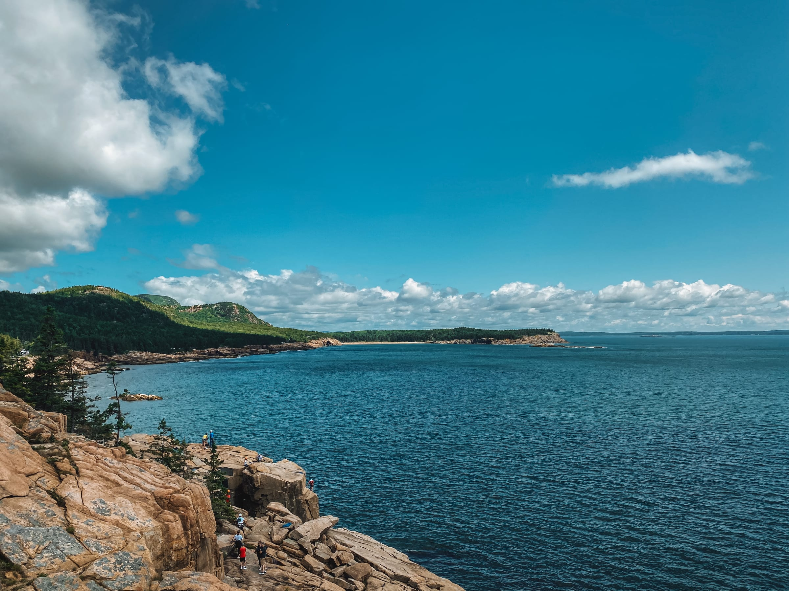
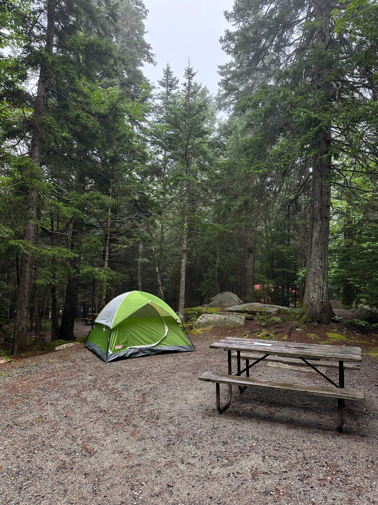
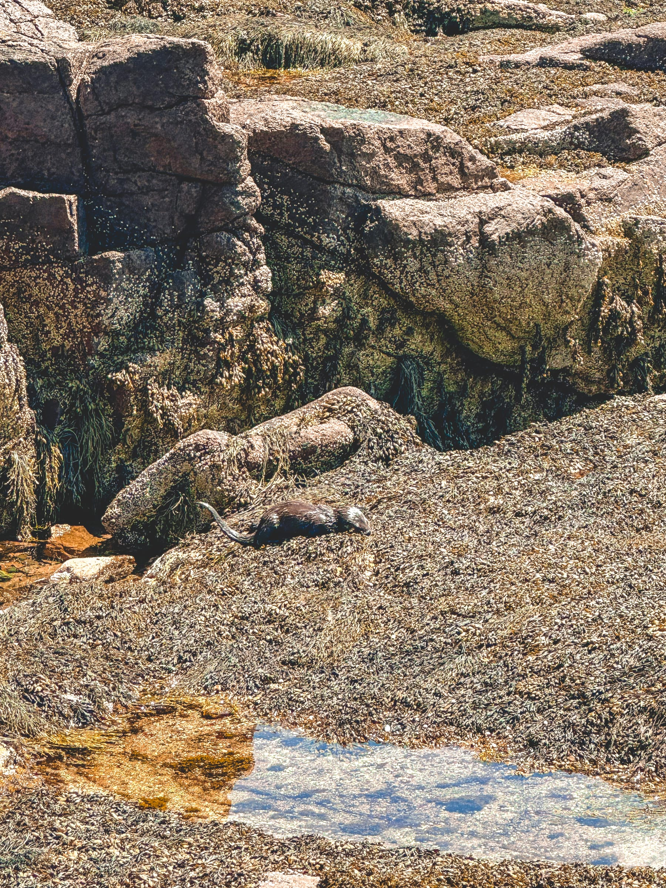
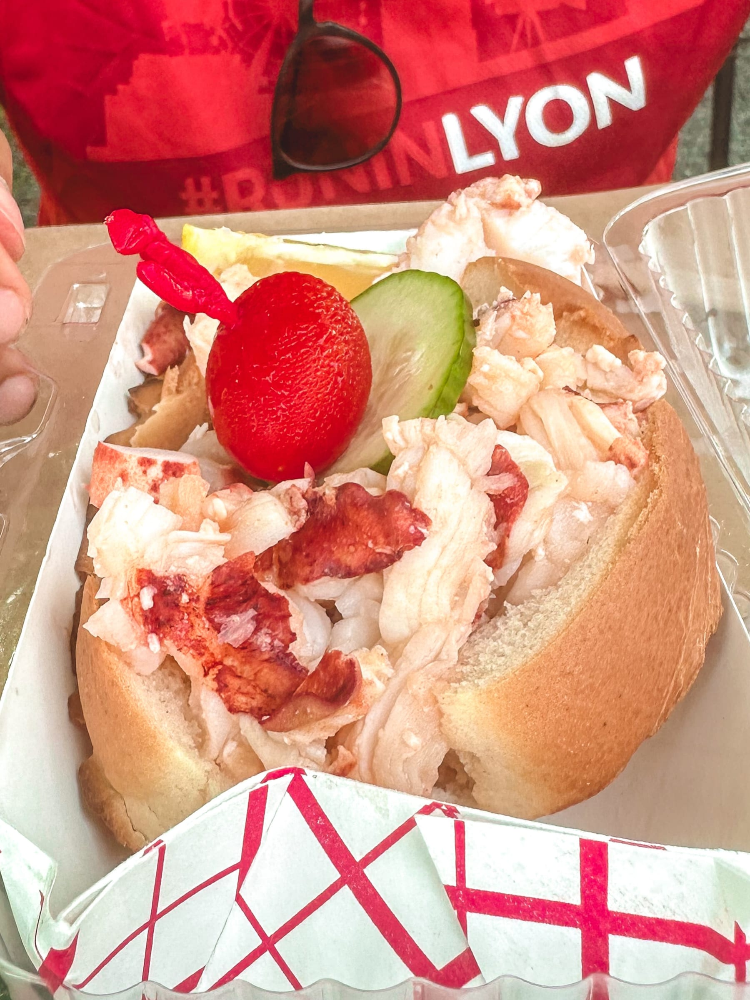

import Gallery from '../../../components/Gallery.astro';

Some trips are about the food. This one was about the air. The kind of crisp, piney, salty-off-the-ocean air that makes you take a stupidly deep breath and think “Wow, I should really go outside more.”

We spent three days hiking, camping, and generally pretending to be the outdoorsy people we wish we were full-time (thanks 9-5 jobs!). Acadia delivered in every way - golden light on granite, trails that earned every single view, and the kind of quiet that makes your phone feel irrelevant. (I still took 400 photos. Obviously.)

Also there was lobster. There's _always_ lobster.

##### Day 1: Setting up camp

We headed south to Mount Desert Island for our 2 days in Acadia National Park. We had rented a car in [Montreal](/posts/je-me-souviens-de-poutine-3-5-days-in-montreal) and had snagged a tent, sleeping bag, and cooler from my sister and her roommates in Boston.

Our first stop was right to the campsite after the pine-lined back country roads that led us closer and closer to the salty sea. We had managed to book a campsite in Blackwoods Campground next to Otter Creek back in the spring after a Ticketmarket-esque war to get a site. Worth it!

We set up our tent and sleeping bag and then decided to take advantage of the great weather … not! Mount Desert Island welcomed us to the Maine coast with her signature fog and mist.

<Gallery post="pines-popovers-park-loops-3-days-in-acadia" folder="day-1-setting-up-camp" />

> Very Stephen King vibes.

So we headed into downtown Bar Harbor to try to make the most of our first afternoon, popping into little shops, taking a look at the seafood-studded menus, sitting along the water on Uncle Stephen’s point watching the ships (and the fog) roll in as the seagulls played above us.

The mist turned into a light rain as we headed to the grocery store to stock up on the essentials - Maine craft beer ([sensing a theme here?](/posts/je-me-souviens-de-poutine-3-5-days-in-montreal)) and hotdogs and marshmallows for our first dinner.

What we hadn’t planned for was the misty weather, especially when it came to making a campfire to cook our campground dinner. So after trying to hunt for some dry twigs and sawing off bits and pieces of our damp firewood that we had purchased, I decided that we needed some fresh, dry wood. And luckily the little store down the road had some!

$10 and a bit of my Girl Scout pride gone later, we had the beginnings of a fire! And not a moment too soon, as we cracked open two local brews and got our hot dogs grilling as the first few drops of rain started to fall. We finished up our well-balanced meal with some roasted marshmallows as the rain decided to have us turn in early for the night.

<Gallery post="pines-popovers-park-loops-3-days-in-acadia" folder="day-1-setting-up-camp-2" />

##### Day 2: Otter Cove lives up to its name

We woke up with the sun and the birds our first full day in Acadia, ready to go. Our [campground](https://www.nps.gov/acad/planyourvisit/blackwoods-campground.htm) was actually perfectly placed for our day of adventures so we were more than happy to leave the rental car and head out on foot.

We took a footpath through the Maine woods, the sweet smell of pines around every corner and little patches of ocean air accompanying us in our morning walk. Our first stop was along Otter Cove, Otter Point, and Otter Cliff (sensing a theme here?) stopping for some pictures against the shimmering blue water every now and then.

<Gallery post="pines-popovers-park-loops-3-days-in-acadia" folder="day-2-otter-cove-lives-up-to-its-name" />

We then headed to Thunder Hole, trying to time the tides correctly to get that oh-so-famous spray of water in the hole. Unfortunately, timing was not on our side, but we did have a different surprise - we spotted an otter sunbathing on the rocks nearby!

> An otter-ly perfect day!

After a quick lunch on the rocks overlooking the tourists at Thunder Hole and a quick dip at Sand Beach (again, so happy to have left the car at the campsite with all the traffic we passed!), we headed up to the Beehive, my favorite Acadia trail! Inching along some not-so-wide paths and climbing up metal rungs planted in the granite as you overlook the most stunning views of the Atlantic, what’s not to love!

<Gallery post="pines-popovers-park-loops-3-days-in-acadia" folder="day-2-otter-cove-lives-up-to-its-name-2" />

We headed down the other side to the Bowl, aka a large pond (in the shape of a bowl, whodathunk) enjoying the views along the way, and then climbed back up another mountain, Gorham this time! I had never done this trail before, and it was worth it - with different views of the park with that salty sea air that we’d grown so accustomed to and even a family of wild turkeys.

Unfortunately, my feet were not having as good as a time (again, thank you blisters) as we headed back down to the campsite for a quick shower and change of clothes before our dinner plans at Jordan Pond House. Again, we had made a reservation pretty early on in late spring, and I definitely recommend doing this. The sun set over Jordan Pond as we sipped on our blueberry lemonade and blueberry mojitos for a lovely picture-perfect moment. Dinner was a lobster grilled cheese for Louis and a turkey and bacon sandwich for me and of course, we had to try their famous popovers for dessert! The fluffy and airy pastry with butter and strawberry jam was a delight to end our long day before heading back to our home away from home and a little campfire to end the night (with some dry wood this time!).

<Gallery post="pines-popovers-park-loops-3-days-in-acadia" folder="day-2-otter-cove-lives-up-to-its-name-3" />

##### Day 3: Double Bubble Trouble

We packed up the campsite and loaded up the car before driving down the road to the Bubble trailhead for our last hike of the Acadia leg of the trip.

After a highly nutritious breakfast of salted peanuts, we basically rock-climbed 872 ft (or 250 meters for my Europeans) straight up to North Bubble with views over Jordan Pond and of the ocean further out. Then back down a bit and back up (again basically rock climbing!) to South Bubble this time, with its rock delicately perched on the edge of the cliff.

<Gallery post="pines-popovers-park-loops-3-days-in-acadia" folder="day-3-double-bubble-trouble" />

It was a fun trail and the way back down and around Jordan Pond in the shadow of the pines was a great way to end our Acadia stay.

And another lobster roll for Louis at our go-to spot on the way out of the park.

Because Maine. ❤️
