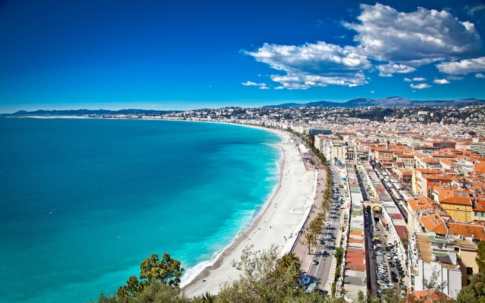
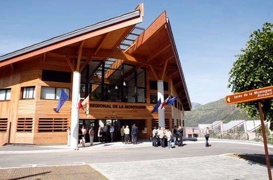
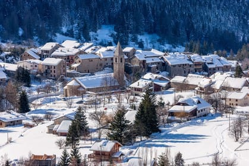

import Gallery from '../../../components/Gallery.astro';

Bonjour! We're t-minus 90 (!!!) days until my flight to Nice and believe me when I say its been quite the ride! So to update _le monde_ (the world) I got my placement for my actual school in mid-June ... ~ I'll side note here and add some information about the TAPIF program. I applied after Winter Break and heard back in the spring that I was accepted! The program is through the French Education Department and I'll be the language assistant to a middle/high school for 12-15 hours a week. You get to pick your top 3 regions to be placed in and I was super lucky to get my top pick! The only region I didn't get to when I was abroad was the South of France, so it seemed like a great place to spend 7 months. The program doesn't aid with housing or anything like that so I'll be doing the whole adulting thing solo, but in a foreign country and language! ~

it's gonna be a NICE 8 months ... (the puns start early)

I knew I was going to be in the Nice region, but it was unclear where. I was hoping (and expecting tbh) to be placed in a town on the water ... but when the email with my _arrete de nomination_ came and I frantically googled the name of the town and high school, I found myself staring at a Google Maps image of a small village (800 people total!) tucked away in a valley, surrounded by the Alps, and an extensive bus trip to the nearest airport or city. So definitely not a town on the beach. \*cue the freaking out and numerous hours googling\*

little town ... it's a quiet village

are you kidding me with this view??

It's always good to take a step back (and a breath or two) and more importantly - text your friends and fam. Everyone made a veeeery good point that no matter where I am placed, I am still living in France and can travel! So I looked at the school again and stumbled upon the website which had some very inviting photos of a cute school with picturesque mountain views. Everyone is joking that I am basically Belle from Beauty and the Beast (no complaints - she's my favorite princess). I even emailed the head teacher after I got my _arrete_ and she emailed back super quick with some great info about the school and town and answered my (slightly neurotic) questions. Turns out she's originally from California too. Small world!

She also gave me the email of the last English language assistant from the school to contact. The past assistant was super helpful and very nice to answer my email and she even gave me the email of her friend from California who was also an assistant last year! So I reached out to him as well and he also was more than happy to answer my questions (and also told me that French people seem to love Californians!)  After all this good info, I'm definitely feeling better and more prepared for this wild adventure. I also reached out to our family friend's uncle who lives there and he was also helpful! The next step was to book a flight and since Norweigan Air was having a sale (and I just got my new credit card) I decided to book one! My mom and I found out on a travel website that prices are cheaper if you book in Norweigan, so we had a small adventure translating and buying tickets in a different language that neither of us spoke - but it ended up being worth the hassle since I saved money. I booked my visa appointment today so I'm all ready to try the new visa system and pretty excited since you don't have to go to the consulate in your jurisdiction akaI don't have to change my residence to Maine or shell out money for a flight back home to LA aka I'll gladly take the 5 hour drive to Boston. Things are looking up! On my list of things to do before my flight takes off ... \- continue making as much money as I can so I can travel around Europe again \- make it to the visa appt (hopefully without any drama like last time) \- research some apartments/roommates in Nice \*\* \*\* Even though I'm going to be in the mountains for school, the head teacher said that last year the assistants commuted from Nice and lived at school for 3 days since there's more to do (and places to live!) in the city. As our family friend's uncle put it "\[the village\] is where you go to see the wildlife, not live the wild life" \- pack for 8 months into a suitcase under 32 kg and one carry on (#yikes) Bisous from your fave _assistante de langue_ to-be and follow along on the rest of _mes aventures_ ! xx, Leah &lt;3
