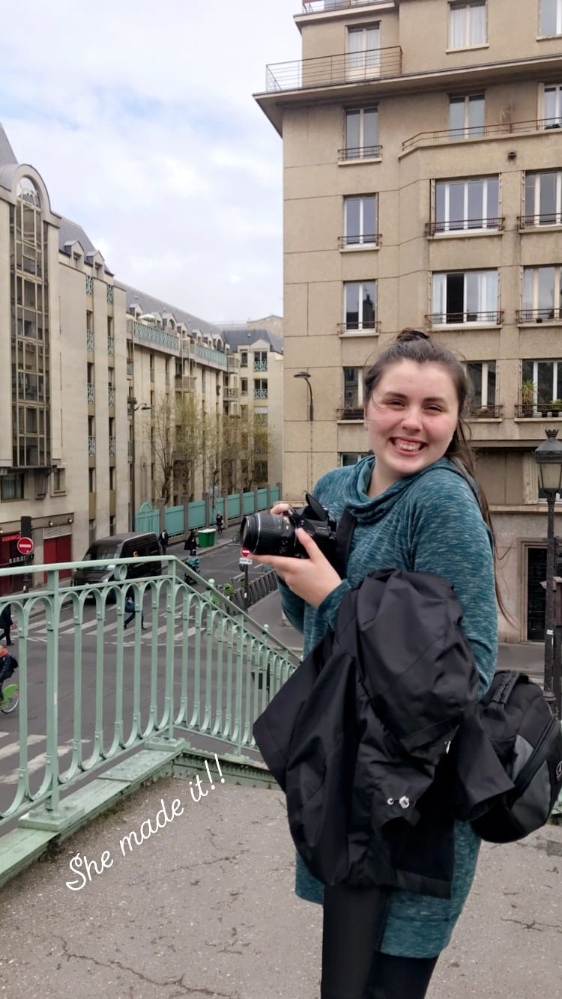

Getting up at 5 am is only exciting when I know I’m heading to Paris!! Or on holiday (again)! We started with a little bump in the road when, on Sunday night, I was texting my travel partner for the next 2 weeks Kass. I said I was excited to see her the next day and she responded saying she wasn’t landing until Tuesday morning! In my planning excitement, I had gotten the dates mixed up! So at 1:30 am I figured out I could change my train ticket and _Les Filles de Chateauneuf_ decided to cook a delish meal to celebrate one last day together, since Katie was leaving during the Easter Holidays.

So, Tuesday morning, I got up (for real) at 5 am and headed to the train station. The train was uneventful (_sauf_ the woman who was aggressively coughing at me through the seats) and I arrived at Gare de Lyon before I knew it. It was gross and rainy (#classicParis) so I metro-ed a few stops to meet Kassi at Gare de Nord. We reunited alongside the RER train and headed to our AirBnB in Belleville!

After dropping off our bags off, we headed down the street to grab some pastries from ... you guessed it, _Du Pain et Des Idées_! We decided to split a _pain au chocolat_ and an _escargot au pistache_. We enjoyed our flaky pastries by the Canal and caught up since we haven’t seen each other since the summer. Luckily, the weather decided to cooperate with us for the afternoon, so we wandered and strolled down towards Bastille in search of some _crêpes_! It was so fun getting to show Kass around my old favorite spots to go, and we even stumbled among some new things I had never seen! Paris, you never fail to disappoint me!

:::gallery{folder="general"}

> _bon appétit_

From there we metro-ed over to _Trocadéro_ to see the Eiffel Tower and the cherry blossoms in bloom. After some pictures and modeling (and a quick freak-out where I thought I lost my phone), we walked across the Champs de Mars and grabbed a _macaron_ to fuel up for the afternoon.

:::gallery{folder="general-2"}

Our next stop was to stroll across to the Champs d’Elysées and down the Tuileries in search of some more blooming flowers and sunshine. We headed into my favorite _brasserie_ as the sun went down on Paris and the lights turned on. We caught up over a _charcuterie et fromage_ board and some _kirs_ and red wine. _Bien sûr_, we had to marvel at the glittering Eiffel Tower as the clock struck 9.

:::gallery{folder="general-3"}

> Paris, we _Louvre_ you!

We headed back over the river to catch a glimpse of Notre Dame\* and a sweet crepe to end our night.

\*this was just a few days before the fire and I feel very lucky I was able to show Kassi it for the first time, and to see it myself, one last time before the fire.

:::gallery{folder="general-4"}

The next morning, we packed up and headed to Holy Belly for some pancakes to fuel our day. The sweet and savory pancake with crispy bacon, homemade bourbon butter and a fried egg paired with a cappuccino was enough to get us up the hills and stairs to _Sacré Cœur_!

:::gallery{folder="general-5"}

> don't go _bacon_ my heart!

We wandered around the Basilica and Montmartre before finding a café to have a late lunch/dinner and some wine. I introduced Kass to the _croque madame_ and she instantly was hooked. After we were full and got some planning for the next few days out of the way, we bussed it over to Beauvais to fly to Barcelona.

:::gallery{folder="general-6"}

Sadly our flight kept getting delayed but we landed in Barcelona around midnight and quickly caught our busses to the hostel without (too much) trouble! We checked in and were very pleasantly surprised when our hostel was more like a hotel - we had a full bed, toilet, and shower in our room! Happy to have made it, we quickly fell asleep.

The next morning we slept in a bit before heading to _Mercado Boqueria_ to explore and grab some juice since it was around the corner. Helpful-tip: stay close to this famous market so you can take full advantage of all the good snacks and juices for breakfast! After we finally decided on our juice choices (#toomanyflavors) we headed down through the narrow streets of the Gothic Quarter and to our first meal - _paella_! It came as a first course with some sangria and we quickly filled up on the delish meal.

:::gallery{folder="general-7"}

> _orange_ ya glad to be in Spain?

Our next stop was the beach! The beach was only about a 15 minute walk from the restaurant and the sun shone down as we wandered post-food coma. We laid in the sun on the sand and soaked up the rays - the perfect way to relax after our whirlwind of two days in Paris.

:::gallery{folder="general-8"}

> _vamos a la playa_

(Barcelona pro tip: people will come up to you literally every 3 minutes asking if you want A) a mojito B) water/beer C) a beach shawl/tapestry to lay on D) a massage E) a tattoo. They are _muy_ relentless and it’s pretty much necessary to sternly say « _No, gracies_ » each time. Unless you like being touched by a stranger. [#nojudgement](https://www.forkspoonandstraw.com/home/hashtags/nojudgement)).

We settled for some more sangria at a little café near the beach before the skies opened up and we hurried back to the hostel for a _siesta_ before dinner. When in Spain, am I right?

:::gallery{folder="general-9"}

Dinner was tapas at _La Flauta_ - a trendy, small plates restaurant. We waited a bit in line before getting a table and it already was around 9:30 pm. Spain really does do everything later! We decided on _patatas bravas_, _croquetas_, mushrooms with an egg yolk and _churros y chocolate_! It was the perfect first dinner before we met up with some of my friends from Nice for a night at the bars.

:::gallery{folder="general-10"}

> there wasn't _mushroom_ in our bellies after this meal!

Morning 2 in Barcelona started at Brunch and Cake, an insta-worthy brunch place in the _Eixample_ neighborhood. After a little wait, we decided on a chipotle chicken sandwich with guacamole, and a chocolate pancake with some coffee! Totally worth the queue in the sunshine. We wandered over to _Sagrada Familia_ to at least see the outside since we couldn’t get entry tickets. It did not disappoint! It was much bigger than I thought it was going to be, and the gorgeous flowering trees painted a beautiful backdrop.

:::gallery{folder="general-11"}

> talk about this guac!

Kass and I headed down to the _Arc de Triomf_ (Barce edition) and then back across to ... you guessed it the Mercado! We had to try a popsicle on this nice day before dinner! Passion fruit for me, kiwi for Kass. Then, we were off to _Parc Guell_! We took loads of pictures in the tiled-park and enjoyed the parakeets in the trees. The park was unique and I'm glad we went. There was a killer view of the city below, and the architecture was unlike anything I had ever seen before. Make sure you get tickets for the _parc_ and for _Sagrada Familia_ in advance, since they tend to sell out.

:::gallery{folder="general-12"}

:::gallery{folder="general-13"}

> _Guell, Guell, Guell,_ what do we have here?

Dinner was more tapas - highlights included a delish Thai peanut gyoza and tasty delish _croquetas_ with more sangria. We then went to _L’Ovella Negra_ which is a little underground bar as recommended by my friend Jenn! We ended our night on a walk home to the hostel and found ourselves in a cute, church courtyard surrounded by orange trees. _Que bueno!_

:::gallery{folder="general-14"}

Our last morning in Spain, we started at the market for one last juice and breakfast of fruit and potato-on-a-stick before wandering back to _La Flauta_ for a late-tapas lunch! We hung out, just chatting and laughing over our favorite _patatas bravas_ and sangria, getting churros and heading to the airport. It’s fun to see all the monuments and museums but it’s also the little moments like those that make travel so fun! I've been super lucky to have such a great travel and food buddy with me this trip. We grabbed a Fanta _limon_ before we boarded to our flight to Portugal!

:::gallery{folder="general-15"}

> bravo to these _patatas bravas_

Can't wait to eat all the Portuguese food ...

