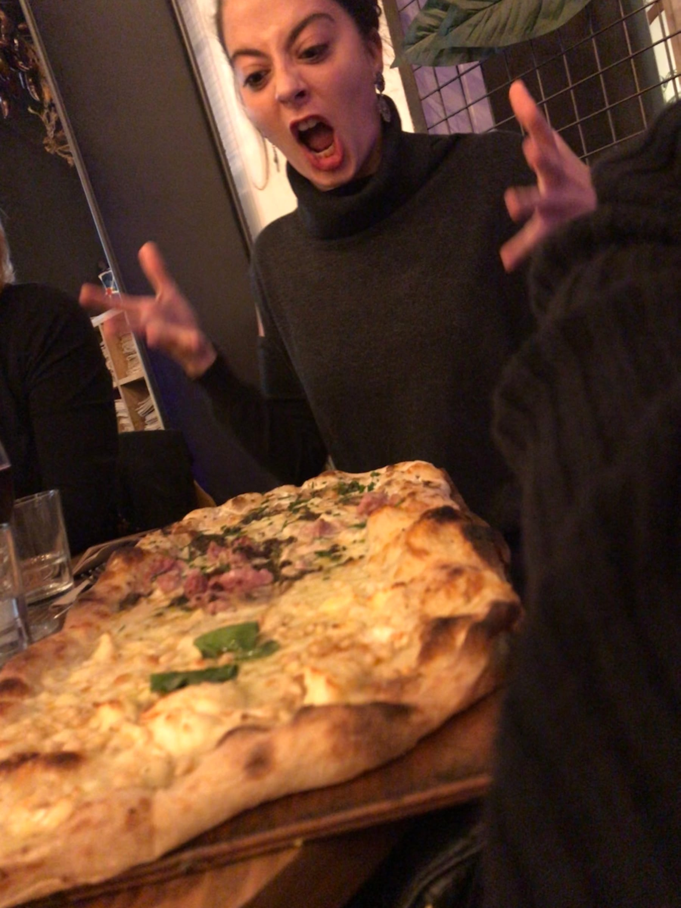
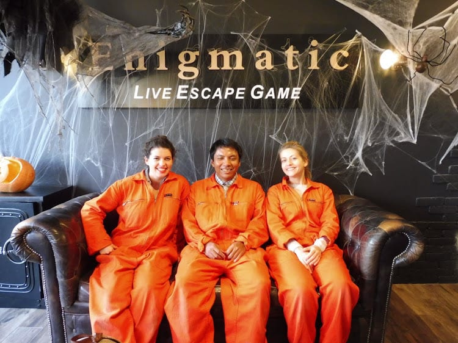
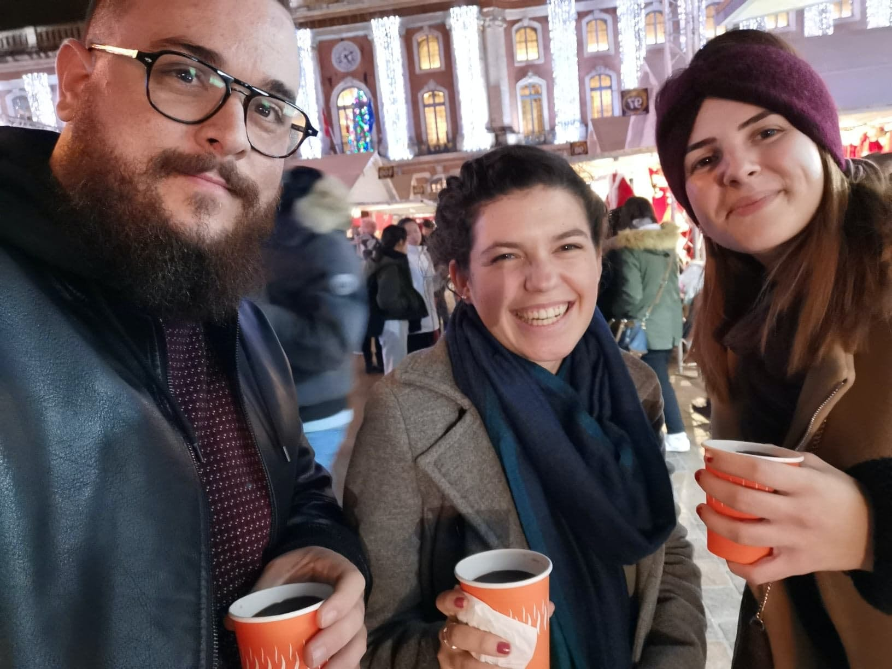
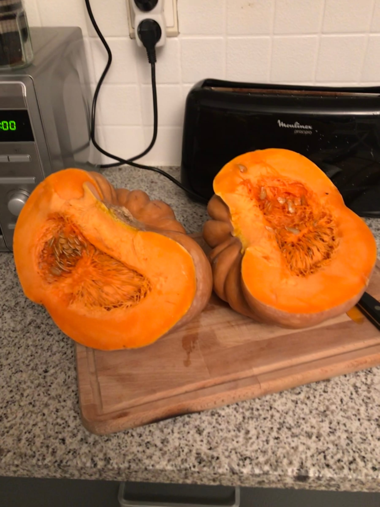

_Coucou_ friends and family! It's been a second since the last blog post ... and let me just say a lot has happened!

shout out to my colleague for reminding me that I should update my fans, followers, and people I know about life in France. 😁

Exciting news! I am no longer homeless! (Ok woah woah [#dramatic](https://www.forkspoonandstraw.com/home/hashtags/dramatic) ... I was never homeless to begin with) but I've moved into my apartment! My _colocataires_ (housemates) and I got the keys at the end of October and moved in on November 1st which luckily was a _jour férié_ or a public holiday. So I woke up early and began packing and then headed over to the apartment to help one of my _colocs_ move her stuff into the apartment. Shout out to the elevator! Her parents came to help and had borrowed a van to fit all her stuff so we unloaded it and then headed to Ikea to furnish! We both needed beds and mattresses and since we had already been and tested them - we knew what we wanted! A couple hundred Euros, an arm workout, and a Burger King sandwich later and we headed back out into the rain to the apartment.

:::gallery{folder="general"}

We lugged all the purchases up and then got to work putting the beds together in teams - me and my _coloc_ versus her parents. And let's just say we didn't bring home the trophy ... _bon bref,_ we finished setting things up and then I power walked across town to the store where I had bought my duvet and sheets and pillows. Imagine my surprise when I got to the store and the employees gave me two huge boxes to take back with me. There was no way I could walk or take the metro so I sent an SOS to my housemate who drove over and rescued me (and picked up some suitcases).

The rest of the weekend was spent unpacking, decorating, and moving my second _coloc_ into the apartment! The highlight is that the apartment is legit next door to a really good pizzeria (and dangerous too! we've already been once and I smell it each night I come home from work).

Life in the apartment is good! I live with two French girls my age. We all get along well, have loads of space and are even having our house-warming (_pendaison de crémaillaire_ \- we looked up why it's called this and it is because the crémaillaire which is like a roasting spit was the last thing furnished in the houses back in the day and therefore signified the end of the move!).

Work is heating up! 🔥The Halloween party at work was loads of fun! We worked a half-day in costume with decorations in the office then had activities in the afternoon. We had a costume contest, did a Blind Test (guess the song), had Halloween punch and then did an Escape Game.

:::gallery{folder="general-2"}

> [#SquadGhouls](https://www.forkspoonandstraw.com/home/hashtags/SquadGhouls) 👻

I had never done one before and it was loads of fun! (and hard too esp since it was all in French) Tbh, I was wicked nervous going into it because I wasn't in the easiest/least scary room and I had heard there was like a little jump scene. I'll spare you the details and just admit that I only clung onto my manager's arm 2 or 3 times when the lights went out .... [#scaredycat](https://www.forkspoonandstraw.com/home/hashtags/scaredycat). Nah, but in all seriousness it was really cool to do and we apparently did really well - even if we three had never done an escape game before and 2 out of the 3 were Anglophones!

We headed back and had a beer before everyone finished the escape game and then drove into town for an office-dinner! It was delish and cool to eat all together. The restaurant was all decked out in Halloween which added to the ambiance. I chatted with the CEO and CTO before everyone got there and got to recap the fun stories of how I found the job and [had to battle mosquitoes after the wifi cut out during my first interview.](/posts/my-first-month-in-toulouse)

November seemed to fly by! I really got to dive into things at work and take charge of projects which is wild. Like, for example, this month I made Christmas and holiday cards for people to buy at [CVS](http://www.minute-photo.com) or [Walgreens](http://www.pictarine.com) (shameless plug everyone go check them out!) that people are actually buying! Or that I wrote articles that people all over the world read. Or that I made a pin on Pinterest that has over 118k views!! Or that I got to write over 100 puns and Instagram captions for fall. Or that I am learning HTML code. Super crazy. We all got massages today to relax us as this is our crazy-busy season and we have goals to achieve in December! It's the push to the summit of 2020, plus we are moving offices at the same time.

:::gallery{folder="general-3"}

> from posing with moustaches for Movember to getting help with coding - we've got each other's backs!

Obviously things are amazing with my coworkers as per usual. The team Growth has an awesome ambiance with music often played in our little corner, a mix of English, French and Franglais, lots of laughs, rankings of Christmas movies on Netflix ... My _bînome_ (other half/partner in crime) and I really are just that. We've started sharing content and bouncing ideas off each other, always giggling at something, finding out we both are Christmas fans, love turtles, get emotional during movies - it's very blessed. And my other colleague wants to get in on this action in the blog, so he gets a special shoutout as a _trînome honoraire avec nous !_

And my work friends don't stop there! Because the office is so small I have pals in all of the different teams. We go to the gym together [#gains](https://www.forkspoonandstraw.com/home/hashtags/gains), go out to lunch or to the mall together, grab beers afterwork or even have game nights! I'm so very lucky that I've landed in a great environment not only just to work but to also have friends.

> on est chaud pour le vin chaud 🍷

Weekends have been very low-key for me. It's amazing how working all week and being immersed in a different language can really exhaust you! I've hung out with my other friend in Toulouse almost every weekend getting food, shopping or even going ice skating!

Of course I'm eating well. Cooking in the big kitchen has been fun and I've been discovering the many tasty eats in town! Highlights include getting a bunch of my colleagues hooked on pumpkin beer (and finding pumpkin beer!), trying coffee liqueur with Coke (don't knock it 'till you try it), homemade pumpkin bread, fajitas, Thanksgiving leftover sandwich, some really good Asian fusion food and a tasty brunch with Eggs Benedict!

:::gallery{folder="general-4"}

> it's a Gouda 🧀 thing I joined a gym ...

Fall in Toulouse is quite pretty with all the leaves changing, despite the weekly protests on Saturday with tear gas galore. (Fun fact- we're in the largest strike in France in the past 24 years currently!)

:::gallery{folder="general-5"}

## Gobble 'till you Wobble

_Thanksgiving in Toulouse_

I bought and roasted a whole pumpkin to make puree! For pie! And figured how to make Green Bean Casserole!

pumpkin spice & everything nice

My American colleague (and British colleague who lived in America for a while) all prepared Thanksgiving together. We had stuffing and potatoes and cranberry sauce and cornbread and rotisserie chickens .... it really was a feast! And as to be expected Thanksgiving was quite tough being so far away from friends and fam back home, but being with new friends and colleagues really helped.

:::gallery{folder="gobble-till-you-wobble"}

> Pie know what I'm thankful for 🎃

And then I recreated dinner for my _colocs_ that night! I would definitely advise against eating two Thanksgiving dinners on the same day for anyone considering it.

We're really in the swing of all things Christmas here - from the _Marché de Noël_ to Christmas carols and movies galore at home and at work, to Christmas content at work, and even Advent Calendars!

:::gallery{folder="gobble-till-you-wobble-2"}

Time is flying by here and I can't believe it's already December. I head back home to California (In & Out I'm coming for ya) for the holidays for the first time in 2 years. So stay tuned for end-of-the-year fun and of course a Picta'Christmas party!

Sending Christmas Kisses,

