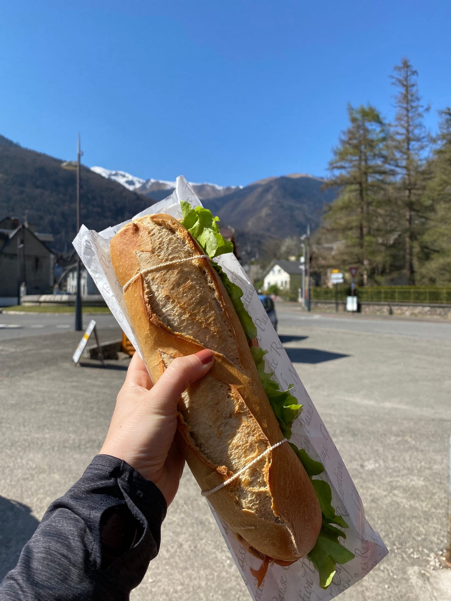
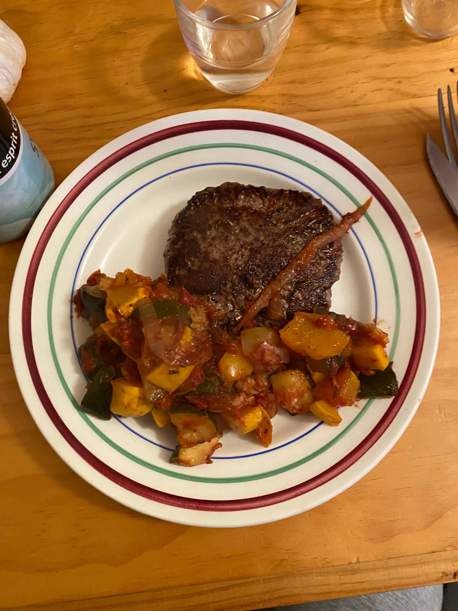
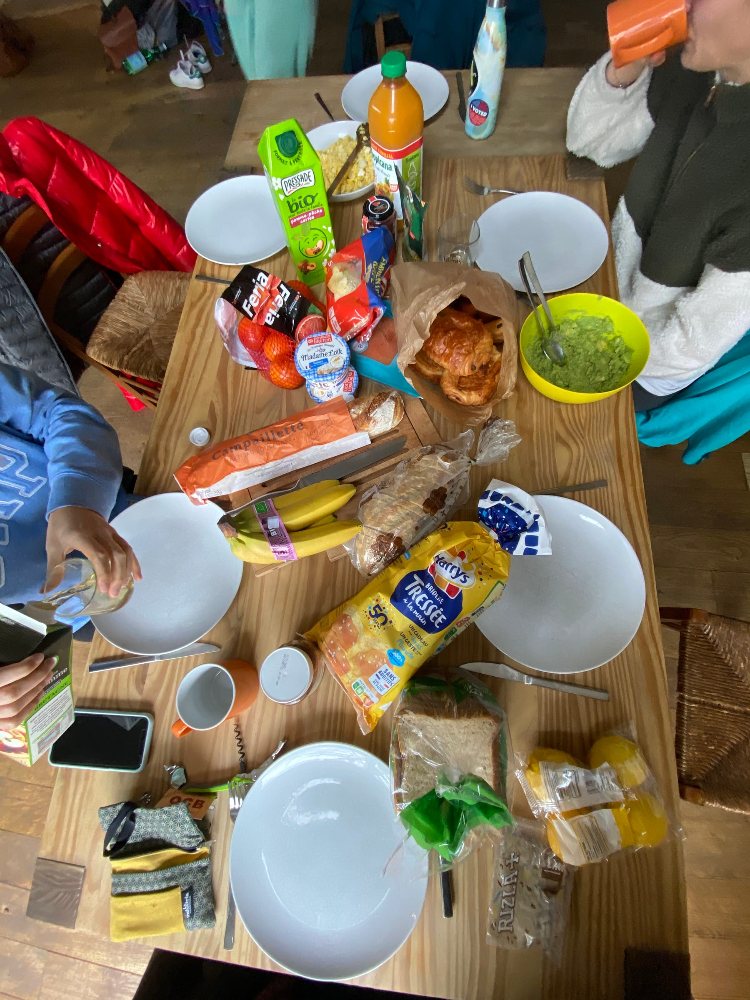
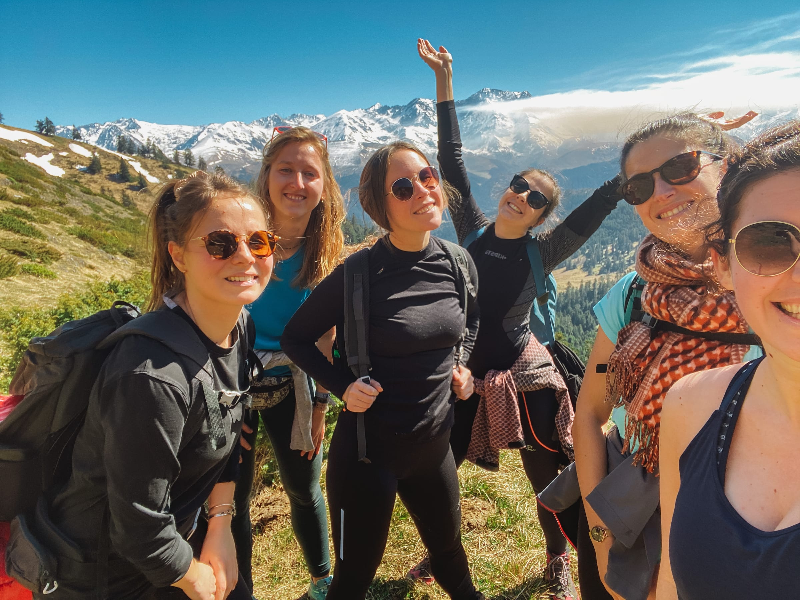

import Gallery from '../../../components/Gallery.astro';

##### Salut à tous !

When the _couvre-feu_ and the impending doom of a 3rd confinement get you down, it's always nice to have something to look forward too. I don't remember who brought it up, but I think back in February, we had the idea to rent an AirBnb in the Pyrenees and have a fun long weekend of hiking and thermal baths _entre gonzesses_**_._**

One _lundi aprèm_, we were browsing on AirBnb in the region to see what was available and stumbled upon a real _pépite_. It was a whole house with a shared pool, Jacuzzi, yard, ping-pong and more! We just knew we had to snatch up this great find (for a great price too) and booked later that night. The plan was starting to come together ...

The week in March seemed to fly by and before I knew it, it was Wednesday and Océane's friend Mathilde arrived from Montpellier. We had a nice carb-loaded dinner of _pâtes avec des lardons et une sauce au bleu_ before watching "She"s The Man" and heading to bed relatively early.

Thursday morning we finished packing, loaded up Math's car, and hit the road to Luchon, a ski town about an hour and a half south of Toulouse towards the mountains. We arrived around noon and stopped at a _boulangerie_ for a sandwich and a coffee before heading to the starting point of our _randonnée_.

> this lunch was sure to bag-get me up the mountain!

We started our hike on the outskirts of a little _commune_ near Luchon with a sign warning us of avalanches. Needless to say, we were a bit wary! We headed up, up, up ... following a little river until we reached our first viewpoint of _la Cascade d'Enfer_ (literally hell's waterfall 👀). It was very impressive and we even braved the icy and very slippery stairs down to catch a better glimpse.

<Gallery post="randos-repos-a-long-weekend-in-the-pyrenees" folder="salut-tous" />

> don't go chasing waterfalls ... or in this case ... do!

From there we alternated between icy snow, mud and rocky ground as we continued to hike. We saw a group of _chevreuils_ (a sort of deer) but Océ who had taken the lead was convinced it was a group of men!

The hike was gorgeous and got slowly but surely a bit snowier before we rounded the corner to _cette vue magnifique_. It was jaw-dropping with the snowy mountains against the blue sky.

<Gallery post="randos-repos-a-long-weekend-in-the-pyrenees" folder="salut-tous-2" />

> la cascade de l'enfer ... en fait c'est le paradis !

We continued until we reached the source of the _cascade_ and then quickly left since there was a bit of melting snow that fell from the mountains near us (and sounded suspiciously like an avalanche...)

The way back we had a _pause Pom'pote_ and enjoyed the view before continuing back down the way we came. We reached the _cascade_ viewing point and then took our final trail to complete the 9 km loop.

<Gallery post="randos-repos-a-long-weekend-in-the-pyrenees" folder="salut-tous-3" />

> running from the "avalanche" like ...

Our last pause before heading down some _virages_ (switchbacks) was a field with an almost 360° view of the Pyrenees. The way down went quickly and we were back at the car by 16h. This was one of my favorite hikes I have done in France - the views were _trop beaux_ and I loved the fact that we were hiking in the snow, _avec du soleil quand même !_

We headed into town to buy groceries to make dinner for the night (_merci le couvre-feu_) and then after a wrong stop, we found our AirBnb for the night. It was like the opposite of an Escape Game (Entry Game?) where we had a code and an apartment number. Our first task was to find the correct apartment in the building complex using the numbers and names on the mailboxes. Then we found a key under the mat to the mailbox. We headed back and in the mailbox there was a lockbox to input the code we had and then get the key to the apartment! Phew!

And when I say it was a _petit appartement_, it really was just that - a small bedroom with a double bed, a bathroom and toilet and the _salon_ and _cuisine_ were made for 2 people max, in my opinion. But, it was all worth it for _le balcon_ with a great view of the mountains! We were already excited for breakfast the next morning. We showered and started prepping dinner - _ratatouille_ (but without salt and pepper because the AirBnb was not equipped with that!).

> "it sounds like _rat_ and _patootie_"

_Apéro_ was held on the balcony as the last rays of sun dipped behind the looming mountains. We _santé_\-ed to the beginning of a fun weekend and enjoyed our _cidre_ and played some board games before dinner. Dinner was a bit _fad_ as they say here but luckily we had bought _herbes de Provence_ to spice up the ratatouille. We relaxed and watched tv and stretched before turning in at like 10 pm since we were _KO_ from our hike.

The next morning was breakfast on the _balcon_ with _brioche_ and _Nutella._ We lounged around and played another game before finally _bouger nos culs_ to start the day. We headed into Luchon to the _office de tourisme_ to see if they had any ideas for a small _randonnée_ we could do in an hour before heading to our second AirBnb.

<Gallery post="randos-repos-a-long-weekend-in-the-pyrenees" folder="salut-tous-4" />

> let me Nut-tel-ya about this morning view

We ended up just walking around the town and following a river past an airfield which had _planeurs_ (glider planes) taking off. We had a _kebab_ (#healthy) for a late lunch before heading west towards _Pau_ to our second destination, with the music blasting and our best karaoke of course!

In about an hour we had arrived in _Lagos_ ... and no, not in Portugal! This little village reminded us a lot of [_Réquista_](/posts/des-vacances-sportives) where we spent a week this summer. We found the AirBnb and got the little tour before quickly calling the second half of our clan who had just left Toulouse. We headed to the next town to do some grocery shopping for dinner and _apéro_, _bien sûr !_

When Noémie, Gwen and Claire arrived, we checked in with the AirBnb host and then headed directly to the pool! _Apéro_ was poolside and we had a blast splashing around and enjoying the hot-tub of course. We stayed in the pool until about 10 pm, which was the curfew for the pool (can't escape it!).

Dinner was lasagna and we headed to bed when we found a 7th houseguest ... apparently there was a mouse in the house!

<Gallery post="randos-repos-a-long-weekend-in-the-pyrenees" folder="salut-tous-5" />

_Samedi matin_ we decided to sleep in a bit ... I was up at 9 am and wildly Nono was motivated to head into town to get _pain et pâtisseries_ for brunch so I went with her! Math tackled some crosswords and Océ was motivated to get some laps in the pool when we got back.

We chilled and did some crossword puzzles while waiting for Gwen and Claire to wake up and then _lancé le brunch_ of avocado toasts with scrambled eggs, lox, bacon, _brioche,_ and _pains aux raisins._ After brunch since the weather was kinda crappy, we headed back to the pool.

> avoca-don't you want some?

The afternoon was spent playing ping-pong, _babyfoot_ (any ideas what this game is?) and hanging out in the Jacuzzi and pool. We even took advantage of the sun at the end of the day and read and did crosswords in the garden with the bunny! (Yes, we turn into 80 year old _mamies_ when we are _en vacances_).

<Gallery post="randos-repos-a-long-weekend-in-the-pyrenees" folder="salut-tous-6" />

_Qui dit week-end entre copines, dit apéro tous les soirs !_ We prepared the _saucisson_ and _Despés_ and decided to break out a board game - Dixit! We ended up making some _tartes_ for dinner and dancing around the apartment, playing ukulele, and ending the evening with another _jeu de société_.

Sunday morning, we all got up pretty early to pack up (and clean up!) before leaving the AirBnb and heading halfway back to Toulouse ... to the depart of our last _randonnée._ We struggled a bit trying to find a _boulangerie_ that was open with sandwiches on the way and ended up just grabbing supplies at a little store to make our own.

_Et c'etait parti ..._ up the last trail, with gorgeous view of the snow-capped mountains. This hike was pretty muddy (and steep) since it is springtime here and we had a time slipping around in the _boue._

<Gallery post="randos-repos-a-long-weekend-in-the-pyrenees" folder="salut-tous-7" />

> _les aventurières !_

_Comme d'habitude,_ the view from the top was so worth it, even if it was a little bit more of a struggle (I had the excuse of a twisted ankle ...). We _pique-nique_\-ed at the top, and I learned a new word in french - _les orties_ (stinging nettles) as I put my hand directly in one during lunch.

<Gallery post="randos-repos-a-long-weekend-in-the-pyrenees" folder="salut-tous-8" />

We popped back down the mountain and had one last _goûter_ together before splitting up in the cars to head back to reality.

All in all, it was a great mini-vacation with great friends, good food, and some fun times spent together on the mountain or in the hot-tub!

> les gonz à la montagne 🥰

_À refaire très bientôt_,

##### xx lele

[Video hike #1](https://vm.tiktok.com/ZMRY7nn1U/) [Video hike #2](https://vm.tiktok.com/ZMRY7KHY8/)

[Video week-end](https://vm.tiktok.com/ZMRY7pGVv/)
