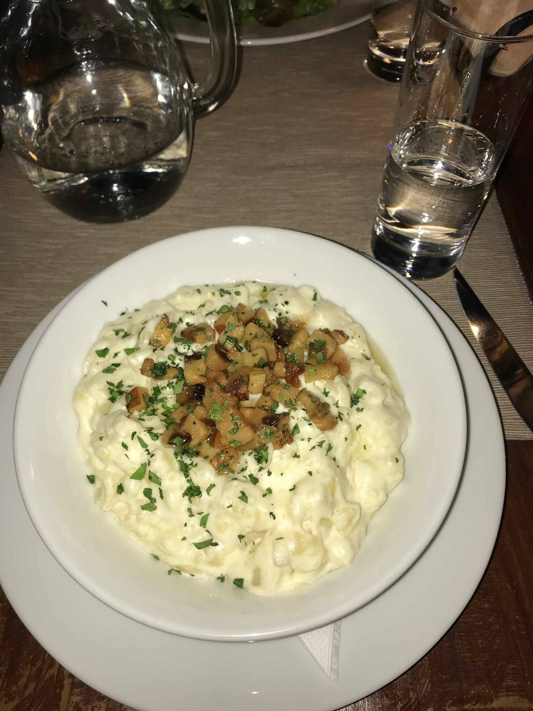

Taking buses through Eastern Europe is definitely the way to go - especially when the only cost 5 euros and come with a free coffee and entertainment systems! It only took about an hour to cross over the border into Slovakia from Vienna.

We managed to figure out the bus system and make it to our AirBnB on the 9th floor of an old apartment building across the Danube from the downtown Bratislava. The downside to this was that the elevator looked like it had been built with the building and shuddered every-time we got to our floor - so we avoided the elevator whenever we could ... can you say leg day?

Our first stop was downtown for some lunch and I had found a traditional Slovakian restaurant to get a taste of the region. Lunch was filling as the meals over break usually were and I enjoyed my sheep's cheese and bacon noodles.

not a baaaaaah-d meal 🐑

We were fueled enough to tackle the castle which is just outside the city's fortified walls. We climbed the steps and windy roads up to the top, just as the sun was setting! The castle was definitely a highlight of the short trip and it was cool to look out down the Danube.

:::gallery{folder="general"}

We headed back into the city walls to explore before it got too dark. The sun set earlier than we were used to in the South, so we quickly explored and took pictures. We stumbled upon the "Working Man" statue and spotted Saint Michael's Gate as we entered the city. We were pretty full from our late lunch so we decided to just to grab a beer before heading back to our AirBnb.

:::gallery{folder="general-2"}

I got to call the 'rents on our early night in which was nice to recap my past few days adventures.

Tuesday morning, we packed up and snuck back into the city for some pastries and coffee thanks to a recommendation from a friend. They were out of their homemade brioche so I settled for a cinnamon pastry and a cappuccino which were absolutely delish. We grabbed our bags and went back to the bus station for our next trip ...

:::gallery{folder="general-3"}

On to the next city!

Lele
