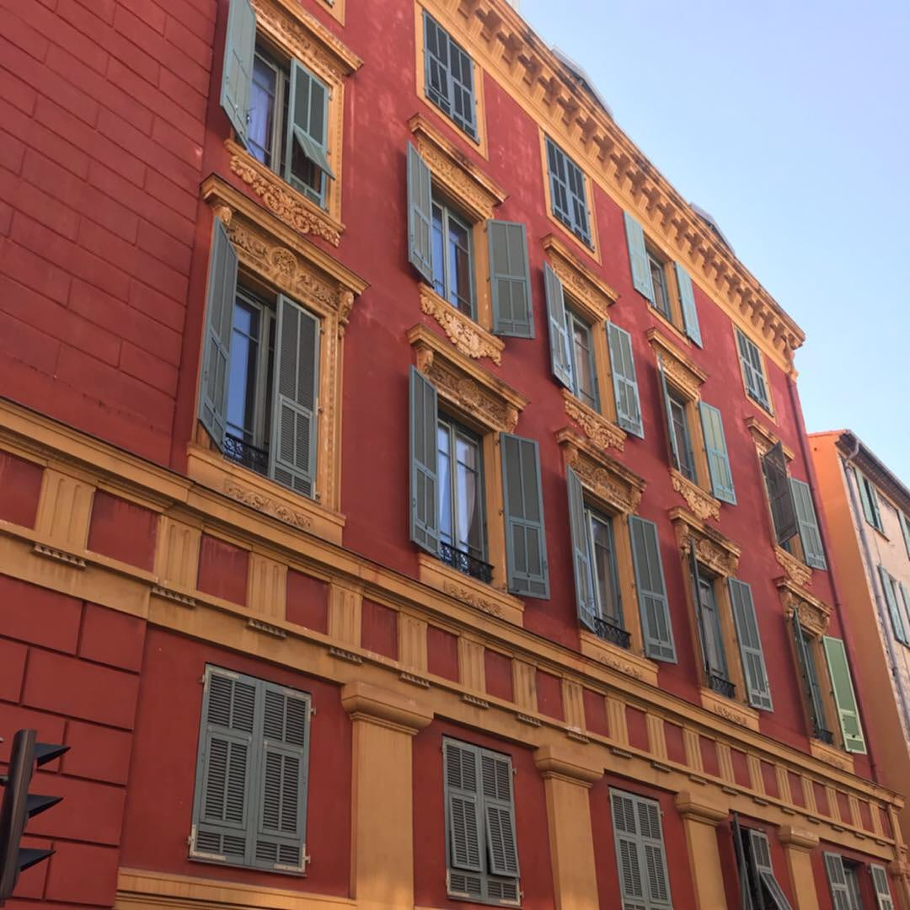
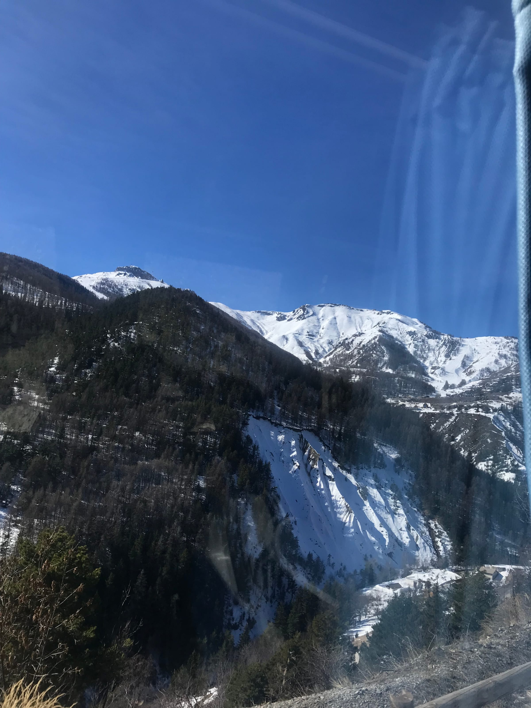
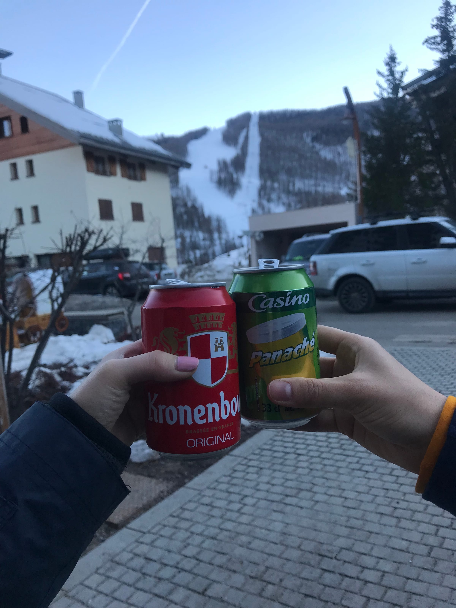

(or ... all the times we failed while going skiing)

Coucou from _les Alpes_! Mel and I spontaneously decided to join some friends on a ski trip to _Auron_ this past Friday. We had always talked about going skiing for the day and it seemed like the perfect time since it was the last week of break. Melissa was supposed to come back late Thursday evening, so I headed out in the afternoon in search of some ski pants.

I took the long walk to Decathalon, a sporting good store, and managed to find some pants for both of us. Our first struggles started here, Melissa kept getting delay after delay on each train she took and I tried to ask some employees questions about their trial period and return policy with no luck. Then I called the bus company to try to reserve tickets for the special ski station bus our friends were taking. The man on the phone was not helpful, but our friends said maybe it was possible to buy the tickets on board since they saw that happen last time.

Friday morning, we woke up early (ok so like an average Monday for me) and took the tram to the bus station, stopping for a croissant on the way. We waited in line for the bus when bad news [#2](https://www.forkspoonandstraw.com/home/hashtags/2) struck - we were out of luck for the tickets to take the ski bus. Melissa and I waited outside the bus and tried to re-evaluate our options. The good news was that we hadn't booked our skip pass or rentals yet so technically we weren't out any money! The bus driver luckily felt some sympathy for us and let us know that there was a later bus we could take at 10 am, so we headed back home, walked the dog, bought our online ski passes and grabbed some sandwiches for the way.

The bus came on time and we were able to get on _tout suite_ until bad news [#3](https://www.forkspoonandstraw.com/home/hashtags/3) struck - there was no late bus back since it was booked up and we would have to leave at 3 pm, giving us about 2 hours to ski. We honestly started to laugh since it seemed like our bad luck would never end - until I had a genius idea to see if there were any Bla Bla cars in the area and an angel appeared in the form of a car going back to Nice from the ski slopes at 6 pm. Success at last!

We saw more and more snow until we arrived at Auron and headed to a rental shop to get fitted with out boots and skis (you already know that I had to have child sized everything [#babyfeet](https://www.forkspoonandstraw.com/home/hashtags/babyfeet)). We said hi to our Cannes friends who we met while they were having lunch and went to pick up our ski passes that we had bought online.

Bad news [#4](https://www.forkspoonandstraw.com/home/hashtags/4) when the first woman at the counter couldn't find out reservation in her system so we were passed to her colleague who also couldn't find it. She directed us to the side office where the third colleague was also stumped. About a half-hour later we learned reservations made the day-of are only valid after the date of purchase... just our luck. At this point we could physically see the gondalas going up and down the slopes and were so close we could taste it! We explained that we didn't see anywhere on the website that this rule existed and we did not want to shell out another 30 euros each to buy a new pass. I'll spare you the borderline-crazy laughter, arguments, and lots of time waiting but at 1:30 pm we were on the _télécabine_ up to shred on the slopes!

:::gallery{folder="general"}

Skiing was so fun! It took a few runs to get my feet (and skis) underneath me but after 3 times on the beginner slope, we hit a medium one! The lift on the way up took us over a ski school so we were able to watch the little kids do some crazy cool slaloms and giant slaloms. It made me think of my students at school who all ski!

The bigger slopes were definitely steeper but still the most fun! Our last two runs were on the most beautiful slope I had ever seen. Seriously, it was hard to focus on keeping my skis straight when the Alps were literally right in front of me. _Trop cool !_ I did fall once (let's blame it on the scenery) but we got so many cool pictures and views.

:::gallery{folder="general-2"}

Melissa and I looked at the time and realized we only had 15 minutes to take the gondola back, return out skis and find the Bla Bla car! We were in the gondola when I got a all from the rideshare that she was going to be about 20-30 minutes late - _tant mieux !_ We were able to return our equipment and grab some food and an _après-ski_ beer before heading back.

wished we had \[lager\] to ski

All-in-all it was a super fun day, even with all the troubles we had. We kept saying how fun it was and how much we already wanted to go back! And now we know to book (a little) more in advance ...

The next Olypic gold medal goes to ...

Lele! xxx
