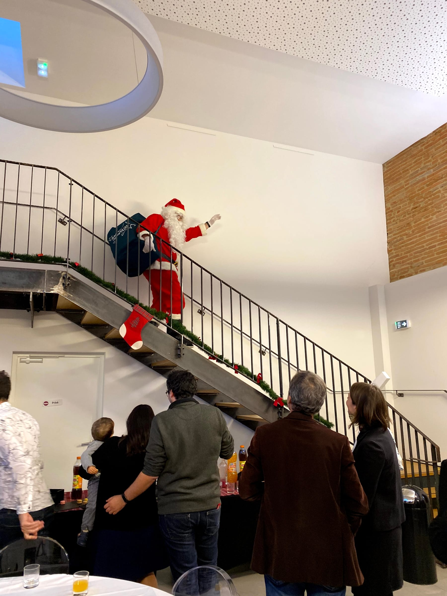
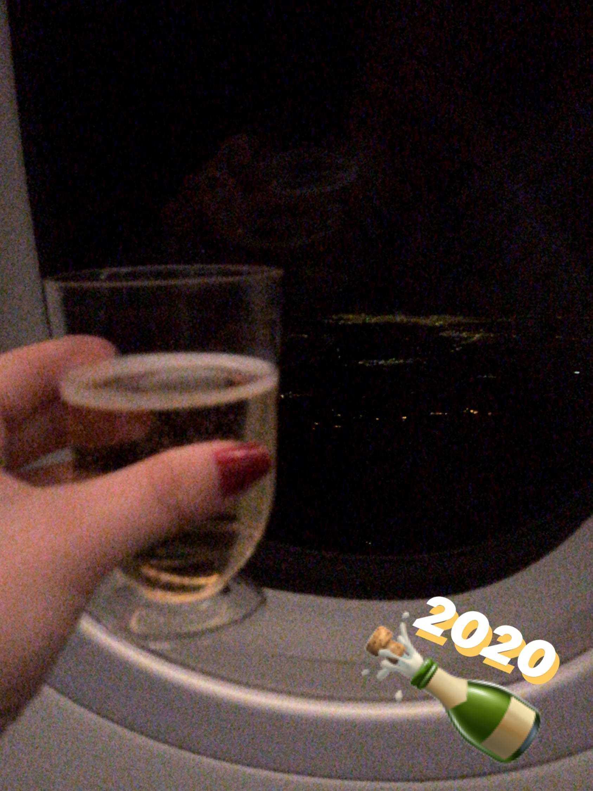

_Coucou les ami.es !_ Everyone at work wasn’t kidding when they said December is our busiest month … and pair that with holiday parties and housewarmings and it’s been a _sacré_ (helluva) month. Not to worry - the Picta’Team knows how to unwind and we proved we were more _knotty_ than nice when we got massages at work!

The first weekend of December, my housemate had a friend from home visiting and we all went to the _pendaison de cremaillère_ of another friend in Toulouse (housewarming - the hanging of the _cremaillère_ was the last thing when moving into a house in the 19th century in France and signified that you were finally all moved in). It was a fun, house party with lots of good snacks and then we hit the town!

Sunday was spent lounging around the apartment and catching up on sleep since I was out until 2 am the night before. It’s definitely not as easy as it was in college!

The next rainy week at work flew by as we had our work _soirée de Noêl_ (Christmas party) on Wednesday! It was so much fun - we had a cocktail hour with little appetizers and lots of champagne [#WhenInFrance](https://www.forkspoonandstraw.com/home/hashtags/WhenInFrance). Then … Santa stopped by! I won’t say that I knew him … but let’s just say we got a sneak preview the week before to make sure the suit was ready to go! There was supposed to be a sleigh but due to the rain, the rental company canceled it (apparently horses don’t like to pull the sleigh in the rain - who knew!). I also then learned the word for sleigh in French - _une calèche_ in case you’re wondering.

Santa handed out the presents to the Picta’kids and then us employees even got Christmas gifts as well! So sweet.

The young people without kids hung out together at the _soirée_ and we even had a kid’s table to ourselves for the meal! The champagne flowed, we ate our four-course meal and even had a magician perform for us! We had the venue until midnight so we celebrated until the last second. I crashed at my _bînome_’s apartment since it was much closer!

:::gallery{folder="general"}

> had my _foie gras_ like any good Frenchie for Xmas

That Friday, after work, a group of Picta’Pals went to a fancy wine tasting where we learned about lots of wine, and drank _pas mal du vin !!_ (Of course) The next morning I woke up early and headed to try to finish my last-minute holiday shopping before starting our preparations for our own _crémaillère !_ We spent the afternoon cooking and even had a friend come over to make homemade pizzas from scratch - sooooo tasty.

:::gallery{folder="general-2"}

We had a super fun night with all our friends and colleagues hanging out, eating, drinking, and having a blast! We partied just until 4 am 😮

:::gallery{folder="general-3"}

The next day I headed out again to _profiter bien du soleil_ (take advantage of the sun) and really finish up my holiday shopping … nothing like waiting until the last minute! The beginning of the rest of the week was busy, busy, busy finishing up all my blog posts, pinning all the pins, and programming every social media channel so I could leave for vacation. Thursday rolled around and it was our _“Dire Au Revoir aux Locaux’_ (say goodbye to the office) party! I helped plan the menu and the games with a coworker and we had a blast all night long.

:::gallery{folder="general-4"}

The next day, we all had a late start … except for those who slept at the office! We learned that we had achieved 2 of our goals for the month of December! What a great way to start the break. I headed home to finish packing my suitcases since I had a wicked early flight _le lendemain_ (the next morning)…

The next morning at 4 am rolled around way too early but there was nothing better than a fresh almond croissant to make it better! My hour and a half flight from Toulouse flew by (pun intended, c'mon y'all ... _c'est moi_) and I landed in Paris and grabbed my _valise_ (suitcase) before I knew it. I hung out and watched Netflix for about half of my 6-hour layover before changing terminals and standing in long lines for exit customs and bag drops. But I was on the plane and ready for 11 hours in the air!!

Turns out 2.5 glasses of red wine is the magic number to make me fall asleep on planes and I took a little 4-hour nap, blogged, edited photos and watched movies for the rest of the time. We landed and I switched out my SIM card like the international citizen I am and nearly ran off the plane to customs. I had a little hiccup at customs when the airline had put my birthdate in wrong but the customs agent was super chatty and nice and fixed it for me! [#TantMieux](https://www.forkspoonandstraw.com/home/hashtags/TantMieux) [#WelcomeBackToAmerica](https://www.forkspoonandstraw.com/home/hashtags/WelcomeBackToAmerica)

:::gallery{folder="general-5"}

Grabbed my bag, found my Uber (thanks for making the 5 minute drive, Dad) and headed directly to our annual holiday party (and housewarming !!). Let me tell you it was so weird to “come home” to a new house and have to ask my parents where the bedrooms and bathrooms were! We ate so much good food, I caught up with friends and family I hadn’t seen in 2 years and I ate. A lot. Also I wouldn’t recommend being awake for 30 hours nonstop and then having a lot of socializing but if you do, have some holiday punch! 😉 it helps.

:::gallery{folder="general-6"}

_Ça y est !_ There it is ... I was on vacation! We hung out at home a bunch before Christmas and did some last-minute holiday shopping. I was home for all 8 nights of Hannukah which was fun and lit (_c’est moi …_ pun definitely intended!) We did lots of fun American Christmas things like driving around looking at the lights in our new neighborhood, drinking lots of Peppermint Mochas, wrapping presents.

:::gallery{folder="general-7"}

Christmas Eve rolled around quickly and we celebrated with In & Out burgers and fries and _A Christmas Story_, my fave holiday film! The next morning, we had bagel breakfast sammies and mimosas while opening presents! The afternoon was spent lounging, falling asleep on the couch [#jetlag](https://www.forkspoonandstraw.com/home/hashtags/jetlag), watching movies and then we had a little appetizer, small bites “Christmas Dinner” with tamales, wings, latkes, street tacos, dumplings … definitely not a traditional meal!

:::gallery{folder="general-8"}

Other highlights of my little stay at home were going to get _Xiao long bao_ (Chinese soup dumplings), a little family hike, driving like _Fast and the Furious_ to catch the sunset with Claire, visiting with my childhood friends and their families for carne asada and margaritas, eating Chicken and Waffles, eating garlic knots, eating Chimney cakes, eating donuts …. (Sensing a theme here????)

:::gallery{folder="general-9"}

I caught up with some friends from high school, a Paris pal, a friend from Nice and of course, spent lots of time with the fam ❤️! It was strange being home in LA since it had been about 2 years since I'd been back but the little break was definitely needed! The new house was different and I'm sure it will be changed with the remodel the next time I am home. I definitely did miss being close to my family and friends (even if it was something as simple as being in the same time zone to talk more frequently) but I still was a bit excited to go back to my life in France. I'm just saying if we could make the Atlantic Ocean a lot smaller that'd make my life much easier!

:::gallery{folder="general-10"}

I celebrated New Years Eve on the plane after a tearful goodbye (literally _never_ gets easier) with some champagne and lots of turbulence. I hung out in the Paris airport all afternoon then hopped on the plane to land in Toulouse around 10 pm. My _coloc_ picked me up from the airport and I promptly fell asleep because …

I had to work the next day!!! The first few days were rough at work and I napped during my lunch break. My _colocs_ and I picked up a new sofa from work because we were moving and _à la fin de la semaine_ (at the end of the week) we put the last things into boxes at work!

We worked remotely or in a cowering space for 2 days and then got to work unpacking and setting up _les nouveaux locaux_ (the new office)_._ The sunsets here are wicked! We celebrated with some _galettes de rois_ (king’s cake) because it was Epiphany at the beginning of January.

I brought over loads of snacks and goodies from the States for my colleagues and everyone enjoyed them! We are slowly but surely _s’habituer_ à (getting used to) the new workspace and all the extra space and killer kitchen we have!

:::gallery{folder="general-11"}

Happy (belated) holidays & _Bonne année !_

