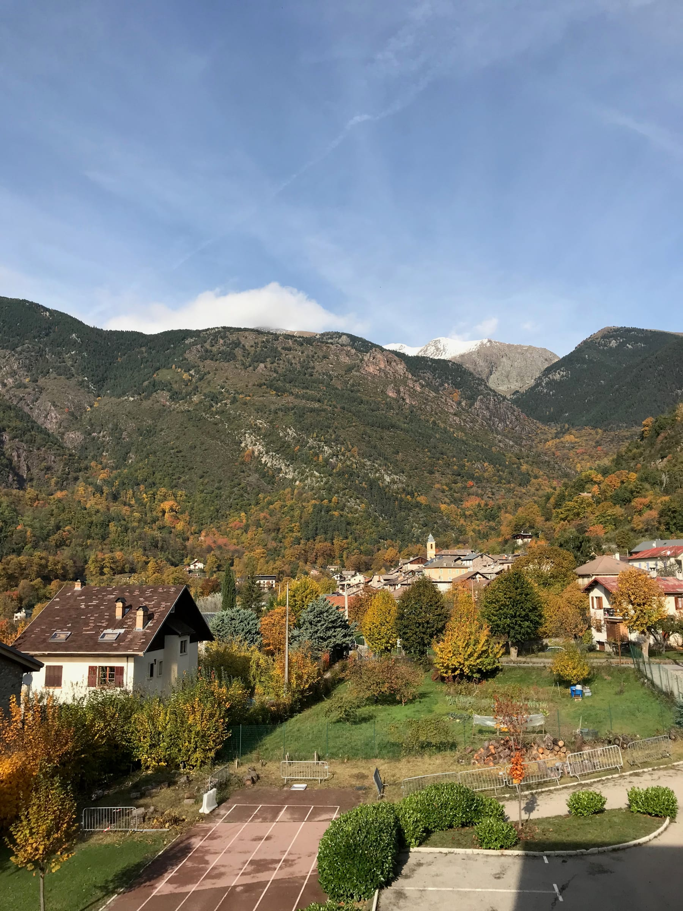
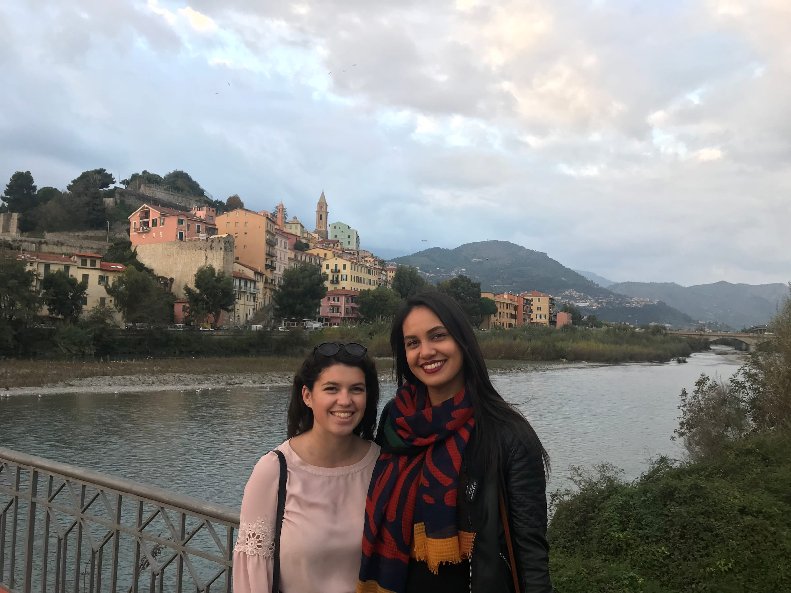
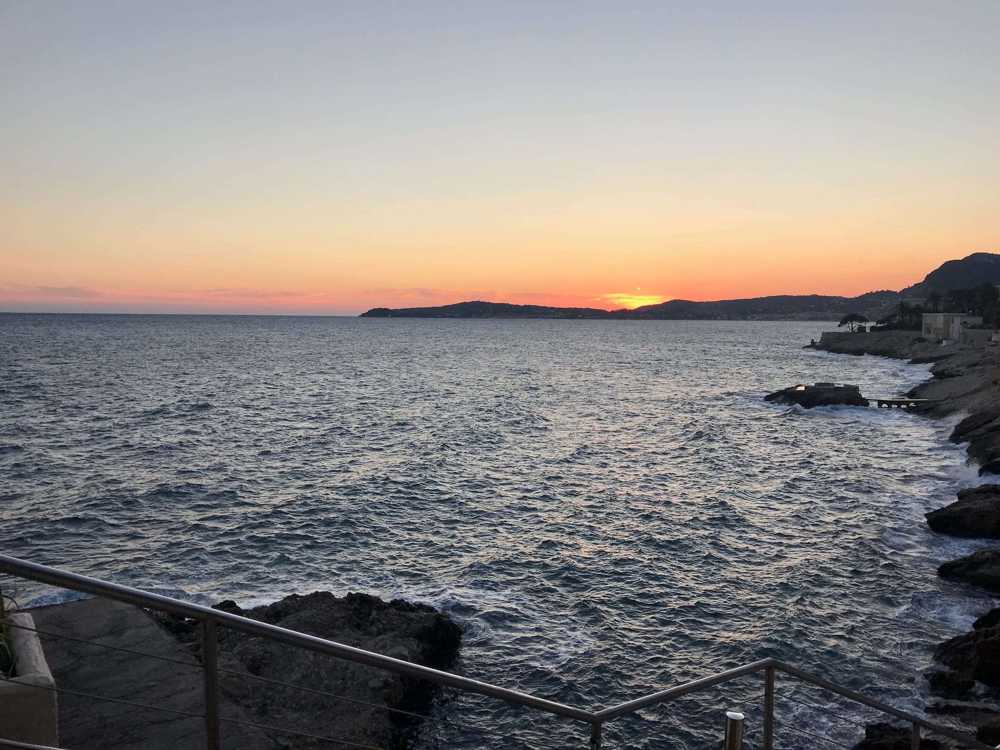

_Coucou à tous et à toutes !_ It’s your favorite mountain goat here back from vacation - my housemates’ friends came to visit these past 2 weeks so I’ve been tagging along on all their _aventures_.

The first trip was to Monaco for a few hours (what is my life!?) It was fun to see the casino and walk around Monte Carlo for a bit before hopping back on a train to Nice! The country is quite small and it is perfect for a day trip to explore the city. That’s wild to me that so many places are a short train ride away.

:::gallery{folder="general"}

> Let's Mona-go!

Our next trip (aka the next day) was to rent a car and head to the Alps to _faire une randonnée_ (go for a hike)! We hit a few bumps in the road with renting the car (turns out you need 3 forms of identity!) but we headed up the route to school and then turned to a different part of the Alps. The drive up was stunning with views of the mountains and the autumn leaves. It turns out over break, even the South of France got in on that fall action. We stopped at the town close by to grab some snacks before heading to the national park. The scenery kept getting prettier and we started to drive by some _neige_ on the ground ...

:::gallery{folder="general-2"}

> Some better shoes may (h)Alp next time

We left a little late for our hike and it took a bit longer than we thought as we were trudging through lots of slippery mud in the rain. But the views made up for all of it - the trees were so yellow it seemed almost photoshopped (#nofilter). We got about halfway to the lake when we realized we were maybe underprepared for this hike with our sneakers and lack of winter jackets and late start. So we ended up stopping at a waterfall and taking pictures before turning back. All in all, definitely a good decision since it was almost dark when we got back to the car!

:::gallery{folder="general-3"}

Our drive down is when it got a little harrowing - I’d never believed the expression “fog as thick as pea soup” until this moment when we were driving down switchbacked, narrow mountain roads barely able to see 3 feet in front of the car. The car of 4 girls was completely silent for about an hour until we could see again! Something to write home about for sure.

We returned the car with only making 2 laps around the airport to find the car return section. We went back home and had some well-deserved pasta and wine to end our very long day!

School was low key this week - highlights included reading horoscopes and doing quizzes from the newspaper with the teachers Monday evening and this conversation with one of my _secondes:_

Me: “what is your favorite food and why?”

Student: “you”

(The class and mostly me are cracking up)

Student: “uh no I didn’t mean that - it was a question - you?”

But we all know I’m a snack ;)

More pals of the housemates are here this weekend so we set off to Ventimiglia on Friday morning _par train_ to see the Italian markets! The first city across the French-Italian border is only about 1 hour away from Nice and we always talked about hopping over for a day. On the train, Melissa and I ended up talking to a cute older woman from nice who goes to the markers a lot- she ended up giving us so much advice and even led us into town and to where the markets are.

Ventimiglia is a small town which has a fruit and veggie market and a clothes and goods street market downtown. Usually, the fruit markets close around 12/1 pm but since it was Friday they were open until 4. We decided to go to the clothes market for a bit before grabbing food. There was so much leather and winter jackets and it was so nice to walk around and window shop (and listen to the mix of Italian and French around). Lunch was a huuuuge helping of homemade Italian pasta! Mel and I split a truffle, mushroom, cream dish that was to die for!

:::gallery{folder="general-4"}

> There wasn't mushroom in our bellies after this meal!

After lunch, we slowly pulled our stuffed selves off of our seats and walked along the beach for a bit (and took some pictures _bien sûr_). We stumbled back upon the fruit and veggie market and peeked around. Some purchases included phallic-shaped pasta, a cactus, and a sampling of _pistache_ liqueur.

:::gallery{folder="general-5"}

We walked back to the ocean just as the sun was setting and climbed up to the old town to catch the last rays climbing down below the sea. Ended our day in Italy with some gelato as we hopped on the train. Grabbed a drink with another assistant I met in Budapest to end a lovely Friday!

:::gallery{folder="general-6"}

Saturday afternoon, we headed to the neighboring town of Villefranche-sur-Mer for a seaside stroll ... which ended up being quite a _randonnée_. Katie and I were underprepared for this rocky walk with our heeled boots and jeans _(comme d’habitude_) but we still had a nice time with lots of good pictures! Saturday night, I stayed in with Melissa and Hallie which was definitely needed after a busy weekend.

:::gallery{folder="general-7"}

> every good photoshoot includes bread - _bien sûr !_

Sunday we tried to go to _Tete de Chien_ which is a hike in Cap d’Ail but we didn’t realize how long it would take to get there. So I left and headed back to Nice so I could make dinner before I crashed early (ya girl's gotta get up at 5:45 on Mondays!!). The train station was questionable so I ended up hiking through the hilly town to catch the bus back (and a killer sunset).

coucher de soleil - sleeping of the sun

I’m wiped - these last 2 weekends were not a time to relax but lots of fun _quand même_. Katie and I hosted some other assistants over for Thanksgiving and it was a blast! Besides an old man yelling at us that the party needed to be over by 10 pm (it was only 8 pm when he knocked on our door), there was lots of fun, food, and friends! A perfect way to celebrate. I'm off to another orientation to talk about how lessons at our schools are going.

_À la prochaine_,

Lele
