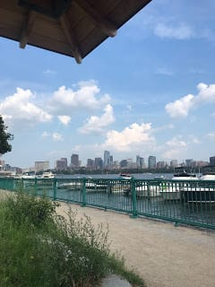

_Coucou tout le monde !_ Hello everyone -

In a classic scene from my life movie - I took a small journey to get my visa and (as always) hit a few bumps in the road.

My first visa experience when I studied abroad in Paris was much worse (phone dying because it was negative degrees plus windchill, calling my mom in a panic and having her track me and direct me to the consulate while I hid my phone in my hood to keep it warm ... ). So when I heard I would only have to drive 5 hours to Boston, I was pretty pumped. _Youpi_ ! I left at 5:00 am, just as the sun was starting to peek through the Maine trees and I ended up on a bridge in Boston traffic a few hours (and a bunch of songs) later. I found parking pretty easily and took the elevator up to the 18th floor of the new outsourced visa office. I ended up being a little early for my appointment but it was ok as I was brought to the office a few minutes early.

That's definitely when my good luck ran out. I was in a small office with one tiny rotating fan in the 90 degree heat. (A very big change from the freezing temps of last visit - quelle ironie!). About 45 minutes later my name was called and I handed the official my folder with 4 copies of every single document I thought they would or could ask for. Everything was being checked off smoothly until he asked if I had any other passport photos. Apparently, the biometric scanner wouldn't accept my photos so I got some very choppy directions to the nearest post office to take some new ones. Luckily it was only a 10 minute walk away through (the very cute) Kendall Square. I basically ran into the post office and kind of shouted (sorry @the super nice post office lady who helped me) and asked if they took passport photos.

Flash forward another half hour and my photos were approved, and my fingerprints were taken (again!) and I had a receipt for a submitted long-stay visa! (And again, in classic Leah fashion I decided to move my car to a different parking lot because it was cheaper -- and ended up paying two-times the parking fees). I blame it on my stressed visa brain and the heat and the excitement of being in a town with more than 2,000 people.

The rest of my day was lovely! The second I walked out of my appointment I decided I needed _une bière_ ASAP - because it was so hot and I was so happy to be done. So I walked into Boston and met my friend for lunch in the Finance District. She actually was another student when I studied abroad in Paris and we had the same host family! The rest of my day was spent wandering (and sweating) to the waterfront and then sitting by the river and watching the sailboats and windsurfers. Then it was off to Boston Logan to pick up my sister and road-trip back to Maine (after getting caught in a crazy storm - nothing like some more excitement after a long 20 - hour day.

comme d'habitude / as per usual enjoy a pic of my view

_Merci_ for following on and reading (_Je vous promets_ / I promise the blog posts will get more interesting once I actually leave!) I'm sure there will be a fun post about the struggles of finding an apartment/opening a bank account/getting a French phone number - things to look forward too!

_Bises et bières pour tous_ (Kisses and beers for all), Xx,Lele
