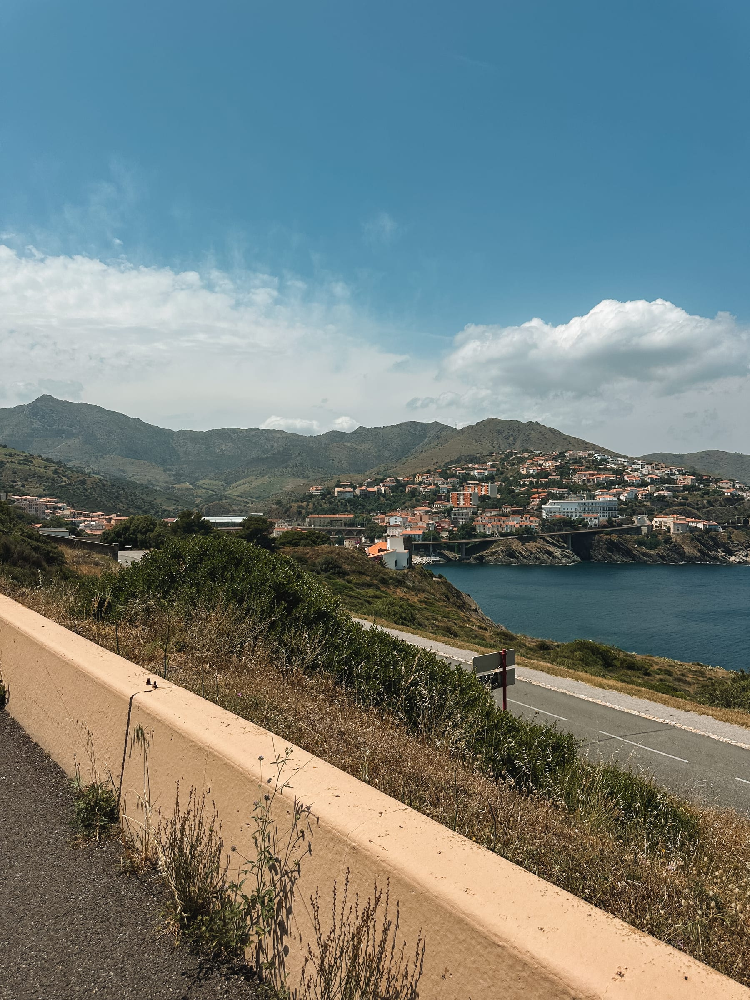

_Fade in._

You, the open road, the Mediterranean doing its whole sparkling-blue thing right there beside you. _Sacoches_ full of local cheese on a sandwich (and a bottle of _banyuls_, because priorities).

The kind of adventure where you just... go, and the coast unfolds, and every stop is a new excuse to eat something incredible.

Oh yeah and gravel roads that pop up every now and then (it’s the adventure part of the journey!). The kind that bump, bump, bump you and the bike everywhere until your teeth rattle and your _bidon_ makes a break for it. But then you round a corner, the sea reappears, and someone hands you a glass of something cold and refreshing, and suddenly you forgive everything. 

We did it anyway. _Obviously_.

Welcome to our bike-packing Eurovelo 1 adventure - 4 days, 275 km, and a few sore muscles at the end of the day. This is the story of sun-soaked coastal roads, questionable navigation decisions, and the kind of meals that made every pedal stroke worth it.

Spoiler: they were all worth it. Even the uphill ones. (Mostly.)

Grab a glass, get comfy. This one's a ride! 🚲

##### Day 1: Sète -> Capestang, 78 km

Our day started early (before the sun), which is how you know it’s going to be a good adventure! We grabbed the TER train heading to _la Méditérannée_ and transferred at Narbonne. Before we knew it, we arrived at our _point de départ_, Sète, a cute canal-filled city on the coast. Our first stop? _La boulangerie, bien sûr_, to fill up on coffee and pastries to make sure we were fueled up. A little detour to find our actually starting point and we were ready to roll (pun intended!) … for about 2 minutes. 

:::gallery{folder="day-1-s-te-capestang-78-km"}

Turns out my _sacoches_ were not in the right spot and we needed to tweak things. It was a super fun 200 meters! 😂 After a screwdriver adjustment and some photos at our nicely-chosen reparation spot, now we were _really_ off! 

The first part of our trip took us along the Mediterranean, between the sparkling sea (ok maybe not yet, there were a bit of clouds on our first day) and the Étang de Thau. Riding on a freshly paved bike-path, the first few kilometers flew by … wind in our helmets, legs-a-turning, the perfect start to our adventure. 

We stopped for a quick dip in the ocean before reaching Agde (ok our feet dipped in the ocean, like I mentioned we did have some clouds on the first day). After a quick lunch break at a _boulangerie_ and a few stray drops, we tackled the second half of our day.

:::gallery{folder="day-1-s-te-capestang-78-km-2"}

We biked through cute little towns, along canals and next to farms before we reached Béziers, which turned out to be the perfect stopping point as it started to rain! 

We took a lap of the city with its _cathédrale_ on a hill and famous 7 locks that take boats up a steep hill via the _Canal du Midi_. And then, as the first (real) drops of our bike-packing adventure began to fall, we took refuge at the _Brasserie de la Gorge Fraiche_ for a well-deserved beer! 

:::gallery{folder="day-1-s-te-capestang-78-km-3"}

Our _apéro improvisé_ had us feeling a bit hungry, so after our break, we headed back out along the Canal to our first stop at Capestang. And this, folks, is where the trip got interesting with some questionable trails along the Canal. When I say we were bumped around, there were only about 10 kilometers of tricky terrain, but it felt longer than the whole day of biking (especially for my hands and butt!). 

Capestang turned out to be a cute little town with the collegiate church of Saint-Etienne and a pizzeria that was open on Monday (there wasn’t a whole lot of choice). Now when I say we were completely wiped out from our early start and long day on the bike … I think I was asleep before my head hit the pillow.

:::gallery{folder="day-1-s-te-capestang-78-km-4"}

##### Day 2: Capéstang -> Port-la-Nouvelle, 73km 

After a great night sleep (and the included breakfast in our _chambre d’hôtes)_ we were ready to set off, in the sunshine this time! Because Capestang was right along the Canal, it was super easy to find out way back to our path. The first few kilometers were a little bumpy but nothing compared to the day before. Plus the sun shining and our quaint little path along the Canal put both of us in a great mood. 

We rode along the Canal, and then forked off to another Canal that would take us south. We could have also continued along the Canal du Midi which would have taken us back to Toulouse. 

:::gallery{folder="day-2-cap-stang-port-la-nouvelle-73km"}

We decided to take a parallel road since the path along the canal was quite bumpy and we were feeling the effects of the day before … 

… and before we knew it, we were in the city of Narbonne! And lucky for us there was randomly an Italian food festival going on in the city. 

We stocked up on prosciutto and some Italian cheese and decided to picnic in a park next to the famous Narbonne cathedral (and this super big bench!). 

:::gallery{folder="day-2-cap-stang-port-la-nouvelle-73km-2"}

Fueled up and ready to go, we had a big afternoon ahead of us as we were taking a detour to go to Gruissan along the water and its pink salt marshes. One detour, an almost closed bike path, and carrying our bikes for a couple meters, and we were on our way out of Narbonne and _en route_ to Gruissan. The path to get there was a bit treacherous but super sun between rivers and the sea as we headed to the city and the beach. The pink lake contrasted against the blue sky (not a cloud to be found!) was truly picture perfect and the perfect stop for us to pick up some souvenirs for the family. 

:::gallery{folder="day-2-cap-stang-port-la-nouvelle-73km-3"}

:::gallery{folder="day-2-cap-stang-port-la-nouvelle-73km-4"}

Our route back to the Eurovelo 1 was incredible, a long slow, descent on a paved road was just what was needed to boost our spirits as we headed back to the coast. 

Our last leg of the day was through the _étangs de Narbonne_ which had us biking on a little dirt strip in between the sparkling, cerulean sea (yes, for real this time!) and the ponds and lakes closer inland. It was jaw-dropping to say the least, and I had my phone out probably like half of the time trying to capture the moment. (The other 50% I had a death grip on the handlebars as we were back on a bump, bump, bumpy gravel road as we rode alongside the train tracks). 

:::gallery{folder="day-2-cap-stang-port-la-nouvelle-73km-5"}

The dirt path turned into paved bike path as we arrived in _Port-la-Nouvelle_ where we were staying for the night. We had enough time and energy to take a real dip into the ocean as the sun went down. Add in some fresh seafood, a glass of sangria (heading closer and closer to Spain!), and an ice cream to top it all off for the perfect end to a pretty perfect day. (Except for the sunburn. Oops, my bad.) 

##### Day 3: Port-la-Nouvelle -> Collioure, 84km

In hindsight, I would probably have tried to stay in a neighboring town like Leucate or even Gruissan as Port-la-Nouvelle wasn’t my favorite spot on the trip. But we headed out early with plans to stop in Leucate and grab breakfast at a boulangerie to start off our day. 

The rest of our morning was spent on bike paths along the sea, perfect pour taking in the scenery and taking advantage of the sun that was starting to peek out from behind the morning clouds. As we headed closer and closer to Collioure, it seemed like there were more and more people along the beach and bike path which was a nice change of pace. 

:::gallery{folder="day-3-port-la-nouvelle-collioure-84km"}

We stopped along the beach for some sandwiches with bread that we had picked up from a _boulangerie_ and the rest of our Italian meats and cheeses from the day before. It was a lovely stop in the sun (and I even remembered to reapply my sunscreen this day). 

We rolled along in the afternoon until our legs started crying out for a little break (or maybe it was our bums!) and we decided to grab a coffee at a rooftop bar we had seen from the bike path. 

The boost from my iced coffee and the looming rain clouds were enough to motivate us for the final kilometers to our destination for the evening. We did hit our second wrong turn in two days as the GPS wanted us to take a hiking trail (or maybe super intense mountain biking trail if you’re motivated for that) for the last final kilometers to Collioure but we decided to head via the road (thanks to Strava and a colleague that had done this leg of the journey, we had this backup plan!). 

And up we went! We finally ended our relatively flat journey and headed to the hilly section along the coast. _La route de cols_ really did live up to its name and it was almost nice to have a change of pace (maybe my legs would disagree with me). But as we climbed, we could look to the left out at the sea and to the right were loads of vineyards and vines. Picture perfect. Again. 

:::gallery{folder="day-3-port-la-nouvelle-collioure-84km-2"}

Coming over the crest of the hill brought us right into Collioure and to our last hotel of the trip. We had a well-deserved shower and then headed for a little walk into the town before dinner. I had found a restaurant right on the water which seemed perfect for our last night on the trip!\*

\*If at this point you are asking yourself, “Why does she keep crossing out the ‘lasts’?”, the answer would be that the SNCF aka the French national railway had a strike the day after and all the trains were cancelled. So during our lovely dinner (and after another glass of Banyuls, a local, fortified wine for our _apéro_) we decided it was the universe’s way of saying we should try to bike to the border, something we were both a bit disappointed that we didn’t plan to do. So we booked a hotel and decided to keep this bike trip rolling …. 

Dinner was amazing! We split a bottle of wine (_après l’effort, le réconfort !_) and started off with a _tataki de thon_ while the sun set in front of us. If that’s not a great end to a day, I don’t know what is! And, in a twist of fate, we shared two fish dishes - spicy-crusted cod and a swordfish with risotto. When in 𝖱̶𝗈̶𝗆̶𝖾̶ Collioure, right? 

:::gallery{folder="day-3-port-la-nouvelle-collioure-84km-3"}

##### Day 4: Collioure -> Port Vendres, 3km

We slept in. Full stop. (After three days of biking, we were super excited for a day “off”). 

The morning consisted of meandering around the cute little _rues_ of Collioure and finding a great _torréfacteur_ to enjoy a coffee along the beach next to the port. Definitely recommend if you are in Collioure, they’ve got a great _terrasse_ or do take-away and you can even buy some beans if you like what you tried.

Lunch was back to our beach after looking at some different options. We decided to get a little “picnic basket” to-go from a famous tapas place and got to enjoy a glass of sangria and a fresh beer in the sun while they prepared it for us. Sun, sangria, and pan con tomate … what’s not to love! 

:::gallery{folder="day-4-collioure-port-vendres-3km"}

We lounged around in the afternoon on the beach, enjoying not pedaling before grabbing our bikes and bags from the hotel and biking to the next town over where we found a cheap hotel. 

We actually hit traffic and were stopped with the cars between Collioure and Port Vendres which was pretty funny to me. In hindsight, I think we would have tried to bike further and stayed in Banyuls-sur-Mer since it’s a much cuter town with more food options. Will keep that in mind for _une prochaine fois._

We ended the afternoon with a 10km hike to _Cap Béar_ which is a point with a lighthouse and some great ocean views. We even got a sneak preview of the route for the next day … spoiler alert, _ça grimpe !_

:::gallery{folder="day-4-collioure-port-vendres-3km-2"}

Dinner was some seafood at one of the few restaurants that was open, again, not the greatest stop of our trip but the glass of _banyuls_ at the end of the meal and a sunset over the port was a great way to end the day. 

##### Day 5: Port Vendres -> España ! 22km

Ok, so spoiler alert, the hotel lived up to its very cheap €60/night price … even if we were upgraded to a room with a view of the port. Nothing better to motivate us than the thought of a pastry in Banyuls and the most gorgeous day ahead of us!

We headed up, up, up … first on a bike path that was so steep at the end I had to walk alongside the bike at the end, then along the _Route des Cols_, which definitely lived up to its name! 

It wasn’t a long ride to Banyuls and it was midmorning when we descended into town and right along the beach. Our first stop was to a _boulangerie_, what else! We found a hidden gem a few streets off the beach which has sourdough-based bread and pastries which we snacked on while watching the sun sparkle on the waves. A few crossword pages later and we started to get hungry … 

:::gallery{folder="day-5-port-vendres-espa-a-22km"}

Luckily when we had been at the _boulangerie_, we had struck up a conversation with a local enjoying his coffee and asking about our bike trip. We had originally planned to bike to the next town, Cerbère which is the last town before the Spanish border, but our new friend recommended a local restaurant across the street. We put in our names for a reservation and then had the epiphany of the century! We had already stopped in Banyuls-sur-Mer a few years ago and found ourselves at a _cave_ to pick up some local wine. We had about an hour to kill and some space in our _sacoches_ so we decided to make a pitstop. 

We actually stumbled upon the owner of the _cave_, whom we had spoke with the last time we were there, and he was pretty surprised since he is maybe behind the counter a couple times a month. What great timing! 

We got to taste a few different wine options and then came the holy grail, a sip of a 1996 bottle of _banyuls_. It was in-cre-di-ble. One look at Louis and I knew we both were blown away by this aged, fortified wine. 

A quick discussion and some great arguments like:

*   We never buy any fancy wine for ourselves

*   It’s a 1996 wine, the year we were both born! 

*   We can celebrate our 30th birthdays with this

*   We were technically on this bike trip because we got _PACS_\-ed (or the French equivalent of a civil union) and wanted something to celebrate that

*   YOLO, it’ll also make for a great _souvenir_

And we left the _cave_ with our wallets a little lighter (it was a great deal honestly) and our _sacoches_ a little heavier. I even negotiated that it was Louis who took the bottle and moved things around as we were in for some steep climbs to hit the Spanish border! 

Then, we headed over to the restaurant for lunch. Vintage vibes mixed with a recently renovated hotel and restaurant and some of the most delicious food I have tasted. I even looked up the prices to stay in the hotel and turns out it was pretty much the same price as we had paid to stay in Port Vendres. So now we know for next time! 

:::gallery{folder="day-5-port-vendres-espa-a-22km-2"}

Bellies full (and our hearts and spirits high), we set out … _direction la frontière !_

A quick descent into town (and spotting a local café that was open to grab a drink after!), was enough to propel us up the first hill which lead to a lighthouse along the border. The road to the border was awesome; super well-paved, respectful cars that passed us with ample room, and _surtout_ killer views of the ocean along the way. We had a quick stop at the lighthouse, snapped some photos, and then kept on pedaling. The wind was a bit aggressive at this point and I’d like to say that was the reason why I arrived at the border a couple minutes after Louis … 😅 But we made it (and the bottle of _banyuls_ made it too!), which was the most important! 

The view from the top was beautiful and we snapped some more pictures before heading back down to grab a drink and/or an ice cream (pick your team!) and our train back to Toulouse. 

:::gallery{folder="day-5-port-vendres-espa-a-22km-3"}

**Final recap:** 275 km, 1230m _de dénivelé_, at least 4 glasses of _banyuls_, and two happy 𝖼̶𝖺̶𝗆̶𝗉̶𝖾̶𝗋̶𝗌̶ bikers!

If you've ever stared at a map and thought "what if we just... biked there?" - do it. Pack light, eat heavy, and drink/bring more Banyuls than you think you need. (Trust me on that last one.)

_Sunburnt, saddlesore, and already planning the next one,_
