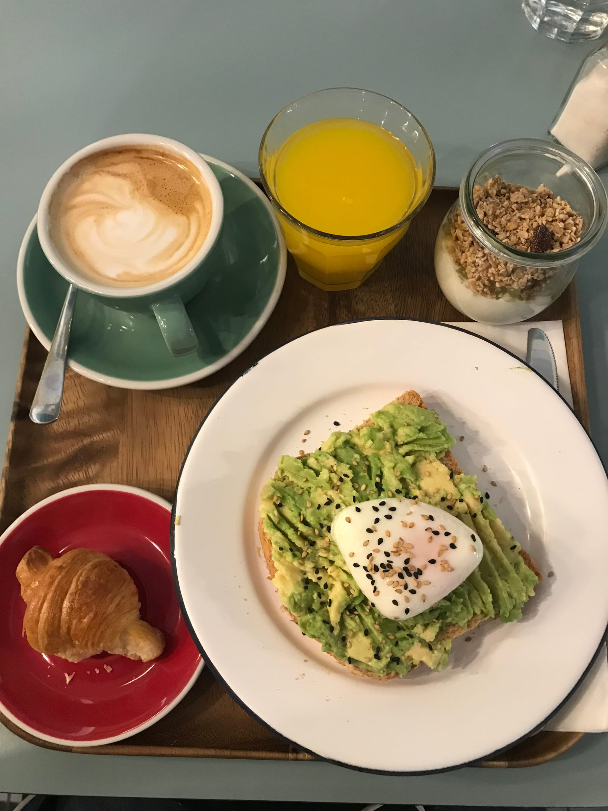

_Bonnes vacances !_ Happy break! After a solid three weeks of teaching (one of which was just introducing myself) we totally deserved a two-week break. So, Friday I took myself to the beach to celebrate the start of vacation. Saturday morning, I woke up and headed to the airport to fly to Madrid to visit some of my college girlfriends. Kristen met me at the airport and we metro-ed into the city. I miss being in a bigger city a little bit and being able to hop on the metro (the tram in Nice is not the same!). The _chicas_ and I grabbed brunch at a cute café near their apartment before wandering around Madrid in the afternoon.

avo-gotta have some brunch!

The colored buildings along the _calles_ vaguely reminded me of Nice, but with a Spanish charm. Madrid truly is a vibrant city, from the people to the places. It was also a little nice to be out of my comfort zone, being surrounded by Spanish and only understanding about half of what everyone was saying (people speak _muy_ fast here!)

:::gallery{folder="general"}

Dinner was back at (one of) my favorite places I’ve ever eaten – _Takos al Pastor_! I missed tacos and seasonings so much … don’t get me wrong French food is _très delicieuse_ but Lele needs some spice in her life!

> _Taco_\-bout true love!

4 tacos were eaten, none were regretted- from the classic _Al Pastor_, to a taco with potatoes and cheese to one with spicy warm chicken - ¡_muy delicioso!_ We came back and they had some friends over before going out to a bar in their neighborhood. We didn’t get back until 3 am – classic _España_!

The next morning we got up a bit early because we went to see the running of 1000 sheep for a parade to celebrate the harvest and fall. Sadly, the sheep were about an hour late (perhaps they had a late night as well?). But it was very cool to see them all trotting through the streets with traditional dancers! After a homemade breakfast, Kristen and I walked around Madrid and found a cute rooftop garden for a _cerveza_. We also hopped into a flea market festival and did some browsing in the spontaneous sun-shower. Late lunch/early dinner of _jamon & tomate_ meant churros for dessert! We went to the famous Chocolateria San Gines for 6 long, greasy churros just ready to be dunked in the thick steamy, chocolate sauce. If that doesn't sound like heaven, I don't know what does!

> I _churro_ was glad I got to try churros this time in Madrid

:::gallery{folder="general-2"}

Monday morning, I had the apartment to myself as the Spain pals went off to work. I wandered on a 20 minute walk to a cute café and got breakfast (and ended up doing everything in Spanish – my \[fake\] Spanish heritage is paying off)! Some _tartines_ with butter and _dulce de leche_ was a great start to a sunny day. I wandered around the Parque de Retiro until Kristen and I met up for a _pique-nique_ back at Retiro since it was a lovely, day.

There was a tapas festival happening in a neighborhood across town, so we hopped on the metro and stopped at 3 different restaurants for different tapas at each. Tapas is a spanish tradition of a little appetizer/snack served with a beer in the later afternoon. It's the perfect pick-me-up before a late dinner. The international tapas festival meant we grabbed little bahn mi sandwiches, followed by a North African dish of chicken and rice, and finally a mini falafel sandwich (all with _cerveza_ of course). We had a chill last night in calling our other pal from Skidmore. Spain was _muy_ fun but it also made me miss not being in Paris with the metro and parks, as well as being away from my college friends/roommates.

:::gallery{folder="general-3"}

Tuesday morning, I headed to the airport to catch my flight to the next stop on break ... Prague!

Cheers and beers,

(Spanish) Lele
