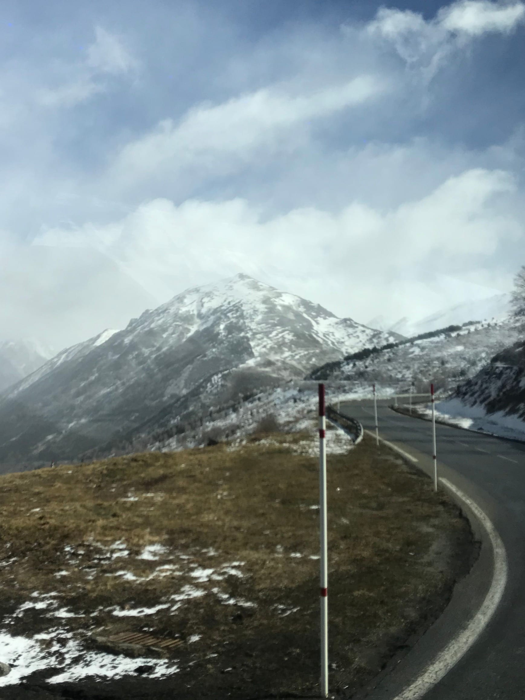

import Gallery from '../../../components/Gallery.astro';

The last Wednesday _en fevrier_ the Picta'Team had an early start to their mornings because _on partait en séminaire !_ It was the annual work seminar, although _chez nous_ it's more of a work retreat!

My suitcase was packed and I battled the rain to get picked up by my _collègue_ and we headed to work a bit earlier than usual. Everyone arrived on time and got their morning _café_ and we loaded up on the bus and headed out! _Direction ... Andorre_ and the Pyrenees! We had about 3 hours on the road and everyone relaxed/slept/listened to music. We had a quick stop in _Ax-les-Thermes_ for a coffee/smoke/snack break. Our office manager packed us all little snack bags in case we got hungry which really wasn't the case because we ate so well! But more on that later ... with photos _bien sûr !_

<Gallery post="with-great-powder" folder="general" />

The air got a bit thinner, the mountains got a bit snowier and before we knew it we crossed over the border into Andorra! Everyone enjoyed the view of the snow and the different _stations de skis_ as we came down into Andorra la Vella where we would be staying for the next two days. The bus managed to drop us off near our hotel in the small, city streets and everyone had their mouths open as we walked in. Seriously y'all we are on India-level here with a fancy 5-star hotel with glass elevators, huge beds and showers and even a fancy bidet on the toilet! Our rooms weren't quite ready, so we headed to _déjeuner_ in the hotel restaurant.

<Gallery post="with-great-powder" folder="general-2" />

We started with a choice of _entrée_ (lentil & pumpkin soup for me) then _plat principal_ (a burger with _reblochon_ and bacon) and then _dessert_ (ice cream). And washed all that down with some red, red wine! I don't know if it was the mountain air or the wine but after two glasses I had a bit of a buzz going.

<Gallery post="with-great-powder" folder="general-3" />

> let me _len-tell_ you about this tasty first meal!

We checked into our rooms (_chacun(e) sa chambre !_) and then set out to walk across town to our first activity, the spa! It was about 10 minutes away and we got to see all the shopping Andorra has to offer. Léa and I had the same massage _créneau_ so we hit the thermal baths (indoor & outdoor), saunas, showers, and hammams before getting our massages!

<Gallery post="with-great-powder" folder="general-4" />

<Gallery post="with-great-powder" folder="general-5" />

The massage was super relaxing and we even got to sit in some cool, heated chairs after with our _thé_. We headed straight back to the _hôtel_ because we had an _apéro dinatoire_ or a little small-plates dinner with lots and lots of tapas! After dinner, we decided to get some mojitos from the hotel bar and call it a night, _un peu tôt_ but we had to be fresh and ready for our big day _le lendemain!_

<Gallery post="with-great-powder" folder="general-6" />

> I loved these tapas from my head to _moji-toes!_

Another early morning rolled around but excitement was in the air for the Picta'Team even at breakfast for our big day _sur les pistes_ ! We loaded up our mini-bus and stopped at our first stop to rent ski supplies (the man who asked for my shoe size had to verify that I said 34 🤦🏻‍♀️). Skis and poles and helmets were rented and then we headed up, up, up as it started to snow! Once we got the the _station de ski_, we split into those who _ont fait les racquettes_ (snow-shoed) and those who _ont fait du ski_. Not gonna lie, it took a few runs for me to get my feet ... er skis ... underneath me but I was with 2 _collégues_ who were about at the same level as me and we had a blast!

<Gallery post="with-great-powder" folder="general-7" />

We ended up doing mostly blue slopes with a few trips down into the "Kid's Forest" to do different obstacles and fun tricks! The views were stunning from the lift and we all agreed that our favorite part was the ski lift (that's how you know we aren't going to the Olympics anytime soon 😉) even if we had a good time doing the actual skiing. I'll admit that it was a bit tricky trying to explain how to get up after falling down in French when _les gars ont tombé_ but everyone managed to get the hang of it.

<Gallery post="with-great-powder" folder="general-8" />

> _SKI_ you later!

We finished around _midi_ and then headed to the restaurant to meet the rest of the gang for lunch ... and a beer for _après-ski_ !

<Gallery post="with-great-powder" folder="general-9" />

> definitely _après_\-ciate this beer after a morning on the slopes!

The first _activité_ of the afternoon was _motoneige_ aka snowmobiling! We got our instructions and learned how to drive and also turn (turns out you have to throw your whole body to the side of the snowmobile when your turn aka leaning wicked far to balance the skis), we paired up and then headed out in a single-file line! I was perfectly happy being a co-pilot and helping turn the sled with Matthias at the wheel, er ... handles. We even had some moments where we sped along and got our adrenaline pumping!

<Gallery post="with-great-powder" folder="general-10" />

Our final activity of the afternoon was snow-tubing. We got our third helmet of the day (#SafetyFirst) and then _on s'est régalé_ whipping each other down the hill to go as fast as we could! I couldn't feel my feet at the end and my boots were destroyed but it was so worth it.

Everyone headed to their _chambres_ once we got back to the hotel to shower and relax for a bit before dinner. I joined some of my _collégues_ in the lobby for _apéro_ (I'm pretty sure all we did was eat and drink!) while the others relaxed or did some shopping.

We walked to dinner and were all amazed by the beautiful decorations in the restaurant. It could have been right out of a _mariage_ ! The red wine started flowing and the apps made their way _au tour du table._ We had some homemade _pan con tomate, croquettes, charcuterie, carpaccio de bœuf,_ blood sausage with a veggie puree ... and that was all before the main course! I swear I only ate 2 bites of my lamb because I was so full! Thankfully a colleague helped me out and finished my dessert of _tiramisu_ as well! [#OutOfCharacter](https://www.forkspoonandstraw.com/home/hashtags/OutOfCharacter)

<Gallery post="with-great-powder" folder="general-11" />

> not a baah-d meal!

We ended our last _soirée_ in Andorra at the bar with _champagne_ and mojitos and some good company!

Our last morning on Friday, we slept in and leisurely grabbed _petit-déjeuner_ before _ma Lélé_ and I hit the shops! We both ended up finding a few things and enjoying the fresh, mountain air and sun before we headed back to a rainy Toulouse.

<Gallery post="with-great-powder" folder="general-12" />

16 left for Andorra and 16 came back! It was a truly great _seminaire_ and it was a ton of fun to hang out with my super-cool colleagues outside of work.

To fresh pow and lots of food,

Ps - if you've made it this far please enjoy this picture of this gnarly bruise I got from falling on my ski pole and then leaning on the snowmobile every time we turned. If you can't tell ... I'm very proud of it! [#BattleScars](https://www.forkspoonandstraw.com/home/hashtags/BattleScars)

<Gallery post="with-great-powder" folder="general-13" />
